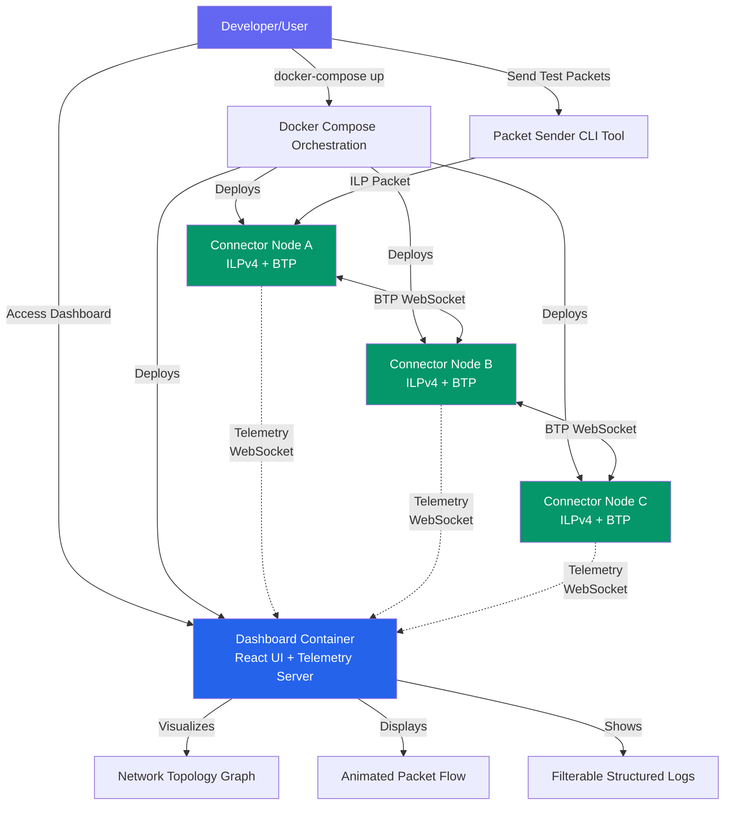

# M2M - Multi-node Interledger Connector

[](CHANGELOG.md)
[](https://github.com/yourusername/m2m/actions)
[](https://www.typescriptlang.org/)
[](https://nodejs.org/)
[](LICENSE)

> **v0.1.0 MVP Release** - Complete ILPv4 connector with bidirectional BTP, real-time telemetry, and network visualization. See [CHANGELOG.md](CHANGELOG.md) for release notes.

Educational implementation of an Interledger Protocol (ILP) connector with Bilateral Transfer Protocol (BTP) support and real-time network visualization dashboard.

## Table of Contents

- [Overview](#overview)
- [Monorepo Structure](#monorepo-structure)
- [Prerequisites](#prerequisites)
- [Setup Instructions](#setup-instructions)
- [Development Environment](#development-environment)
- [Smart Contract Development](#smart-contract-development)
- [Quick Start](#quick-start)
- [Testing Packet Routing with send-packet Tool](#testing-packet-routing-with-send-packet-tool)
- [Docker Compose Deployment](#docker-compose-deployment)
- [Production Deployment](#production-deployment)
- [Dashboard](#dashboard)
- [Documentation](#documentation)
- [Technology Stack](#technology-stack)
- [Interledger Protocol References](#interledger-protocol-references)
- [Contributing](#contributing)
- [Development Workflow](#development-workflow)
- [Project Status](#project-status)
- [License](#license)
- [References](#references)

## Overview

M2M provides a complete ILP routing infrastructure for learning and testing multi-node payment networks.

### Key Features

- **ILP Connector**: RFC-compliant ILPv4 packet routing with BTP WebSocket protocol for connector-to-connector communication
- **Network Dashboard**: Real-time visualization of packet flows, routing topology, connector telemetry, and structured logs
- **Docker Compose Topologies**: Pre-configured multi-node networks (linear chain, full mesh, hub-spoke, complex 8-node)
- **Test Packet Sender**: CLI utility for injecting test packets into the network without external dependencies
- **Structured Logging**: Filterable log viewer in dashboard for debugging multi-node networks with live telemetry
- **Configuration Flexibility**: YAML-based topology configuration with validation for custom network designs

### Why M2M?

- **Educational Purpose**: Learn ILP protocol mechanics through hands-on experimentation with real packet routing
- **Observability**: Visualize packet routing that's normally invisible in production ILP networks through animated packet flows
- **Rapid Testing**: Deploy multi-node topologies in seconds with Docker Compose for quick iteration
- **RFC Compliance**: Implementation follows official Interledger RFCs (ILPv4, BTP, OER) for authenticity

### Architecture Overview



This diagram shows the high-level component interaction: developers deploy multi-node networks via Docker Compose, connectors communicate via BTP WebSocket protocol, and all telemetry flows to the dashboard for real-time visualization and monitoring.

## Monorepo Structure

This project uses npm workspaces to organize code into independent packages:

```
m2m/
├── packages/
│   ├── connector/       # ILP Connector service (BTP server/client, routing logic)
│   ├── dashboard/       # React-based network visualization UI
│   └── shared/          # Shared TypeScript types and utilities (ILP packets, OER encoding)
├── tools/               # CLI utilities for testing
├── docker/              # Docker Compose configurations
└── examples/            # Example topology configurations
```

### Package Purposes

- **@m2m/connector**: Node.js service that implements ILPv4 routing, BTP protocol, and telemetry emission
- **@m2m/dashboard**: React app with Cytoscape.js for visualizing network topology and packet animations
- **@m2m/shared**: Pure TypeScript package with ILP packet types, OER encoding, and validation utilities

## Prerequisites

- **Node.js**: v20.11.0 or higher (LTS recommended)
- **npm**: v10.x or higher
- **Docker**: For running multi-node topologies (optional for development)

## Setup Instructions

### 1. Install Dependencies

```bash
npm install
```

This installs dependencies for all workspace packages using npm's built-in workspace support.

### 2. Build All Packages

```bash
npm run build
```

Compiles TypeScript to JavaScript for all packages (`connector`, `dashboard`, `shared`) using their respective `tsconfig.json` configurations.

### 3. Run Tests

```bash
npm test
```

Executes Jest test suites across all packages with coverage reporting:

- `packages/shared`: >90% coverage threshold
- `packages/connector`: >80% coverage threshold
- `packages/dashboard`: >70% coverage threshold

### 4. Lint Code

```bash
npm run lint
```

Runs ESLint with TypeScript support across all packages to enforce code quality standards.

### 5. Format Code

```bash
npm run format
```

Applies Prettier formatting rules (100 char line length, single quotes) to all TypeScript/JSON/Markdown files.

## Development Environment

M2M uses separate Docker Compose files for development vs production environments to optimize for different use cases.

### Overview

The development environment includes local blockchain nodes and settlement infrastructure for offline development and testing:

**Services Included:**

- **Anvil (Base L2 Fork)** - Local Base Sepolia fork for smart contract development (Epic 7)
- **rippled (XRP Ledger)** - Standalone XRP Ledger for payment channel testing (Epic 7)
- **TigerBeetle** - Settlement accounting database
- **Connectors (Alice & Bob)** - ILP connector nodes for testing packet routing
- **Dashboard (optional)** - Network visualization UI

**Benefits:**

- Offline development (no internet required)
- Instant transactions (no network delays)
- Zero gas costs (local forks)
- Complete control over blockchain state
- Hot-reload for connector code changes

### Quick Start

#### Prerequisites

- **Docker Desktop** - Docker Engine 20.10+ and Docker Compose 2.x
- **Node.js** - v20.11.0 or higher (LTS recommended)
- **npm** - v10.x or higher

#### Step-by-Step Setup

**Step 1: Clone Repository and Install Dependencies**

```bash
git clone https://github.com/yourusername/m2m.git
cd m2m
npm install
```

**Step 2: Configure Environment**

```bash
cp .env.dev.example .env.dev
```

Edit `.env.dev` to customize configuration (optional - defaults work for most cases).

**Step 3: Start Development Environment**

```bash
make dev-up
```

This command starts all development services:

- Anvil (Base L2 fork)
- rippled (XRP Ledger standalone)
- TigerBeetle (settlement database)
- Connector Alice (port 3001)
- Connector Bob (port 3002)

**Step 4: Verify Services Running**

```bash
make dev-status
```

Expected output:

```
NAME                      STATUS
anvil_base_local          Up 2 minutes (healthy)
rippled_standalone        Up 2 minutes (healthy)
tigerbeetle               Up 2 minutes (healthy)
connector_alice_dev       Up 1 minute (healthy)
connector_bob_dev         Up 1 minute (healthy)
```

**Step 5: View Logs**

```bash
make dev-logs
```

Use `Ctrl+C` to exit log viewer.

### Development vs Production

| Aspect                | Development (docker-compose-dev.yml)    | Production (docker-compose-production.yml) |
| --------------------- | --------------------------------------- | ------------------------------------------ |
| **Blockchain Nodes**  | Local forks (Anvil, rippled standalone) | Public RPC endpoints                       |
| **Hot-Reload**        | Enabled (code changes auto-restart)     | Disabled                                   |
| **Optional Services** | Dashboard, auto-ledger (via profiles)   | All services required                      |
| **Secrets**           | Hardcoded (acceptable for dev)          | Environment variables (.env file)          |
| **Log Level**         | DEBUG (verbose)                         | INFO (production-appropriate)              |

**When to Use:**

- **Development**: Local testing, smart contract development, payment channel experimentation
- **Production**: Deploying connectors to public networks with real cryptocurrency

**Configuration Guide:** For production deployment configuration and environment switching, see [Production Configuration Guide](docs/guides/local-vs-production-config.md)

### Available Make Commands

M2M includes a Makefile with commands for common development workflows:

```bash
make help              # Show all available commands
make dev-up            # Start all development services
make dev-up-dashboard  # Start with optional dashboard
make dev-up-auto-ledger # Start with automated rippled ledger advancement
make dev-up-all        # Start with all optional services (dashboard + auto-ledger)
make dev-down          # Stop all services (preserves volumes)
make dev-reset         # Reset to clean state (WARNING: deletes all data volumes)
make dev-logs          # View logs from all services (follow mode)
make dev-logs-alice    # View logs from connector-alice
make dev-logs-bob      # View logs from connector-bob
make dev-status        # Show status of all services
make dev-test          # Run integration tests against development environment
make dev-clean         # Deep clean: remove all containers, volumes, unused Docker resources
```

**Usage Examples:**

```bash
# Start environment
make dev-up

# Start with dashboard for network visualization
make dev-up-dashboard

# Start with auto-ledger advancement (rippled ledgers advance every 5 seconds)
make dev-up-auto-ledger

# View logs from all services
make dev-logs

# View logs from specific connector
make dev-logs-alice

# Reset environment (fresh blockchain data)
make dev-reset

# Stop environment when done
make dev-down
```

### Service URLs

**From Host Machine:**

- **Anvil JSON-RPC**: http://localhost:8545
- **rippled JSON-RPC**: http://localhost:5005
- **rippled WebSocket**: ws://localhost:6006
- **Connector Alice BTP**: ws://localhost:3001
- **Connector Alice Health**: http://localhost:8081/health
- **Connector Bob BTP**: ws://localhost:3002
- **Connector Bob Health**: http://localhost:8082/health
- **Dashboard UI**: http://localhost:8080 (with `--profile dashboard`)

**From Within Docker Network:**

- **Anvil**: http://anvil:8545
- **rippled**: http://rippled:5005
- **TigerBeetle**: tigerbeetle:3000
- **Connector Alice**: alice:3001
- **Connector Bob**: bob:3002

### Troubleshooting

**Issue: Services fail to start**

```bash
# Check Docker is running
docker ps

# Check port conflicts
lsof -i :8545  # Anvil port
lsof -i :5005  # rippled port
lsof -i :3001  # Connector Alice BTP port

# View service logs
make dev-logs
```

**Issue: Connectors can't connect to blockchain nodes**

```bash
# Verify blockchain health checks passed
docker ps  # Check "healthy" status

# Restart dependencies
make dev-reset
```

**Issue: Code changes not reflected**

```bash
# Verify hot-reload volumes mounted
docker inspect connector_alice_dev | grep -A 5 Mounts

# Rebuild containers if needed
docker-compose -f docker-compose-dev.yml up -d --build
```

**Issue: Port already in use**

```bash
# Identify process using port
lsof -i :8545

# Stop conflicting service or change port in docker-compose-dev.yml
```

### Development Workflows

M2M supports two main blockchain development workflows for Epic 8 (EVM smart contracts on Base L2) and Epic 9 (XRP payment channels):

**Workflow 1: Smart Contract Development (Epic 8 - Base L2)**

- Write contract → Test on Anvil → Deploy locally → Test with connectors → Deploy testnet
- **See**: [Smart Contract Development Workflow](docs/guides/local-blockchain-development.md#workflow-1-smart-contract-development-epic-8) for complete tutorial
- **Tools**: Foundry (forge/cast), Anvil, Solidity
- **Best For**: Payment channel smart contracts, EVM-based settlement logic

**Workflow 2: XRP Payment Channel Testing (Epic 9 - XRP Ledger)**

- Start rippled → Create accounts → Fund accounts → Open channel → Sign claims → Test settlement
- **See**: [XRP Payment Channel Workflow](docs/guides/local-blockchain-development.md#workflow-2-xrp-payment-channel-testing-epic-9) for complete tutorial
- **Tools**: rippled RPC, helper scripts, curl
- **Best For**: XRPL payment channels, off-ledger claim signing and validation

### When to Use Each Makefile Command

Choose the right development command for your workflow:

**`make dev-up`** - Default development mode (no dashboard, manual ledger advancement)

- **Best for**: Rapid iteration, minimal resource usage
- **Use when**: Developing connectors, testing ILP routing without visualization
- **Resource usage**: Low (~2GB RAM)

**`make dev-up-dashboard`** - Development with network visualization

- **Best for**: Debugging packet routing, visualizing network topology
- **Use when**: Working on multi-connector deployments, debugging packet flow
- **Resource usage**: Medium (~3GB RAM)

**`make dev-up-auto-ledger`** - Development with automatic XRPL ledger advancement

- **Best for**: XRP payment channel testing (Epic 9), continuous integration testing
- **Use when**: Testing payment channels without manual ledger advancement
- **Resource usage**: Low (~2GB RAM)

**`make dev-up-all`** - All optional services (dashboard + auto-ledger)

- **Best for**: Full-featured development environment
- **Use when**: Working on both Epic 8 (EVM) and Epic 9 (XRP) simultaneously
- **Resource usage**: High (~4GB RAM)

**`make dev-reset`** - Clean state reset (WARNING: deletes all blockchain data)

- **Best for**: Starting fresh after corrupted state or major config changes
- **Use when**: Blockchain state corrupted, testing from genesis, changing fork block
- **Data loss**: YES - all blockchain data, deployed contracts, payment channels deleted

**`make dev-test`** - Run integration tests

- **Best for**: Validating full stack before committing changes
- **Use when**: Pre-commit validation, CI/CD pipeline integration

**For detailed deployment tutorials and debugging workflows**, see [Local Blockchain Development Guide](docs/guides/local-blockchain-development.md).

### Further Reading

- **Local Blockchain Development Guide**: [docs/guides/local-blockchain-development.md](docs/guides/local-blockchain-development.md) - Detailed setup and usage instructions
- **Epic 7 Documentation**: [docs/stories/7.\*.story.md](docs/stories/) - Architecture and implementation details for local blockchain infrastructure

## Smart Contract Development

M2M uses **Foundry** for smart contract development, testing, and deployment. Smart contracts are deployed to **Base L2** (an Ethereum Layer 2 scaling solution) for low-cost payment channel operations.

### Quick Start

1. **Initialize Foundry project** (already done in packages/contracts/):

   ```bash
   cd packages/contracts
   forge build
   ```

2. **Run tests**:

   ```bash
   forge test
   ```

3. **Deploy to local Anvil** (requires Anvil running via docker-compose-dev.yml):
   ```bash
   npm run deploy:local
   ```

### Deployment Progression: Local → Testnet → Mainnet

**1. Local Development (Anvil)**

- Deploy to local Anvil fork of Base Sepolia
- Instant feedback, free gas, offline development
- Command: `npm run deploy:local`

**2. Testnet Deployment (Base Sepolia)**

- Deploy to public Base Sepolia testnet
- Test with real blockchain but $0 gas costs
- Requires `BASE_SEPOLIA_RPC_URL` and `ETHERSCAN_API_KEY` in .env.dev
- Command: `npm run deploy:sepolia`

**3. Mainnet Deployment (Base L2 Production)**

- **CRITICAL: Security audit required before mainnet deployment**
- Deploy to Base L2 mainnet with real cryptocurrency
- Requires secure `PRIVATE_KEY` from hardware wallet or KMS
- Command: `npm run deploy:mainnet`

### Documentation

- **Smart Contract Development Guide**: [docs/guides/smart-contract-development.md](docs/guides/smart-contract-development.md)
- **Local Blockchain Development**: [docs/guides/local-blockchain-development.md](docs/guides/local-blockchain-development.md)
- **Environment Configuration**: [docs/guides/local-vs-production-config.md](docs/guides/local-vs-production-config.md)

### Security Warning

⚠️ **NEVER use development private keys for testnet or mainnet deployment**

The default `PRIVATE_KEY` in `.env.dev` is Anvil Account #0 - a publicly known development key. This key should ONLY be used for local Anvil deployment. For testnet and mainnet, use a secure private key from a hardware wallet or key management service.

## Quick Start

Get up and running with a 3-node ILP network in under 10 minutes:

### 1. Clone the Repository (~5 seconds)

```bash
git clone https://github.com/yourusername/m2m.git
cd m2m
```

### 2. Build Docker Image (~2 minutes)

```bash
docker build -t ilp-connector .
```

**Expected Output:**

```
Successfully built abc123def456
Successfully tagged ilp-connector:latest
```

### 3. Start the Network (~30 seconds)

```bash
docker-compose up -d
```

**Expected Output:**

```bash
docker-compose ps
```

```
NAME           STATUS                    PORTS
connector-a    Up 30 seconds (healthy)   0.0.0.0:3000->3000/tcp
connector-b    Up 28 seconds (healthy)   0.0.0.0:3001->3001/tcp
connector-c    Up 26 seconds (healthy)   0.0.0.0:3002->3002/tcp
dashboard      Up 25 seconds             0.0.0.0:8080->80/tcp
```

### 4. Access the Dashboard (Immediate)

Open your browser to:

```
http://localhost:8080
```

You should see the network topology graph with three connectors (A → B → C) and real-time telemetry.

### 5. Send a Test Packet (~1 second)

```bash
npm run send-packet -- -c ws://localhost:3000 -d g.connectorc.dest -a 1000
```

**Expected Output:**

```
[info] Connecting to connector: ws://localhost:3000
[info] Connected to BTP server
[info] Sending ILP PREPARE: destination=g.connectorc.dest, amount=1000
[info] Received ILP FULFILL: executionCondition matched
✓ Packet fulfilled successfully
```

### 6. Observe Visualization (Real-time)

Watch the dashboard to see:

- Animated packet flow from Connector A → B → C
- Network graph updates with packet telemetry
- Structured logs showing PACKET_SENT and PACKET_RECEIVED events

### Troubleshooting Quick Start

**If Docker build fails:**

```bash
# Verify Docker is running
docker version
```

**If port conflicts occur:**
See [Docker Compose Deployment → Troubleshooting → Port Conflicts](#port-conflicts)

**If dashboard doesn't load:**

```bash
# Wait 10 seconds for containers to fully start, then check status
docker-compose ps

# If containers show "unhealthy", view logs
docker-compose logs dashboard
```

### Development Mode

For rapid development with hot module replacement:

```bash
# Start connector in watch mode
npm run dev --workspace=@m2m/connector

# Start dashboard in watch mode
npm run dev --workspace=@m2m/dashboard
# Access at http://localhost:3000
```

### Running Tests with Coverage

```bash
npm run test:coverage
```

Generates detailed HTML coverage reports in `coverage/` directory for each package.

### Running Tests in Watch Mode

```bash
npm run test:watch
```

Runs tests in watch mode for development, automatically re-running tests when files change.

### End-to-End System Verification

The E2E test validates full system integration by deploying a 3-node network, sending a test packet, and verifying telemetry and logging.

**Purpose:**

- Validates complete system deployment with Docker Compose
- Tests multi-hop packet routing through 3 connectors (A → B → C)
- Verifies telemetry events appear in dashboard WebSocket stream
- Confirms container health checks and peer connections
- Ensures all components work together correctly

**Prerequisites:**

- Docker and Docker Compose installed
- Docker daemon running
- Built connector image: `docker build -t ilp-connector .`

**Running the E2E Test:**

```bash
npm test --workspace=packages/connector -- e2e-full-system.test.ts
```

**Expected Output:**

```
PASS packages/connector/test/integration/e2e-full-system.test.ts
  E2E Full System Integration
    Container Deployment and Health
      ✓ should verify all 4 containers are healthy (3 connectors + dashboard) (15000 ms)
    Packet Routing Through Network
      ✓ should route packet from A → B → C and verify in logs (30000 ms)
    Dashboard Telemetry Verification
      ✓ should connect to dashboard telemetry and verify PACKET_SENT events (40000 ms)
    Error Handling and Cleanup
      ✓ should provide clear error messages on container failure (2000 ms)
      ✓ should successfully tear down environment after tests (1000 ms)

Test Suites: 1 passed, 1 total
Tests:       5 passed, 5 total
Time:        88 s
```

**Test Workflow:**

1. **Setup Phase** (`beforeAll`):
   - Cleans up any existing Docker containers
   - Deploys 3-node network using `docker-compose up -d --build`
   - Waits for all containers to report healthy status (60 second timeout)
   - Waits for BTP peer connections to establish

2. **Test Execution**:
   - Verifies health check endpoints for all 3 connectors + dashboard
   - Sends ILP Prepare packet from Connector A to Connector C (requires routing through B)
   - Verifies packet appears in logs of all 3 nodes (received, forwarded, delivered)
   - Connects to dashboard telemetry WebSocket (ws://localhost:9000)
   - Verifies PACKET_SENT and PACKET_RECEIVED telemetry events for all hops
   - Verifies NODE_STATUS events show all 3 nodes connected

3. **Cleanup Phase** (`afterAll`):
   - Tears down Docker Compose environment with `docker-compose down`
   - Removes all containers, networks, and volumes

**Interpreting Test Results:**

- **Success**: All assertions pass, containers deploy and communicate correctly, telemetry events verified
- **Failure**: Error message indicates which component failed:
  - **Container startup failure**: Check Docker daemon, image build, port conflicts
  - **Packet routing failure**: Check logs for BTP connection errors, routing configuration
  - **Telemetry verification failure**: Check dashboard container health, WebSocket connection

**Debugging E2E Test Failures:**

```bash
# Check container logs
docker-compose logs connector-a
docker-compose logs connector-b
docker-compose logs connector-c
docker-compose logs ilp-dashboard

# Verify Docker daemon running
docker info

# Check port availability
lsof -i :3000  # Connector A BTP port
lsof -i :9000  # Dashboard telemetry WebSocket port
lsof -i :8080  # Dashboard HTTP port

# Manually test health endpoints
curl http://localhost:9080/health  # Connector A
curl http://localhost:9081/health  # Connector B
curl http://localhost:9082/health  # Connector C
```

**CI Integration:**

The E2E test runs automatically in the GitHub Actions CI pipeline on every push to main and pull request. Container logs are uploaded as artifacts on failure for post-mortem debugging.

**Important Notes:**

- Test requires ~88 seconds to complete (includes Docker container build and startup time)
- Docker and Docker Compose are pre-installed on GitHub Actions runners (ubuntu-latest)
- Test is skipped automatically if Docker or Docker Compose are not available
- Run this test before submitting pull requests to verify no regressions

### Running with Docker

The connector can be deployed as a Docker container for production or testing.

#### Build Docker Image

```bash
docker build -t ilp-connector .
```

The multi-stage Dockerfile produces an optimized Alpine-based image (~150-200MB) with:

- Node.js 20 runtime
- Production dependencies only (no TypeScript compiler or dev tools)
- Non-root user execution for security
- Health check endpoint

#### Run Container

**Basic usage:**

```bash
docker run -d \
  -e NODE_ID=connector-a \
  -e BTP_SERVER_PORT=3000 \
  -p 3000:3000 \
  --name connector-a \
  ilp-connector
```

**With custom configuration:**

```bash
docker run -d \
  -e NODE_ID=my-connector \
  -e BTP_SERVER_PORT=4000 \
  -e LOG_LEVEL=debug \
  -p 4000:4000 \
  --name my-connector \
  ilp-connector
```

#### Environment Variables

| Variable            | Default          | Description                                           |
| ------------------- | ---------------- | ----------------------------------------------------- |
| `NODE_ID`           | `connector-node` | Unique identifier for this connector instance         |
| `BTP_SERVER_PORT`   | `3000`           | Port for incoming BTP WebSocket connections (1-65535) |
| `HEALTH_CHECK_PORT` | `8080`           | Port for HTTP health check endpoint (1-65535)         |
| `LOG_LEVEL`         | `info`           | Pino log level: `debug`, `info`, `warn`, `error`      |

#### View Container Logs

```bash
docker logs connector-a

# Follow logs in real-time
docker logs -f connector-a
```

Logs are output as structured JSON (Pino format) for easy parsing and aggregation.

#### Container Management

```bash
# Stop container (sends SIGTERM for graceful shutdown)
docker stop connector-a

# Start stopped container
docker start connector-a

# Remove container
docker rm connector-a

# Access container shell for debugging
docker exec -it connector-a sh

# Check container health status
docker inspect --format='{{.State.Health.Status}}' connector-a
```

#### Troubleshooting

**Port already in use:**

```bash
# Check what's using the port
lsof -i :3000

# Use a different port
docker run -e BTP_SERVER_PORT=3001 -p 3001:3001 ilp-connector
```

**Container fails to start:**

```bash
# View recent logs
docker logs --tail 50 connector-a

# Check container exit code
docker inspect connector-a --format='{{.State.ExitCode}}'
```

**Permission errors:**
The container runs as the non-root `node` user (UID 1000) for security. If you mount volumes, ensure the node user has appropriate permissions.

## Testing Packet Routing with send-packet Tool

The `send-packet` CLI tool allows you to inject test ILP packets into the connector network for testing routing behavior and observing packet flow in the dashboard.

### Installation

The tool is included in the project workspace. After running `npm install` from the project root, you can use it via the `npm run send-packet` command.

```bash
# From project root
npm run send-packet -- --help
```

### Basic Usage

Send a single test packet to a connector:

```bash
npm run send-packet -- \
  -c ws://localhost:3000 \
  -d g.connectora.dest \
  -a 1000
```

**Options:**

- `-c, --connector-url <url>`: WebSocket URL of the connector (e.g., ws://localhost:3000)
- `-d, --destination <address>`: ILP destination address (e.g., g.connectora.dest)
- `-a, --amount <value>`: Payment amount in smallest unit (e.g., 1000)
- `--auth-token <token>`: BTP authentication token (default: "test-token")
- `--expiry <seconds>`: Packet expiry time in seconds (default: 30)
- `--data <payload>`: Optional UTF-8 data payload
- `--log-level <level>`: Log level: debug, info, warn, error (default: info)

### Multi-Hop Routing Example

Test packet routing through multiple connectors. Start a multi-node network first:

```bash
# Start 3-node linear topology (connector-a → connector-b → connector-c)
docker-compose up -d

# Send packet from connector-a to connector-c (routes through connector-b)
npm run send-packet -- \
  -c ws://localhost:3000 \
  -d g.connectorc.dest \
  -a 5000

# Open dashboard at http://localhost:8080 to see packet flow animation
```

### Batch Testing

Send multiple packets concurrently to test throughput:

```bash
# Send 10 packets in parallel
npm run send-packet -- \
  -c ws://localhost:3000 \
  -d g.connectora.dest \
  -a 1000 \
  --batch 10
```

### Sequential Testing

Send packets one at a time with optional delay:

```bash
# Send 5 packets sequentially with 1-second delay between each
npm run send-packet -- \
  -c ws://localhost:3000 \
  -d g.connectora.dest \
  -a 1000 \
  --sequence 5 \
  --delay 1000
```

### Testing Different Topologies

#### Linear Topology (Connector-A → Connector-B → Connector-C)

```bash
docker-compose -f docker-compose.yml up -d
npm run send-packet -- -c ws://localhost:3000 -d g.connectorc.dest -a 1000
# Packet routes through 2 hops: connector-a → connector-b → connector-c
```

#### Mesh Topology (Direct Routes Between All Connectors)

```bash
docker-compose -f docker-compose-mesh.yml up -d
npm run send-packet -- -c ws://localhost:3000 -d g.connectord.dest -a 1000
# Packet routes directly from connector-a → connector-d (1 hop)
```

#### Hub-Spoke Topology (All Traffic Through Hub)

```bash
docker-compose -f docker-compose-hub-spoke.yml up -d
npm run send-packet -- -c ws://localhost:3001 -d g.spoke2.dest -a 1000
# Packet routes from spoke1 → hub → spoke2 (2 hops)
```

### Observing Results

**CLI Output:**

- The tool logs packet creation, transmission, and response (FULFILL or REJECT)
- Exit code 0 = packet fulfilled successfully
- Exit code 1 = packet rejected or error occurred

**Dashboard Visualization:**

- Open http://localhost:8080 to see the live network graph
- Watch packet animations flow along connector edges
- View detailed logs in the LogViewer component
- See PACKET_SENT and PACKET_RECEIVED telemetry events in real-time

### BTP Authentication Troubleshooting

**Authentication Failed: peer not configured**

This error occurs when a connector receives an incoming BTP connection from a peer that isn't configured for server-side authentication.

**Root Cause:**
BTP uses a two-part authentication mechanism:

1. **Client-side** (outgoing): Configured in YAML `peers` array with `authToken`
2. **Server-side** (incoming): Configured via Docker Compose environment variables `BTP_PEER_<PEER_ID>_SECRET`

**Solution:**
For bidirectional connections, both sides must be configured:

```yaml
# docker-compose.yml
services:
  connector-a:
    environment:
      # Server-side: Accept incoming connection FROM connector-b
      - BTP_PEER_CONNECTOR_B_SECRET=secret-a-to-b

  connector-b:
    environment:
      # Server-side: Accept incoming connection FROM connector-a
      - BTP_PEER_CONNECTOR_A_SECRET=secret-b-to-a
```

**Environment Variable Naming:**

- Pattern: `BTP_PEER_<PEER_ID>_SECRET`
- Peer ID must be uppercase with hyphens replaced by underscores
- Example: peer "connector-b" requires `BTP_PEER_CONNECTOR_B_SECRET`

**Verify Configuration:**

```bash
# Check if environment variable is set
docker exec connector-a env | grep BTP_PEER

# Check connector logs for auth errors
docker logs connector-a | grep -i auth
```

**Common Mistakes:**

1. Only configuring YAML `peers` array (this only sets up outgoing connections)
2. Mismatched token values between YAML and environment variables
3. Incorrect peer ID formatting in environment variable name
4. Missing environment variables for mesh/hub-spoke topologies

**Reference:**
See [docs/configuration-schema.md](docs/configuration-schema.md) for comprehensive BTP authentication documentation including topology-specific patterns.

### General Troubleshooting

**Connection Fails:**

- Verify connector is running: `docker ps | grep connector`
- Check port is correct: `--connector-url ws://localhost:3000`
- Ensure container is healthy: `docker inspect connector-a --format='{{.State.Health.Status}}'`

**Authentication Fails:**

- Verify auth token matches connector configuration
- Default token is "test-token" for example topologies
- Check connector logs: `docker logs connector-a`

**Packet Rejected with F02 (Unreachable):**

- Destination address doesn't exist in routing table
- Verify address format: must be valid ILP address (e.g., g.connectora.dest)
- Check routing configuration in connector's YAML file

## Docker Compose Deployment

Deploy a multi-node ILP network with a single command using Docker Compose. This section covers running pre-configured topologies (linear, mesh, hub-spoke) and creating custom network configurations.

### Prerequisites

- **Docker Engine**: 20.10+ ([Install Docker](https://docs.docker.com/engine/install/))
- **Docker Compose**: 2.x ([Install Docker Compose](https://docs.docker.com/compose/install/))
- **Connector Image**: Build the image first: `docker build -t ilp-connector .`

### Quick Start

#### Start Default 3-Node Linear Topology

```bash
# Build the connector image
docker build -t ilp-connector .

# Start the network (connectors + dashboard)
docker-compose up -d

# Access dashboard at http://localhost:8080

# View logs from all services
docker-compose logs -f

# Check health status
docker-compose ps

# Stop the network
docker-compose down
```

The default topology creates a linear chain: **Connector A → Connector B → Connector C**

- `connector-a`: Entry point (port 3000)
- `connector-b`: Transit node (port 3001)
- `connector-c`: Exit node (port 3002)

### Alternative Topologies

#### Full Mesh Topology (4 Nodes)

```bash
# Start mesh topology
docker-compose -f docker-compose-mesh.yml up -d

# View logs
docker-compose -f docker-compose-mesh.yml logs -f

# Stop mesh topology
docker-compose -f docker-compose-mesh.yml down
```

**Mesh Topology Structure:**

```
    A ←→ B
    ↕ ✕ ↕
    D ←→ C

All connections are bidirectional BTP peerings.
```

In a full mesh topology, each connector has direct connections to all other connectors. This provides:

- **Redundant Paths**: Multiple routes between any two nodes for fault tolerance
- **Low Latency**: No multi-hop routing required (any node can reach any other in one hop)
- **High Resilience**: Network remains functional even if some connections fail
- **Ideal for Testing**: Great for experimenting with routing algorithms and observing direct connections

The mesh topology deploys 4 connectors with 6 bidirectional peer connections:

- `connector-a` (port 3000) ↔ all other nodes
- `connector-b` (port 3001) ↔ all other nodes
- `connector-c` (port 3002) ↔ all other nodes
- `connector-d` (port 3003) ↔ all other nodes

**Comparison: Linear vs. Mesh**

- **Linear (A → B → C)**: Multi-hop forwarding required, B is single point of failure
- **Mesh (A ↔ B ↔ C ↔ D)**: Any node can reach any other in one hop, multiple redundant paths

#### Hub-and-Spoke Topology (1 hub + 3 spokes)

```bash
# Start hub-and-spoke topology
docker-compose -f docker-compose-hub-spoke.yml up -d

# View logs
docker-compose -f docker-compose-hub-spoke.yml logs -f

# Stop hub-and-spoke topology
docker-compose -f docker-compose-hub-spoke.yml down
```

**Hub-and-Spoke Topology Structure:**

```
         Spoke-1
             ↓
       ← Hub (center) →
      ↙           ↘
  Spoke-2       Spoke-3

All spokes connect to the central hub. All inter-spoke traffic flows through the hub.
```

Creates a centralized routing architecture where a hub connector manages all inter-spoke communication. This provides:

- **Simplified Configuration**: O(n) connections instead of O(n²) for full mesh
- **Centralized Control**: Hub is single point of control for routing policies
- **Multi-hop Routing**: Spoke1 → Hub → Spoke2 (two hops for inter-spoke traffic)
- **Scalability**: Easy to add new spokes without reconfiguring existing nodes
- **Single Point of Failure**: Hub failure disconnects all spokes

The hub-and-spoke topology deploys 4 connectors with 3 bidirectional peer connections:

- `connector-hub` (port 3000) - central relay point, accepts connections from spokes
- `spoke-1` (port 3001) - connects to hub
- `spoke-2` (port 3002) - connects to hub
- `spoke-3` (port 3003) - connects to hub

#### Custom Topology

```bash
# Copy the template
cp docker/docker-compose.custom-template.yml docker/docker-compose.my-topology.yml

# Edit the file to configure your topology
# Then start it:
docker-compose -f docker/docker-compose.my-topology.yml up -d
```

### Modifying Node Count

To add or remove connectors, follow these steps:

1. **Copy an existing compose file** as a template
2. **Add a new service** with this pattern:

```yaml
connector-new:
  image: ilp-connector
  container_name: connector-new
  environment:
    NODE_ID: connector-new
    BTP_SERVER_PORT: 3004 # Increment from last port (3000, 3001, 3002, 3003...)
    LOG_LEVEL: info
    # Add BTP peer connections (requires Story 2.6 config loader)
    BTP_PEER_A_URL: ws://connector-a:3000
    BTP_PEER_A_SECRET: secret-new-to-a
  ports:
    - '3004:3004' # Match BTP_SERVER_PORT
  networks:
    - ilp-network
  restart: unless-stopped
  healthcheck:
    interval: 30s
    timeout: 10s
    retries: 3
    start_period: 10s
```

3. **Environment Variable Patterns**:
   - `NODE_ID`: Unique identifier for the connector
   - `BTP_SERVER_PORT`: Unique port (increment from 3000)
   - `BTP_PEER_{ID}_URL`: WebSocket URL for peer connection
   - `BTP_PEER_{ID}_SECRET`: Shared secret for authentication

4. **Port Allocation**: Increment from 3000 (3001, 3002, 3003, etc.)

5. **Shared Secret Naming**: Use format `secret-{source}-to-{destination}`

**Note**: BTP peer environment variables (`BTP_PEER_*`) are documented for Story 2.6. Full peer configuration support requires the config loader implementation.

### Modifying Topology

#### Adding BTP Peer Connections

To connect two connectors, add environment variables to both services:

```yaml
# In connector-a service:
environment:
  BTP_PEER_B_URL: ws://connector-b:3001
  BTP_PEER_B_SECRET: secret-a-to-b

# In connector-b service:
environment:
  BTP_PEER_A_URL: ws://connector-a:3000
  BTP_PEER_A_SECRET: secret-a-to-b
```

#### Changing Routing Configuration

Basic routing is managed through BTP peer connections. Advanced routing configuration will be available in Story 2.6 with YAML-based config files.

#### Network Isolation

Connectors communicate over the `ilp-network` Docker bridge network. To isolate groups of connectors:

1. Define multiple networks in the compose file
2. Assign connectors to appropriate networks
3. Only connectors on the same network can communicate

### Log Viewing and Debugging

#### View All Logs

```bash
docker-compose logs
```

#### Follow Logs in Real-Time

```bash
docker-compose logs -f
```

#### View Specific Connector Logs

```bash
docker-compose logs connector-a
docker-compose logs -f connector-b  # Follow mode
```

#### Filter by Log Level

```bash
# View only errors
docker-compose logs | grep '"level":50'

# View warnings and errors
docker-compose logs | grep -E '"level":(40|50)'
```

#### Access Container Shell

```bash
docker-compose exec connector-a sh
```

### Health Checks and Monitoring

Each connector exposes an HTTP health check endpoint at `/health` for monitoring and orchestration. This endpoint is used by Docker HEALTHCHECK and can be queried by external monitoring tools.

#### Health Endpoint URL Format

```
http://localhost:{HEALTH_CHECK_PORT}/health
```

Default ports:

- **connector-a**: http://localhost:9080/health
- **connector-b**: http://localhost:9081/health
- **connector-c**: http://localhost:9082/health
- **dashboard**: http://localhost:8080 (web UI, not health endpoint)

#### Health Status Response Format

The health endpoint returns JSON with the following structure:

```json
{
  "status": "healthy",
  "uptime": 3600,
  "peersConnected": 2,
  "totalPeers": 2,
  "timestamp": "2025-12-27T10:30:00.000Z",
  "nodeId": "connector-a",
  "version": "0.1.0"
}
```

**Field Descriptions:**

| Field            | Type   | Description                                         |
| ---------------- | ------ | --------------------------------------------------- |
| `status`         | string | Health state: `healthy`, `unhealthy`, or `starting` |
| `uptime`         | number | Seconds since connector started                     |
| `peersConnected` | number | Number of peers with active BTP connections         |
| `totalPeers`     | number | Total configured peers                              |
| `timestamp`      | string | ISO 8601 timestamp of health check                  |
| `nodeId`         | string | Connector identifier from configuration             |
| `version`        | string | Connector version from package.json                 |

**Status Meanings:**

- **`healthy`**: All critical systems operational, ≥50% peers connected
- **`unhealthy`**: <50% peers connected, indicating network partition or peer failures
- **`starting`**: Connector initialization in progress, BTP server not yet listening

#### Check Container Health

```bash
docker-compose ps
```

Expected output showing healthy status:

```
NAME           STATUS                    PORTS
connector-a    Up 30 seconds (healthy)   0.0.0.0:3000->3000/tcp, 0.0.0.0:8080->8080/tcp
connector-b    Up 28 seconds (healthy)   0.0.0.0:3001->3001/tcp, 0.0.0.0:8081->8080/tcp
connector-c    Up 26 seconds (healthy)   0.0.0.0:3002->3002/tcp, 0.0.0.0:8082->8080/tcp
```

#### Query Health Endpoint

```bash
# Check connector-a health
curl http://localhost:9080/health | jq

# Check connector-b health
curl http://localhost:9081/health | jq

# Check connector-c health
curl http://localhost:9082/health | jq
```

#### Inspect Docker Health Status

```bash
docker inspect --format='{{.State.Health.Status}}' connector-a
```

Possible statuses:

- `healthy`: Container is running and passed health checks
- `unhealthy`: Container is running but failing health checks (e.g., <50% peers connected)
- `starting`: Container is starting, health checks not yet passing (40s grace period)
- `none`: No health check configured (shouldn't happen with our setup)

#### View Health Check Logs

```bash
# Health checks are logged at DEBUG level to avoid log noise
# Set LOG_LEVEL=debug to see health check requests

docker-compose logs connector-a | grep health_check
```

#### Health Check Configuration

The Docker HEALTHCHECK is configured with the following parameters:

- **Interval**: 30 seconds (balance between responsiveness and overhead)
- **Timeout**: 10 seconds (health endpoint should respond quickly)
- **Start Period**: 40 seconds (allow time for BTP connections to establish)
- **Retries**: 3 (mark unhealthy after 3 consecutive failures)

#### External Monitoring Integration

The health endpoint can be integrated with external monitoring tools:

```bash
# Example: Continuous monitoring script
while true; do
  curl -s http://localhost:8080/health | jq '.status'
  sleep 30
done
```

**Monitoring Tool Examples:**

- **Prometheus**: Use [blackbox_exporter](https://github.com/prometheus/blackbox_exporter) to scrape health endpoints
- **Nagios**: HTTP check plugin with JSON response parsing
- **Datadog**: HTTP check with custom metrics extraction
- **Kubernetes**: Configure liveness and readiness probes to use `/health` endpoint

#### Security Note

**⚠️ IMPORTANT**: The health endpoint exposes internal network topology information (peersConnected, totalPeers, nodeId). This is acceptable for internal monitoring and the MVP deployment context (localhost Docker networks), but:

- **Production Deployment**: Health endpoint should NOT be exposed to public networks
- **Access Control**: Use firewall rules, network policies, or reverse proxy authentication to restrict access to authorized monitoring systems only
- **Network Isolation**: In cloud deployments, place health endpoints on internal-only networks (no public IP)

The health endpoint itself does not implement authentication (intentionally simple for Docker HEALTHCHECK), so network-level security is the primary protection mechanism.

#### Troubleshooting Unhealthy Containers

**Symptom**: `docker-compose ps` shows "unhealthy" status

**Diagnosis**:

```bash
# Check health endpoint response
curl http://localhost:8080/health | jq

# View connector logs for BTP errors
docker-compose logs connector-a | grep btp_

# Inspect Docker health check details
docker inspect connector-a | jq '.[0].State.Health'
```

**Common Causes**:

1. **Peer Connection Failures**: <50% of configured peers are connected
   - **Solution**: Check peer URLs and authentication tokens in configuration
   - **Solution**: Verify peer containers are running and healthy

2. **Port Conflicts**: Health check port already in use
   - **Solution**: Change HEALTH_CHECK_PORT environment variable
   - **Solution**: Use different host port mappings (e.g., 8083:8080)

3. **Startup Timing**: Connector still establishing BTP connections
   - **Solution**: Wait for 40-second start period to complete
   - **Solution**: Increase `start_period` in healthcheck configuration if needed

### TigerBeetle Accounting Database

**New in v0.1.0+**: TigerBeetle is deployed as a containerized service for settlement layer accounting (Epic 6: Settlement Foundation).

#### What is TigerBeetle?

TigerBeetle is a high-performance distributed accounting database that provides:

- **Double-Entry Bookkeeping**: ACID-compliant accounting for settlement balances
- **High Performance**: Millions of transactions per second with microsecond latency
- **Distributed Consensus**: Multi-replica clusters with quorum-based replication
- **Immutable Audit Trail**: Complete transaction history for regulatory compliance

**Role in M2M System:**

TigerBeetle tracks settlement balances between ILP connector peers, enabling cryptocurrency payment channel settlement. When connectors forward ILP packets, TigerBeetle records balance changes, triggering settlement when thresholds are reached.

```
ILP Connectors (Packet Forwarding)
        ↓
TigerBeetle (Settlement Accounting)
        ↓
Payment Channels (Blockchain Settlement)
```

#### Quick Start

TigerBeetle starts automatically with `docker-compose up`:

```bash
# Start all services (TigerBeetle + connectors + dashboard)
docker-compose up -d

# Check TigerBeetle status
docker-compose ps tigerbeetle

# Expected output:
# NAME         STATUS                  PORTS
# tigerbeetle  Up 30 seconds (healthy)

# View TigerBeetle logs
docker-compose logs -f tigerbeetle
```

#### Service Configuration

| Property            | Value                                    | Description                                  |
| ------------------- | ---------------------------------------- | -------------------------------------------- |
| **Container Name**  | `tigerbeetle`                            | Docker container identifier                  |
| **Image**           | `ghcr.io/tigerbeetle/tigerbeetle:latest` | Official TigerBeetle image from GitHub       |
| **Port (Internal)** | `3000`                                   | Client connection port (Docker network only) |
| **Data Volume**     | `tigerbeetle-data`                       | Named volume for persistent cluster data     |
| **Cluster ID**      | `0` (default)                            | Unique cluster identifier (immutable)        |
| **Replica Count**   | `1` (development)                        | Single-node for development                  |

**Important:** TigerBeetle port 3000 is **internal-only** (not exposed to host) for security. Connectors access TigerBeetle via Docker network hostname: `tigerbeetle:3000`

#### Connection Details

Connectors connect to TigerBeetle using the internal Docker network:

```bash
# Connection string from connector containers
tigerbeetle:3000
```

**Client Library Integration:** Covered in Story 6.2 (TigerBeetle client library for TypeScript)

**Account Management:** Covered in Story 6.3 (peer account creation and balance tracking)

#### Monitoring TigerBeetle

**Check Health Status:**

```bash
# Docker health check status
docker inspect tigerbeetle --format '{{.State.Health.Status}}'
# Expected: healthy

# Container status
docker-compose ps tigerbeetle

# View logs
docker-compose logs -f tigerbeetle
```

**Health Check Method:**

TigerBeetle uses TCP socket check (no HTTP endpoint available):

```bash
# Manual TCP connectivity test from connector
docker exec connector-a nc -zv tigerbeetle 3000
# Expected: tigerbeetle (172.x.x.x:3000) open
```

**What to Monitor:**

- **Health Status**: Should be "healthy" after ~30 seconds
- **Startup Logs**: Cluster initialization on first run
- **Error Logs**: Connection failures, disk I/O errors

#### Data Persistence

TigerBeetle data is stored in Docker named volume: `tigerbeetle-data`

```bash
# View volume
docker volume ls | grep tigerbeetle
# Output: local     m2m_tigerbeetle-data

# Inspect volume details
docker volume inspect tigerbeetle-data

# Backup volume (recommended before major changes)
docker run --rm \
  -v tigerbeetle-data:/data \
  -v $(pwd):/backup \
  alpine tar czf /backup/tigerbeetle-backup.tar.gz /data
```

**Data File Structure:**

```
/data/
└── 0_0.tigerbeetle  # Format: {cluster_id}_{replica_id}.tigerbeetle
```

**CRITICAL:** Cluster ID is **immutable** after initialization. Changing `TIGERBEETLE_CLUSTER_ID` environment variable requires reformatting (DATA LOSS).

#### Configuration

TigerBeetle is configured via environment variables in `.env.production.example`:

| Variable                    | Default | Description                                  |
| --------------------------- | ------- | -------------------------------------------- |
| `TIGERBEETLE_CLUSTER_ID`    | `0`     | Unique cluster identifier (immutable)        |
| `TIGERBEETLE_REPLICA_COUNT` | `1`     | Number of replicas (1 for dev, 3-5 for prod) |
| `TIGERBEETLE_PORT`          | `3000`  | Internal port (do NOT expose to host)        |
| `TIGERBEETLE_DATA_DIR`      | `/data` | Data directory inside container              |

**Example `.env` file:**

```bash
# Development (single-node)
TIGERBEETLE_CLUSTER_ID=0
TIGERBEETLE_REPLICA_COUNT=1
TIGERBEETLE_PORT=3000
```

#### Production Multi-Replica Deployment

**Current Status:** Single-node deployment (1 replica) for development

**Production Recommendation:** 3-5 replicas for high availability and fault tolerance

**Multi-Replica Architecture:**

```
┌────────────────────────────────────┐
│     TigerBeetle Cluster (3 nodes)  │
│  ┌──────────┐  ┌──────────┐  ┌──────────┐
│  │ Replica 0│  │ Replica 1│  │ Replica 2│
│  └────┬─────┘  └────┬─────┘  └────┬─────┘
│       └─────────────┼──────────────┘
│            Quorum Consensus
└────────────────────────────────────┘
```

**Multi-Replica Setup:** See [docs/guides/tigerbeetle-deployment.md](docs/guides/tigerbeetle-deployment.md) for detailed instructions on configuring production clusters.

#### Troubleshooting TigerBeetle

**Container Won't Start:**

```bash
# Check logs for errors
docker-compose logs tigerbeetle

# Common causes:
# - Cluster ID mismatch (data file vs environment variable)
# - Insufficient disk space
# - Permission issues on data volume

# Solution: Verify cluster ID in environment
docker inspect tigerbeetle --format '{{.Config.Env}}'

# If needed, delete volume and reinitialize (DATA LOSS)
docker-compose down -v
docker volume rm tigerbeetle-data
docker-compose up -d tigerbeetle
```

**Health Check Failing:**

```bash
# Check if TigerBeetle is listening on port 3000
docker exec connector-a nc -zv tigerbeetle 3000

# If connection refused:
# - Restart TigerBeetle container
docker-compose restart tigerbeetle

# - Check for network issues
docker network inspect ilp-network
```

**Connection Refused from Connectors:**

```bash
# Verify TigerBeetle is on same Docker network
docker inspect tigerbeetle --format '{{.NetworkSettings.Networks}}'

# Test DNS resolution from connector
docker exec connector-a ping -c 3 tigerbeetle

# Expected: 3 packets transmitted, 3 received
```

#### Documentation

For comprehensive TigerBeetle deployment guide, see:

**📖 [TigerBeetle Deployment Guide](docs/guides/tigerbeetle-deployment.md)**

Topics covered:

- Single-node vs multi-replica deployment
- Cluster configuration and initialization
- Backup and restore procedures
- Operational best practices
- Production scaling strategies

**Official TigerBeetle Documentation:** https://docs.tigerbeetle.com/

### Troubleshooting

#### Port Conflicts

**Problem**: "port is already allocated" error

**Solution**: Change host port mappings in docker-compose.yml:

```yaml
ports:
  - '4000:3000' # Map host port 4000 to container port 3000
```

#### BTP Connection Failures

**Problem**: Logs show "btp_connection_error" or "btp_auth_error"

**Solutions**:

1. Verify peer URLs match container service names and ports
2. Ensure shared secrets match on both sides
3. Check containers can reach each other: `docker-compose exec connector-a ping connector-b`
4. Wait for all containers to become healthy before testing connections

#### Container Startup Failures

**Problem**: Container exits immediately or won't start

**Solutions**:

1. Check if image was built: `docker images | grep ilp-connector`
2. Rebuild image: `docker build -t ilp-connector .`
3. View container logs: `docker-compose logs <service-name>`
4. Check for port conflicts: `lsof -i :3000` (or relevant port)

#### Network Connectivity Issues

**Problem**: Containers can't communicate

**Solutions**:

1. Verify containers are on same network: `docker network inspect <network-name>`
2. Check network exists: `docker network ls`
3. Restart network: `docker-compose down && docker-compose up -d`

### Useful Scripts

The repository includes helper scripts for managing Docker deployments:

#### Network Status Script

```bash
./scripts/docker-network-status.sh [compose-file]
```

Displays comprehensive network status:

- Container health (color-coded)
- BTP connection status
- Resource usage (CPU, memory)
- Network information

#### Packet Flow Test Script

```bash
./scripts/docker-test-packet-flow.sh [compose-file]
```

Analyzes logs for packet flow activity and connection health.

#### Rebuild Script

```bash
./scripts/docker-rebuild.sh [compose-file]
```

Automates the process of rebuilding the connector image and restarting the network:

1. Stops existing containers
2. Rebuilds connector image
3. Starts network
4. Waits for health checks

### Production Considerations

For production deployments, consider:

1. **Secrets Management**: Use Docker secrets or environment files instead of hardcoded secrets
2. **Persistent Storage**: Add volumes for configuration and logs
3. **Resource Limits**: Add CPU and memory constraints
4. **Monitoring**: Integrate with logging and monitoring solutions
5. **Network Security**: Use encrypted overlay networks for multi-host deployments

Example with resource limits:

```yaml
connector-a:
  # ... other config ...
  deploy:
    resources:
      limits:
        cpus: '0.50'
        memory: 512M
      reservations:
        cpus: '0.25'
        memory: 256M
```

## Production Deployment

Deploy a production-ready single-node ILP connector with security hardening, secrets management, and operational best practices.

### Overview

The production deployment configuration (`docker-compose-production.yml`) is optimized for running a single ILP connector in production environments. Unlike development deployments that prioritize multi-node testing and observability, production deployments focus on:

- **Security**: Non-root container user, environment-based secrets, minimal port exposure
- **Reliability**: Auto-restart policy, health checks, structured logging
- **Simplicity**: Single-node deployment, production-appropriate defaults
- **Best Practices**: No hardcoded secrets, read-only config mounts, restricted file permissions

### Production vs Development

| Aspect        | Development (docker-compose.yml)       | Production (docker-compose-production.yml) |
| ------------- | -------------------------------------- | ------------------------------------------ |
| **Nodes**     | Multi-node (3-5-8 nodes)               | Single node                                |
| **Logging**   | DEBUG level, pretty-printed            | INFO level, JSON structured                |
| **Secrets**   | Hardcoded in YAML (acceptable for dev) | Environment variables (.env file)          |
| **Ports**     | All exposed to host                    | Minimal (BTP only, health internal)        |
| **Restart**   | No restart policy                      | `restart: unless-stopped`                  |
| **User**      | Root (default)                         | Non-root (node user)                       |
| **Dashboard** | Always deployed                        | Optional (disabled by default)             |

### Prerequisites

- **Docker Engine**: 20.10+ ([Install Docker](https://docs.docker.com/engine/install/))
- **Docker Compose**: 2.x ([Install Docker Compose](https://docs.docker.com/compose/install/))
- **Connector Image**: Build the image first: `docker build -t ilp-connector .`

### Quick Start

#### 1. Copy Environment Template

```bash
cp .env.production.example .env
```

This creates a `.env` file for your production secrets and configuration. **Never commit the `.env` file to git** - it's in `.gitignore` for security.

#### 2. Edit Environment Variables

```bash
# Edit .env file with your production values
nano .env  # or vim, code, etc.
```

**Key variables to configure:**

```bash
# Connector identifier
NODE_ID=production-connector

# Log level (info, warn, error - do NOT use debug in production)
LOG_LEVEL=info

# BTP server port (exposed to host)
BTP_PORT=3000

# Optional: Dashboard telemetry WebSocket URL
# Leave empty to disable dashboard in production
DASHBOARD_TELEMETRY_URL=
```

#### 3. Generate BTP Secrets

Generate strong random secrets for BTP peer authentication:

```bash
# Generate a secure random secret
openssl rand -base64 32
```

**Example output:**

```
h3xK9mP2vQ7wL5nR8tY1uI4oA6sD3fG0jH2kL9mN5bV8cX1zW4qE7rT0yU3iO6pA
```

Add these secrets to your `.env` file following the `BTP_PEER_<PEER_ID>_SECRET` pattern:

```bash
# Example: If your YAML config has peer with id "remote-connector"
BTP_PEER_REMOTE_CONNECTOR_SECRET=h3xK9mP2vQ7wL5nR8tY1uI4oA6sD3fG0jH2kL9mN5bV8cX1zW4qE7rT0yU3iO6pA
```

#### 4. Configure BTP Peers

Edit the production connector configuration to add your BTP peers:

```bash
nano examples/production-single-node.yaml
```

**Example peer configuration:**

```yaml
peers:
  - id: remote-connector
    url: ws://remote-connector-host:3000
    # Authentication token loaded from .env file
    authToken: ${BTP_PEER_REMOTE_CONNECTOR_SECRET}
```

**Add corresponding routes:**

```yaml
routes:
  - prefix: g.production.connector
    nextHop: production-connector
    priority: 0
  - prefix: g.remote.network
    nextHop: remote-connector
    priority: 0
```

#### 5. Deploy Production Connector

```bash
docker-compose -f docker-compose-production.yml up -d
```

**Expected output:**

```
Creating network "m2m_ilp-production-network" ... done
Creating ilp-production-connector ... done
```

#### 6. Verify Deployment

Check container health:

```bash
# View container status
docker-compose -f docker-compose-production.yml ps

# Expected output:
# NAME                       STATUS
# ilp-production-connector   Up 30 seconds (healthy)
```

Check logs:

```bash
# View recent logs
docker logs ilp-production-connector

# Follow logs in real-time
docker logs -f ilp-production-connector
```

Verify health endpoint:

```bash
# Query health endpoint (inside container)
docker exec ilp-production-connector wget -qO- http://localhost:8080/health

# Expected output: health check response (200 OK)
```

### BTP Peer Configuration

#### Adding BTP Peers

To connect your production connector to other ILP connectors, add peers to `examples/production-single-node.yaml`:

```yaml
peers:
  - id: peer-1
    url: ws://peer1.example.com:3000
    authToken: ${BTP_PEER_PEER_1_SECRET}

  - id: peer-2
    url: ws://peer2.example.com:3000
    authToken: ${BTP_PEER_PEER_2_SECRET}
```

**Then add corresponding secrets to `.env`:**

```bash
# Generate secrets for each peer
BTP_PEER_PEER_1_SECRET=$(openssl rand -base64 32)
BTP_PEER_PEER_2_SECRET=$(openssl rand -base64 32)
```

**Important:** Coordinate secrets with peer administrators - both sides must use the same secret for authentication.

#### Environment Variable Pattern

BTP peer secrets follow the naming pattern: `BTP_PEER_<PEER_ID_UPPERCASE>_SECRET`

**Examples:**

| Peer ID in YAML    | Environment Variable               |
| ------------------ | ---------------------------------- |
| `remote-connector` | `BTP_PEER_REMOTE_CONNECTOR_SECRET` |
| `peer-1`           | `BTP_PEER_PEER_1_SECRET`           |
| `backup-node`      | `BTP_PEER_BACKUP_NODE_SECRET`      |

The peer ID is converted to uppercase and hyphens/underscores are preserved.

### Monitoring and Health Checks

#### Health Check Endpoint

The connector exposes an HTTP health check endpoint on port 8080 (internal only, not exposed to host):

```bash
# Check health from inside container
docker exec ilp-production-connector wget -qO- http://localhost:8080/health
```

**Health Check Behavior:**

- Returns `200 OK` when connector is healthy (≥50% peers connected)
- Returns `503 Service Unavailable` when unhealthy or starting
- Checked automatically by Docker every 30 seconds
- Container marked unhealthy after 3 consecutive failures

#### Viewing Logs

Production logs are structured JSON format for log aggregation and analysis:

```bash
# View recent logs
docker logs ilp-production-connector

# Follow logs in real-time
docker logs -f ilp-production-connector

# Filter by log level (Pino uses numeric levels: 30=info, 40=warn, 50=error)
docker logs ilp-production-connector | grep '"level":50'  # Errors only
docker logs ilp-production-connector | grep '"level":40'  # Warnings only
```

**Example log entry:**

```json
{
  "level": 30,
  "time": 1704067200000,
  "nodeId": "production-connector",
  "event": "btp_peer_connected",
  "peerId": "remote-connector",
  "msg": "BTP peer connected successfully"
}
```

#### Optional: Enable Dashboard Telemetry

To enable real-time visualization in production (optional):

1. Uncomment the dashboard service in `docker-compose-production.yml`
2. Set `DASHBOARD_TELEMETRY_URL` in `.env`:

```bash
DASHBOARD_TELEMETRY_URL=ws://dashboard:9000
```

3. Redeploy:

```bash
docker-compose -f docker-compose-production.yml up -d
```

Access dashboard at `http://localhost:8080` (or configured `DASHBOARD_HTTP_PORT`).

**Note:** The dashboard is primarily for development/testing. For production monitoring, consider using dedicated observability tools (Prometheus, Grafana, ELK stack, etc.) that consume the structured JSON logs.

### Security Best Practices

#### Secrets Management

**Critical security rules:**

1. **NEVER hardcode secrets in YAML files** - always use environment variables
2. **Generate strong random secrets** - use `openssl rand -base64 32`
3. **Restrict .env file permissions** - run `chmod 600 .env` to prevent other users from reading
4. **Rotate secrets regularly** - update secrets periodically (e.g., every 90 days)
5. **Use different secrets per environment** - never reuse development secrets in production
6. **Use different secrets per peer** - each BTP peer connection should have a unique secret

#### File Permissions

Secure your `.env` file immediately after creation:

```bash
chmod 600 .env
```

This ensures only the file owner can read/write the secrets.

#### Non-Root Container User

The production connector runs as a non-root user (`node` user, uid 1000) inside the container for security:

```bash
# Verify non-root user
docker exec ilp-production-connector id

# Expected output:
# uid=1000(node) gid=1000(node) groups=1000(node)
```

This prevents privilege escalation attacks if the container is compromised.

#### Minimal Port Exposure

Production deployment only exposes the essential BTP server port to the host. The health check port (8080) is internal only, accessible via `docker exec` for monitoring but not exposed to the network.

### Troubleshooting

#### Container Won't Start

**Check .env file exists and is properly formatted:**

```bash
# Verify .env file exists
ls -la .env

# Check file contents (be careful not to expose secrets in logs)
head .env
```

**Verify YAML config syntax:**

```bash
# Check for YAML syntax errors
docker run --rm -v $(pwd)/examples/production-single-node.yaml:/config.yaml alpine/yamllint /config.yaml
```

**Check Docker logs for startup errors:**

```bash
docker logs ilp-production-connector
```

#### BTP Authentication Fails

**Common causes:**

1. **Mismatched secrets:** Verify `BTP_PEER_*_SECRET` environment variable matches peer's expected secret
2. **Incorrect variable naming:** Ensure peer ID is correctly converted to uppercase (e.g., `remote-connector` → `BTP_PEER_REMOTE_CONNECTOR_SECRET`)
3. **Missing environment variable:** Check `.env` file includes the peer secret
4. **Whitespace in secrets:** Ensure no trailing whitespace in `.env` file

**Verify secrets are loaded:**

```bash
# Check environment variables (be careful - this exposes secrets!)
docker exec ilp-production-connector env | grep BTP_PEER
```

#### Health Check Fails

**Check health endpoint accessibility:**

```bash
# Test health endpoint from inside container
docker exec ilp-production-connector wget -qO- http://localhost:8080/health

# Check if connector is listening on port 8080
docker exec ilp-production-connector netstat -tlnp | grep 8080
```

**Verify HEALTH_CHECK_PORT environment variable:**

```bash
docker exec ilp-production-connector env | grep HEALTH_CHECK_PORT
```

**Check container logs for errors:**

```bash
docker logs ilp-production-connector | grep -i error
```

#### Connector Not Accepting BTP Connections

**Verify BTP server port is exposed:**

```bash
# Check port mapping
docker port ilp-production-connector

# Expected output:
# 3000/tcp -> 0.0.0.0:3000
```

**Check if BTP server is listening:**

```bash
docker exec ilp-production-connector netstat -tlnp | grep 3000
```

**Verify firewall rules allow incoming connections on BTP port (3000 by default).**

### Stopping and Restarting

#### Stop Production Connector

```bash
docker-compose -f docker-compose-production.yml down
```

This stops and removes the container but preserves configuration files.

#### Restart Production Connector

```bash
docker-compose -f docker-compose-production.yml restart
```

Restarts the container without rebuilding (useful for reloading configuration).

#### Update Configuration and Redeploy

After editing `examples/production-single-node.yaml` or `.env`:

```bash
# Restart to apply configuration changes
docker-compose -f docker-compose-production.yml restart

# Or fully redeploy
docker-compose -f docker-compose-production.yml up -d
```

**Note:** Configuration changes require a restart. The connector loads configuration at startup only (no hot-reloading).

### Production Checklist

Before deploying to production, verify:

- [ ] `.env` file created from `.env.production.example`
- [ ] All BTP peer secrets generated with `openssl rand -base64 32`
- [ ] `.env` file permissions restricted: `chmod 600 .env`
- [ ] BTP peers configured in `examples/production-single-node.yaml`
- [ ] Routes added for all peer address prefixes
- [ ] `LOG_LEVEL` set to `info` (not `debug`)
- [ ] Dashboard telemetry disabled or secured (set `DASHBOARD_TELEMETRY_URL` appropriately)
- [ ] Firewall rules configured to allow BTP port (default 3000)
- [ ] Health check endpoint accessible via `docker exec`
- [ ] Container runs as non-root user (verified with `docker exec ... id`)
- [ ] Restart policy configured (`restart: unless-stopped`)
- [ ] Monitoring/alerting configured (log aggregation, health checks, etc.)
- [ ] Secrets rotation schedule established
- [ ] Backup and disaster recovery plan documented

## Dashboard

The M2M project includes a React-based network visualization dashboard for real-time monitoring of ILP packet flows and connector topology.

### Accessing the Dashboard

#### With Docker Compose

The dashboard is automatically deployed when using Docker Compose:

```bash
# Start all services (connectors + dashboard)
docker-compose up -d

# Open browser to dashboard
# http://localhost:8080
```

The dashboard UI will display:

- Network visualization (placeholder in current version)
- Real-time packet flow animations (future stories)
- Connector health status (future stories)
- Routing topology graph (future stories)

#### Development Mode

For rapid UI development with hot module replacement:

```bash
# Start Vite dev server
npm run dev --workspace=packages/dashboard

# Access at http://localhost:3000 with hot reload
# Changes to React components auto-update in browser
```

Development mode is useful for:

- Building new UI features without Docker rebuilds
- Testing component changes instantly
- Debugging React components with browser DevTools

### Building Dashboard

#### Production Build

```bash
# Build optimized production assets
npm run build --workspace=packages/dashboard

# Output to packages/dashboard/dist/
# - index.html (entry point)
# - assets/main.[hash].js (~50KB gzipped)
# - assets/vendor.[hash].js (~150KB gzipped, React + Router)
# - assets/index.[hash].css (~10KB gzipped, TailwindCSS)
```

#### Preview Production Build

```bash
# Preview production build locally
npm run preview --workspace=packages/dashboard

# Access at http://localhost:4173
```

### Technology Stack

The dashboard uses modern React tooling optimized for performance:

| Component  | Technology   | Version | Purpose                         |
| ---------- | ------------ | ------- | ------------------------------- |
| Framework  | React        | 18.2.x  | UI component model              |
| Build Tool | Vite         | 5.0.x   | Fast HMR and optimized bundling |
| Styling    | TailwindCSS  | 3.4.x   | Utility-first CSS framework     |
| Routing    | React Router | 6.22.x  | Client-side navigation          |
| Language   | TypeScript   | 5.3.3   | Type safety                     |

**Dark Theme**: The dashboard uses a dark color scheme by default (bg-gray-900) for reduced eye strain during extended monitoring sessions.

**Custom Colors**: ILP packet types have dedicated color coding:

- **Prepare packets**: Blue (#3b82f6)
- **Fulfill packets**: Green (#10b981)
- **Reject packets**: Red (#ef4444)

### Port Allocation

The Docker Compose setup uses the following port mappings:

- **Dashboard**: http://localhost:8080 (nginx serving React app)
- **Connector A Health**: http://localhost:9080/health
- **Connector B Health**: http://localhost:9081/health
- **Connector C Health**: http://localhost:9082/health
- **Connector A BTP**: port 3000
- **Connector B BTP**: port 3001
- **Connector C BTP**: port 3002

**Note**: Connector health check ports were moved from 8080-8082 to 9080-9082 to avoid conflicts with the dashboard on port 8080.

### Development Workflow

```bash
# 1. Install dependencies
npm install

# 2. Start development server
npm run dev --workspace=packages/dashboard

# 3. Make changes to React components in packages/dashboard/src/

# 4. Browser auto-updates with hot module replacement

# 5. Build for production
npm run build --workspace=packages/dashboard

# 6. Test Docker deployment
docker-compose build dashboard
docker-compose up dashboard
```

### Future Features

The current dashboard displays a placeholder welcome message. Future stories will add:

- **Story 3.2**: Network topology visualization with Cytoscape.js
- **Story 3.3**: WebSocket connection to telemetry backend
- **Story 3.4**: Real-time packet flow data display
- **Story 3.5**: Animated packet flow visualization
- **Story 3.6**: Detailed packet inspection panel
- **Story 3.7**: Connector health metrics display

## Documentation

- **Product Requirements**: [docs/prd.md](docs/prd.md)
- **Architecture**: [docs/architecture.md](docs/architecture.md)
- **Configuration Schema**: [docs/configuration-schema.md](docs/configuration-schema.md) - Detailed YAML configuration guide
- **Performance Testing**: [docs/performance.md](docs/performance.md) - NFR validation and baseline metrics
- **Coding Standards**: [docs/architecture/coding-standards.md](docs/architecture/coding-standards.md)
- **Tech Stack**: [docs/architecture/tech-stack.md](docs/architecture/tech-stack.md)
- **Interledger RFCs**: [docs/rfcs/](docs/rfcs/)

## Developer Documentation

Essential guides for contributing to the M2M project:

### Getting Started

- **[Developer Documentation Index](docs/development/README.md)** - Central hub for all developer documentation
- **[Developer Guide](docs/development/developer-guide.md)** - Epic branch workflow, pre-push checklist, git hooks
- **[Git Hooks](docs/development/git-hooks.md)** - Automated quality gates (pre-commit, pre-push hooks)
- **[CONTRIBUTING.md](CONTRIBUTING.md)** - How to contribute, code review process

### Quality Standards

- **[Test Strategy and Standards](docs/architecture/test-strategy-and-standards.md)** - Test anti-patterns, stability testing best practices
- **[Coding Standards](docs/architecture/coding-standards.md)** - TypeScript and Solidity coding standards
- **[CI Troubleshooting Guide](docs/development/ci-troubleshooting.md)** - Debugging CI failures, investigation runbook

### Workflows

- **Epic Branch Workflow**: See [Developer Guide - Epic Branch Workflow](docs/development/developer-guide.md#epic-branch-workflow)
- **Pre-Push Checklist**: See [Developer Guide - Pre-Push Quality Checklist](docs/development/developer-guide.md#pre-push-quality-checklist)

## Technology Stack

| Category   | Technology | Version     | Purpose                               |
| ---------- | ---------- | ----------- | ------------------------------------- |
| Language   | TypeScript | 5.3.3       | Strict typing for protocol compliance |
| Runtime    | Node.js    | 20.11.0 LTS | Async I/O for WebSocket handling      |
| Testing    | Jest       | 29.7.x      | Unit/integration testing framework    |
| Linting    | ESLint     | 8.56.x      | Code quality enforcement              |
| Formatting | Prettier   | 3.2.x       | Consistent code style                 |

## Interledger Protocol References

M2M implements key Interledger Protocol specifications. For deeper understanding of the underlying protocols, see:

- **[RFC-0027: Interledger Protocol v4 (ILPv4)](https://interledger.org/developers/rfcs/interledger-protocol/)**
  Core ILP packet format, routing semantics, error codes

- **[RFC-0023: Bilateral Transfer Protocol (BTP)](https://interledger.org/developers/rfcs/bilateral-transfer-protocol/)**
  WebSocket-based ledger plugin protocol for connector-to-connector communication

- **[RFC-0030: Notes on OER Encoding](https://interledger.org/developers/rfcs/oer-encoding/)**
  Octet Encoding Rules for ILP packet serialization

- **[RFC-0015: ILP Addresses](https://interledger.org/developers/rfcs/ilp-addresses/)**
  Hierarchical addressing scheme for routing (e.g., g.alice, g.bob.crypto)

- **[RFC-0001: Interledger Architecture](https://interledger.org/developers/rfcs/interledger-architecture/)**
  High-level protocol architecture and design philosophy

For M2M-specific implementation details, see [`docs/architecture.md`](docs/architecture.md) and [`docs/configuration-schema.md`](docs/configuration-schema.md).

## Contributing

See [CONTRIBUTING.md](CONTRIBUTING.md) for guidelines on:

- Conventional commit message format
- Branch naming conventions
- Pull request process
- Code review standards

## Development Workflow

1. Create feature branch: `git checkout -b feat/my-feature`
2. Make changes with conventional commits: `git commit -m "feat(connector): add BTP client"`
3. Run tests and linting: `npm test && npm run lint`
4. Push and create pull request
5. CI checks must pass (tests, linting, build)

## Project Status

**Current Phase**: v0.1.0 MVP - Released (2025-12-31)

### Epic Completion Summary

#### ✅ Epic 1: Foundation & Core Connector (Complete)

- [x] Story 1.1: Monorepo setup with TypeScript tooling
- [x] Story 1.2: Shared ILP types and OER encoding
- [x] Story 1.3: BTP protocol implementation
- [x] Story 1.4: Routing logic
- [x] Story 1.5: Configuration loader
- [x] Story 1.6: Telemetry emission
- [x] Story 1.7: Health endpoints

#### ✅ Epic 2: Multi-Node Networking (Complete)

- [x] Story 2.1: BTP server implementation
- [x] Story 2.2: BTP client implementation
- [x] Story 2.3: Peer connection management
- [x] Story 2.4: Multi-hop packet forwarding
- [x] Story 2.5: Routing table lookup
- [x] Story 2.6: Configuration file loading
- [x] Story 2.7: Docker Compose deployment

#### ✅ Epic 3: Real-time Dashboard Telemetry and Visualization (Complete)

- [x] Story 3.1: React dashboard application
- [x] Story 3.2: Network topology graph visualization
- [x] Story 3.3: Packet animation and flow visualization
- [x] Story 3.4: Dashboard telemetry WebSocket connection
- [x] Story 3.5: Telemetry aggregation server
- [x] Story 3.6: Packet detail panel
- [x] Story 3.7: Node status panel

#### ✅ Epic 4: Logging, Configuration & Developer Experience (Complete)

- [x] Story 4.1: Filterable log viewer in dashboard
- [x] Story 4.2: Full mesh topology configuration
- [x] Story 4.3: Custom topology configuration support
- [x] Story 4.4: Test packet sender utility
- [x] Story 4.5: Comprehensive README documentation
- [x] Story 4.6: Architecture documentation
- [x] Story 4.7: Unit and integration test coverage for dashboard
- [x] Story 4.8: End-to-end deployment and routing test
- [x] Story 4.9: Performance testing and optimization
- [x] Story 4.10: Final documentation, examples, and release preparation

### Release Information

- **Version**: 0.1.0 (MVP)
- **Release Date**: December 31, 2025
- **Release Notes**: See [CHANGELOG.md](CHANGELOG.md)
- **GitHub Releases**: [Download latest release](https://github.com/USERNAME/m2m/releases)

## License

This project is licensed under the MIT License - see the [LICENSE](LICENSE) file for details.

## References

- [Interledger Protocol v4 (RFC-0027)](https://interledger.org/developers/rfcs/interledger-protocol/)
- [Bilateral Transfer Protocol (RFC-0023)](https://interledger.org/developers/rfcs/bilateral-transfer-protocol/)
- [OER Encoding (RFC-0030)](https://interledger.org/developers/rfcs/oer-encoding/)

---

**Built with Claude Code** - An educational project for understanding ILP routing mechanics.
