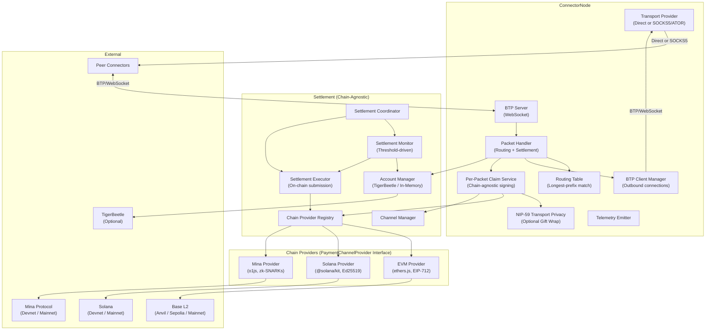
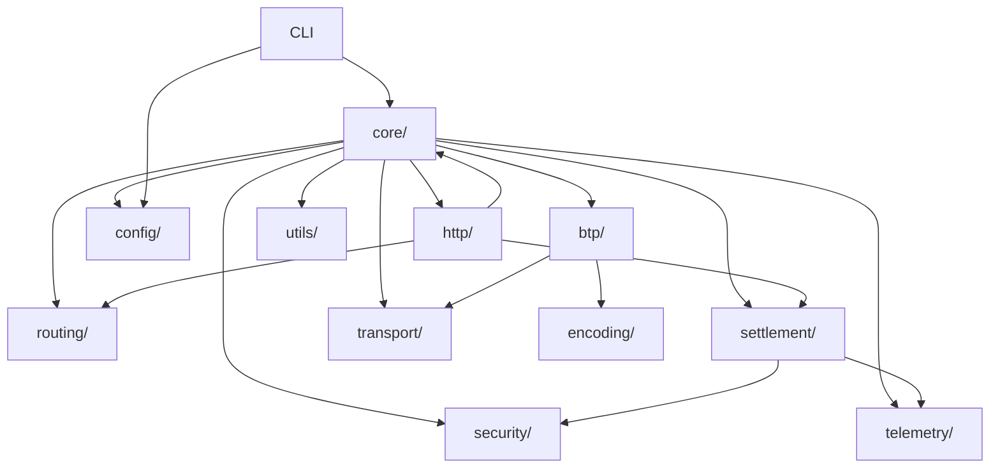
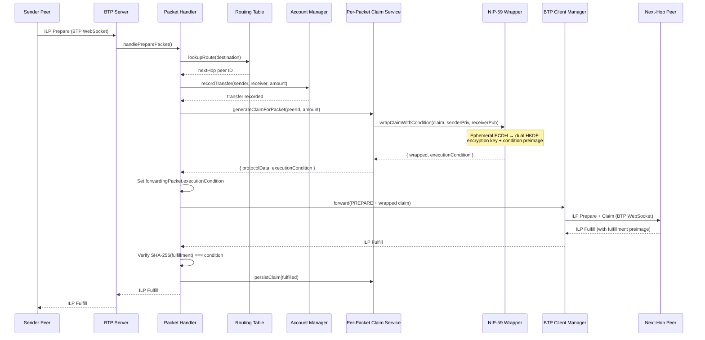
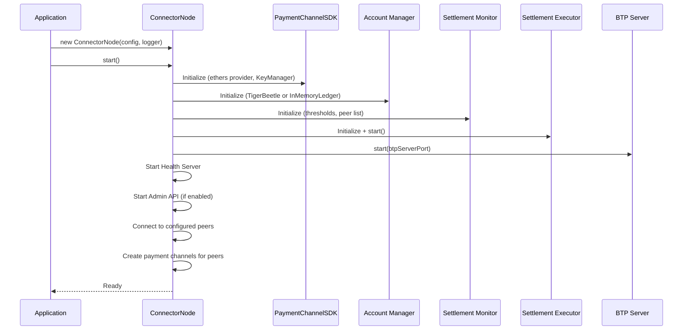
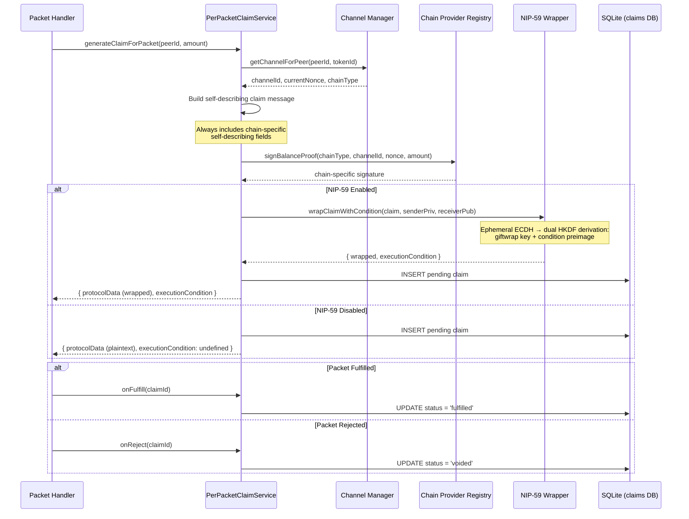
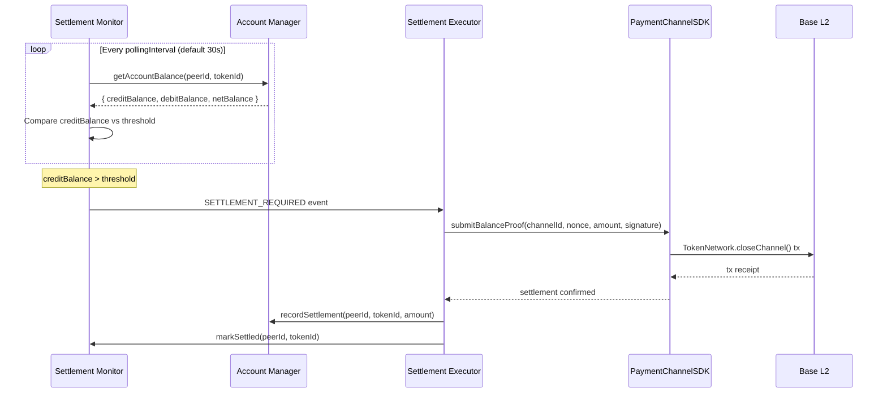
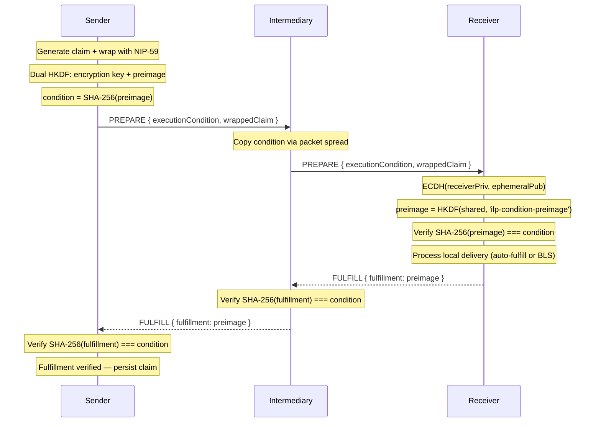

# Town Connector - Architecture Documentation

## Table of Contents

- [1. Introduction](#1-introduction)
- [2. High-Level Architecture](#2-high-level-architecture)
- [3. Monorepo Structure](#3-monorepo-structure)
- [4. Tech Stack](#4-tech-stack)
- [5. Connector Module Architecture](#5-connector-module-architecture)
- [6. Data Models](#6-data-models)
- [7. Core Workflows](#7-core-workflows)
- [8. Settlement Architecture](#8-settlement-architecture)
- [9. Configuration](#9-configuration)
- [10. Security](#10-security)
- [11. Error Handling](#11-error-handling)
- [12. Testing Strategy](#12-testing-strategy)
- [13. Key Design Decisions](#13-key-design-decisions)
- [14. RFC References](#14-rfc-references)

---

## 1. Introduction

**Town Connector** (`@toon-protocol/connector` v1.6.2) is a production-ready
Interledger Protocol (ILP) connector for machine-to-machine payment routing with
multi-chain settlement across EVM (Base L2), Solana, and Mina Protocol.

### Capabilities

- **ILP packet routing** — Longest-prefix matching with static routing tables and BTP transport (RFC-0023, RFC-0027)
- **Balance tracking** — Double-entry accounting via TigerBeetle or in-memory ledger with snapshot persistence
- **Multi-chain settlement** — Pluggable chain-provider architecture supporting EVM (Base L2), Solana, and Mina Protocol payment channels, with per-peer chain selection
- **Per-packet self-describing claims** — Every forwarded packet carries a chain-specific signed claim (EIP-712 for EVM, Ed25519 for Solana, zk-SNARK commitments for Mina) with full on-chain context, enabling permissionless channel verification
- **Transport privacy (NIP-59)** — Optional three-layer claim wrapping (Rumor → Seal → Gift Wrap) inspired by Nostr NIP-59, hiding sender identity, claim content, and timing from BTP intermediaries
- **ECDH-derived conditions & fulfillments** — When NIP-59 is enabled, the ephemeral key used for gift wrapping also derives an ILP execution condition via dual HKDF, cryptographically binding each fulfillment to the receiver's identity (only the holder of the receiver's private key can produce the preimage)
- **ZK-private settlement (Mina)** — Zero-knowledge balance proofs on Mina Protocol where transferred amounts are hidden on-chain via Poseidon commitments, verified by zk-SNARK proofs
- **Pluggable overlay transport (Epic 35)** — Optional SOCKS5-based transport via ATOR/Tor `.anon` hidden services for NAT traversal, IP privacy, and home-hosted connector operation on commodity hardware
- **Multi-deployment modes** — Library (embedded), CLI (standalone), or Docker container

### How to Read This Document

Sections 2-5 describe the static architecture (structure, modules, dependencies).
Sections 6-8 describe runtime behavior (data flow, settlement, claims).
Sections 9-12 cover operational concerns (config, security, testing).
Sections 13-14 capture rationale and standards compliance.

---

## 2. High-Level Architecture

### Architectural Style

Monorepo library with containerized deployment option. The primary artifact is an
npm package (`@toon-protocol/connector`) that can be imported as a library, run as a
CLI, or deployed as a Docker container.

### Principles

1. **Library-first** — The connector is designed to be embedded in application code via `new ConnectorNode(config, logger)`. Standalone mode is an opt-in deployment pattern.
2. **Observability-first** — Every packet, balance change, settlement event, and claim is emitted as a structured telemetry event.
3. **RFC-compliant** — Core protocols follow Interledger RFCs (ILPv4, BTP, OER encoding, ILP addressing).
4. **Multi-chain settlement** — Settlement uses a pluggable `PaymentChannelProvider` interface supporting EVM (Base L2), Solana, and Mina Protocol. New chains require only implementing the provider interface — no core settlement logic changes. Per-peer chain selection allows different peers to settle on different chains simultaneously.
5. **Privacy-by-design** — Optional NIP-59-inspired transport privacy for claim exchange (all chains) and zk-SNARK private balance proofs on Mina Protocol where transferred amounts are hidden on-chain.
6. **Pluggable transport** — Optional SOCKS5-based overlay transport (Epic 35) enables peering through ATOR/Tor `.anon` hidden services for NAT traversal and IP privacy. Default is direct TCP — zero behavioral change for existing deployments.

### System Diagram



### Primary Data Flow

1. Peer sends ILP Prepare packet over BTP WebSocket
2. BTPServer deserializes and passes to PacketHandler
3. PacketHandler queries RoutingTable for longest-prefix match
4. AccountManager records double-entry transfer (debit sender, credit receiver)
5. PerPacketClaimService delegates to the peer's chain provider for claim signing (EIP-712 for EVM, Ed25519 for Solana, Poseidon commitment for Mina)
6. Optionally, the claim is wrapped via NIP-59 Gift Wrap for transport privacy; when enabled, dual HKDF derivation from the same ephemeral key produces both the encryption key and an ILP execution condition (`SHA-256(HKDF(sharedSecret, info='ilp-condition-preimage'))`)
7. PacketHandler sets the ECDH-derived `executionCondition` on the forwarding PREPARE (or 32 zero bytes when NIP-59 is disabled)
8. PacketHandler forwards packet + claim to next-hop peer via BTPClientManager
9. On fulfillment return, PacketHandler verifies `SHA-256(fulfillment) === executionCondition` (skipped when condition is all zeros); claim is persisted to SQLite on success, voided on reject
10. SettlementMonitor polls balances and triggers on-chain settlement when thresholds are exceeded

---

## 3. Monorepo Structure

```
connector/
├── packages/
│   ├── connector/          # Core connector (main package)
│   ├── shared/             # ILP types, OER encoding, telemetry types
│   ├── contracts/          # EVM Solidity smart contracts (Foundry)
│   ├── solana-program/     # Solana payment channel program (Rust/Pinocchio)
│   ├── mina-zkapp/         # Mina payment channel zkApp (TypeScript/o1js)
│   └── faucet/             # Token faucet for local Anvil development
├── tools/
│   ├── send-packet/        # CLI tool for sending test packets
│   ├── fund-peers/         # CLI tool for funding peer accounts
│   ├── solana/             # Solana validator init scripts, keypairs, program deploy
│   └── mina/               # Mina lightnet init scripts, zkApp deploy
├── docker-compose.yml      # Multi-chain local blockchain infrastructure (Anvil, Solana, Mina)
├── Dockerfile              # Multi-stage build (builder → runtime)
└── Makefile                # Dev workflow (build, test, anvil-up/down, solana-up/down, mina-up/down)
```

### Packages

| Package                        | Path                      | Description                                                                                       |
| ------------------------------ | ------------------------- | ------------------------------------------------------------------------------------------------- |
| `@toon-protocol/connector`     | `packages/connector`      | Core ILP connector with BTP, routing, settlement                                                  |
| `@toon-protocol/shared` v1.2.0 | `packages/shared`         | ILP packet types, OER encoding/decoding, telemetry event types, routing types                     |
| `contracts`                    | `packages/contracts`      | EVM Solidity contracts: `TokenNetwork.sol`, `TokenNetworkRegistry.sol` (Foundry, Solidity 0.8.26) |
| `solana-program`               | `packages/solana-program` | Solana payment channel on-chain program (Rust/Pinocchio, Ed25519 claim verification)              |
| `mina-zkapp`                   | `packages/mina-zkapp`     | Mina payment channel zkApp (TypeScript/o1js, zk-SNARK private balance proofs)                     |
| `@toon-protocol/faucet`        | `packages/faucet`         | Token faucet web service for local Anvil development (ETH + USDC distribution)                    |

### Tools

| Tool          | Path                | Description                                                       |
| ------------- | ------------------- | ----------------------------------------------------------------- |
| `send-packet` | `tools/send-packet` | Send ILP Prepare packets to a connector for testing               |
| `fund-peers`  | `tools/fund-peers`  | Fund peer EVM accounts with test tokens                           |
| `solana`      | `tools/solana`      | Solana validator init scripts, keypair generation, program deploy |
| `mina`        | `tools/mina`        | Mina lightnet init scripts, zkApp deploy, account management      |

### Local Blockchain Infrastructure

The project includes self-contained Docker infrastructure for local multi-chain development and integration testing. Each chain runs in its own Docker Compose profile, allowing selective startup per-epic or all-at-once.

| Service                | Image                                         | Ports            | Profile  | Purpose                                                          |
| ---------------------- | --------------------------------------------- | ---------------- | -------- | ---------------------------------------------------------------- |
| **anvil**              | `ghcr.io/foundry-rs/foundry:latest`           | 8545             | `evm`    | Local Ethereum node (Anvil) with auto-deployed contracts         |
| **faucet**             | `packages/faucet/Dockerfile`                  | 3500             | `evm`    | Web UI + API for distributing test ETH and USDC tokens           |
| **solana**             | `ghcr.io/beeman/solana-test-validator:latest` | 8899, 8900, 9900 | `solana` | Local Solana validator with auto-deployed programs               |
| **mina-local-network** | `o1labs/mina-local-network:o1js-main`         | 3085, 8181, 8282 | `mina`   | Local Mina network (lightnet) with accounts manager and explorer |

Managed via `docker-compose.yml` at the project root with Docker Compose profiles:

```bash
# EVM (existing)
make anvil-up      # Start Anvil + Faucet (contracts auto-deploy)
make anvil-down    # Stop EVM services
make anvil-logs    # Follow EVM logs

# Solana (Epic 33)
make solana-up     # Start Solana test validator (program auto-deploy)
make solana-down   # Stop Solana validator
make solana-logs   # Follow Solana logs

# Mina (Epic 34)
make mina-up       # Start Mina lightnet (wait for SYNCED)
make mina-down     # Stop Mina network
make mina-logs     # Follow Mina logs

# All chains
make infra-up      # Start all blockchain services
make infra-down    # Stop all blockchain services
```

**Important constraints:**

- **Solana** requires `security_opt: seccomp=unconfined` in Docker (Agave v2+ uses `io_uring`)
- **Mina** requires 4-8 GB RAM and ~120s startup time (`start_period: 120s`); port 5432 (archive PostgreSQL) should be remapped to 5433 to avoid conflicts with local Postgres
- **Selective startup** is recommended during development — a developer working on Epic 33 should not need Mina running and vice versa

#### EVM (Anvil)

On startup, Anvil deploys the `DeployLocal.s.sol` script which creates a USDC token at the deterministic address `0x5FbDB2315678afecb367f032d93F642f64180aa3` and a TokenNetwork registry. The faucet distributes 100 ETH + 10,000 USDC per request from Anvil's well-known accounts.

#### Solana Test Validator

The Solana service uses `ghcr.io/beeman/solana-test-validator:latest` (nightly Agave builds, multi-arch amd64 + arm64 for Apple Silicon). On startup, the init script:

1. Starts `solana-test-validator --reset` with `--limit-ledger-size 50000000`
2. Waits for validator readiness (`solana cluster-version`)
3. Airdrops 1000 SOL to the default keypair
4. Deploys any `.so` program files from `target/deploy/` (mounted as `/programs`)

SPL Token and Token-2022 programs are built-in to the validator (Solana v1.17+) — no clone required.

| Resource           | Value                   | Source                     |
| ------------------ | ----------------------- | -------------------------- |
| JSON-RPC           | `http://localhost:8899` | Solana validator           |
| WebSocket          | `ws://localhost:8900`   | Solana validator           |
| Faucet             | Port 9900               | Solana validator built-in  |
| Program deploy dir | `target/deploy/`        | Volume mount → `/programs` |

#### Mina Lightnet

The Mina service uses `o1labs/mina-local-network:o1js-main` running a single-node Mina network with archive node and GraphQL API. On startup, the network takes 1-3 minutes to reach `SYNCED` status.

Pre-funded test accounts are acquired via the accounts manager HTTP API:

```bash
curl -s http://localhost:8181/acquire-account | jq
# Returns: { "pk": "B62q...", "sk": "EKE...", "balance": "1000" }
```

| Resource           | Value                           | Source                |
| ------------------ | ------------------------------- | --------------------- |
| GraphQL endpoint   | `http://localhost:3085/graphql` | Mina daemon           |
| Accounts manager   | `http://localhost:8181`         | Lightnet accounts API |
| Explorer UI        | `http://localhost:8282`         | Mina explorer         |
| Archive PostgreSQL | `localhost:5433` (remapped)     | Archive node          |

#### Public Testnets

For integration testing beyond local development:

| Chain      | Testnet      | Endpoint                                         | Faucet                                            |
| ---------- | ------------ | ------------------------------------------------ | ------------------------------------------------- |
| **EVM**    | Base Sepolia | `https://sepolia.base.org`                       | Bridge from Sepolia                               |
| **Solana** | Devnet       | `https://api.devnet.solana.com`                  | `solana airdrop 2` (rate-limited ~5 SOL/hr)       |
| **Mina**   | Devnet       | `https://api.minascan.io/node/devnet/v1/graphql` | `https://faucet.minaprotocol.com/?network=devnet` |

---

## 4. Tech Stack

| Category                  | Technology                                        | Version           |
| ------------------------- | ------------------------------------------------- | ----------------- |
| Language                  | TypeScript                                        | ^5.3.3            |
| Runtime                   | Node.js                                           | >=22.11.0         |
| Transport                 | WebSocket (ws)                                    | ^8.16.0           |
| Transport (overlay)       | socks-proxy-agent, @anyone-protocol/anyone-client | latest            |
| HTTP                      | Express                                           | 4.18.x            |
| EVM                       | ethers.js                                         | ^6.16.0           |
| Logging                   | pino                                              | ^8.21.0           |
| Config                    | js-yaml                                           | ^4.1.0            |
| Validation                | zod                                               | ^3.25.76          |
| Database (claims)         | better-sqlite3                                    | ^11.8.1           |
| Accounting (optional)     | TigerBeetle                                       | 0.16.68           |
| Smart Contracts (EVM)     | Solidity 0.8.26 (Foundry)                         | —                 |
| Smart Contracts (Solana)  | Rust (Pinocchio / native)                         | —                 |
| Smart Contracts (Mina)    | TypeScript (o1js zkApps)                          | —                 |
| Solana SDK                | @solana/kit (renamed from @solana/web3.js v2)     | ^3.0.3            |
| Solana Token SDK          | @solana-program/token, @solana-program/token-2022 | latest            |
| Solana Test (TS)          | solana-bankrun (in-process BanksClient for Node)  | latest            |
| Solana Test (Rust)        | solana-program-test (BanksClient)                 | ^3.1              |
| Mina SDK                  | o1js                                              | latest            |
| Transport Privacy         | @noble/ciphers, @noble/hashes, @noble/secp256k1   | latest            |
| AI (optional)             | @ai-sdk/anthropic, @ai-sdk/openai                 | ^1.2.12 / ^1.3.24 |
| Observability (optional)  | OpenTelemetry, prom-client                        | ^1.9.0 / ^15.1.0  |
| Key Management (optional) | AWS KMS, GCP KMS, Azure Key Vault                 | —                 |
| Testing                   | Jest + ts-jest                                    | ^29.7.0 / ^29.1.2 |
| Build                     | tsc, tsx, Vite                                    | —                 |

---

## 5. Connector Module Architecture

The connector source lives in `packages/connector/src/` with 17 module directories:

| Module        | Directory        | Description                                                                                                |
| ------------- | ---------------- | ---------------------------------------------------------------------------------------------------------- |
| Core          | `core/`          | `ConnectorNode` orchestrator, `PacketHandler` routing/forwarding, `PaymentHandler`                         |
| BTP           | `btp/`           | BTP server, client, client manager, claim types (RFC-0023)                                                 |
| Routing       | `routing/`       | `RoutingTable` with longest-prefix matching                                                                |
| Settlement    | `settlement/`    | Payment channels, claim signing, accounting, monitoring, execution, coordination                           |
| Wallet        | `wallet/`        | Treasury wallet, seed manager, wallet auth/security, audit logger, fraud detector, rate limiter            |
| Security      | `security/`      | `KeyManager` (5 backends), `KeyRotationManager`, fraud detection rules, rate limiting, reputation tracking |
| HTTP          | `http/`          | Health server, admin API server, admin REST endpoints                                                      |
| Config        | `config/`        | `ConfigLoader`, YAML parsing, type definitions                                                             |
| Telemetry     | `telemetry/`     | `TelemetryEmitter`, structured event types                                                                 |
| Observability | `observability/` | Prometheus metrics, OpenTelemetry tracing                                                                  |
| CLI           | `cli/`           | Command-line interface (`connector` binary)                                                                |
| Encoding      | `encoding/`      | OER encoding utilities (RFC-0030)                                                                          |
| Facilitator   | `facilitator/`   | SPSP client for payment setup (RFC-0009)                                                                   |
| Transport     | `transport/`     | `TransportProvider` abstraction: `DirectTransportProvider` (default) and `SocksTransportProvider` (ATOR/Tor SOCKS5 overlay) (Epic 35) |
| Discovery     | `discovery/`     | `PeerDiscoveryService` for dynamic peer discovery                                                          |
| Performance   | `performance/`   | Batching, buffering, connection pooling for high TPS                                                       |
| Utils         | `utils/`         | Logger, optional-require, general utilities                                                                |
| Test Utils    | `test-utils/`    | Test helpers, mocks, fixtures                                                                              |

### Module Dependency Graph



---

## 6. Data Models

### ILP Packets (`@toon-protocol/shared`)

| Type               | Fields                                                                                                        | RFC      |
| ------------------ | ------------------------------------------------------------------------------------------------------------- | -------- |
| `ILPPreparePacket` | `destination`, `amount` (bigint), `executionCondition?` (32-byte, ECDH-derived when NIP-59 enabled), `expiresAt`, `data` | RFC-0027 |
| `ILPFulfillPacket` | `fulfillment?` (32-byte preimage, ECDH-derived when NIP-59 enabled), `data`                                   | RFC-0027 |
| `ILPRejectPacket`  | `code` (ILPErrorCode), `triggeredBy`, `message`, `data`                                                       | RFC-0027 |

Both `executionCondition` and `fulfillment` are TypeScript-optional fields. OER serialization defaults to 32 zero bytes when absent (backward compatible). When NIP-59 is enabled, the condition is derived via `SHA-256(HKDF(ECDH_shared_secret, info='ilp-condition-preimage'))` and the fulfillment is the corresponding HKDF preimage — only derivable by the receiver who holds the matching secp256k1 private key.

### BTP Claim Messages (`btp/btp-claim-types.ts`)

Claims are **always self-describing**. Every claim includes the on-chain context needed for the receiver to verify it without pre-registration. The `chainId`, `tokenNetworkAddress`, and `tokenAddress` fields are TypeScript optionals for backward compatibility with legacy peers, but **all new code, tests, and integrations must always populate them**.

```typescript
interface EVMClaimMessage {
  version: '1.0';
  blockchain: 'evm';
  messageId: string;
  timestamp: string; // ISO 8601
  senderId: string; // Peer ID
  channelId: string; // bytes32 hex (0x-prefixed)
  nonce: number; // Monotonically increasing
  transferredAmount: string; // Cumulative (bigint as string)
  lockedAmount: string;
  locksRoot: string; // 32-byte hex
  signature: string; // EIP-712 typed signature
  signerAddress: string; // 0x-prefixed Ethereum address
  // Self-describing fields (always populated; TypeScript optional for legacy compat only)
  chainId?: number; // EVM chain ID (e.g. 8453 for Base, 31337 for Anvil)
  tokenNetworkAddress?: string; // TokenNetwork contract address
  tokenAddress?: string; // ERC20 token address
}
```

Claims are transmitted via BTP protocolData with protocol name `payment-channel-claim` and content type `1` (JSON). The self-describing fields are cryptographically bound to the EIP-712 signature via the domain separator (`chainId` and `tokenNetworkAddress` are part of the signing domain), preventing spoofing.

### Configuration Types (`config/types.ts`)

Key interfaces:

- `ConnectorConfig` — Top-level config (nodeId, peers, routes, settlement, adminApi, deploymentMode)
- `PeerConfig` — Peer connection (id, url, authToken, evmAddress, nip59PublicKey, nip59Enabled)
- `RouteConfig` — Static route (prefix, nextHop, priority)
- `SettlementConfig` — TigerBeetle accounting params (fees, credit limits, thresholds)
- `SettlementInfraConfig` — EVM infrastructure params (rpcUrl, registryAddress, privateKey, threshold)
- `AdminApiConfig` — Admin REST API (port, apiKey, allowedIPs, trustProxy)
- `DeploymentMode` — `'embedded' | 'standalone'`

### Settlement Types (`settlement/types.ts`)

- `PeerConfig` (settlement) — Peer settlement preferences, EVM address, token/chain info
- `AdminSettlementConfig` — Settlement params received via admin API
- `ChannelMetadata` — Channel state tracking (channelId, status, deposits, nonces)

---

## 7. Core Workflows

### Packet Forwarding (Multi-Hop) with Per-Packet Claims



### Connector Startup Sequence



### Per-Packet Self-Describing Claim Flow

Every forwarded packet carries a self-describing chain-specific signed claim. The `blockchain` discriminator routes to the correct chain provider for signing (EIP-712 for EVM, Ed25519 for Solana, zk-SNARK commitment for Mina). All claims include chain-specific self-describing fields so receivers can dynamically verify unknown channels on-chain.



### Settlement Lifecycle



---

## 8. Settlement Architecture

### Overview

Settlement uses a pluggable **chain-provider architecture** supporting multiple blockchains simultaneously. All chain-specific logic is encapsulated behind the `PaymentChannelProvider` interface, allowing per-peer chain selection. Currently supported chains:

| Chain             | Provider                       | Signature Scheme            | On-Chain Program                      | Privacy                              |
| ----------------- | ------------------------------ | --------------------------- | ------------------------------------- | ------------------------------------ |
| **EVM (Base L2)** | `EVMPaymentChannelProvider`    | EIP-712 (secp256k1)         | `TokenNetwork.sol` (Solidity/Foundry) | Public amounts                       |
| **Solana**        | `SolanaPaymentChannelProvider` | Ed25519 (native precompile) | Rust program (Pinocchio/native)       | Public amounts                       |
| **Mina Protocol** | `MinaPaymentChannelProvider`   | Poseidon + zk-SNARK         | TypeScript zkApp (o1js)               | **Private amounts** (ZK commitments) |

Adding a new chain requires only implementing the `PaymentChannelProvider` interface and registering it with the `ChainProviderRegistry`.

### Chain Abstraction Layer (Epic 32)

The settlement subsystem is chain-agnostic. Core services (`PerPacketClaimService`, `SettlementMonitor`, `SettlementExecutor`, `ClaimReceiver`) delegate chain-specific operations to the appropriate provider via the `ChainProviderRegistry`.

```typescript
interface PaymentChannelProvider {
  readonly chainType: BlockchainType;
  openChannel(params: OpenChannelParams): Promise<ChannelMetadata>;
  deposit(channelId: string, amount: bigint): Promise<TxReceipt>;
  claimFromChannel(channelId: string, proof: BalanceProof): Promise<TxReceipt>;
  closeChannel(channelId: string): Promise<TxReceipt>;
  settleChannel(channelId: string): Promise<TxReceipt>;
  signBalanceProof(params: SignParams): Promise<BalanceProof>;
  verifyBalanceProof(proof: BalanceProof): Promise<boolean>;
  getChannelState(channelId: string): Promise<ChannelState>;
  subscribeToEvents(callback: EventCallback): Unsubscribe;
}
```

### Components

| Component                      | File                                        | Purpose                                                                     |
| ------------------------------ | ------------------------------------------- | --------------------------------------------------------------------------- |
| `ChainProviderRegistry`        | `settlement/chain-provider-registry.ts`     | Manages chain provider instances by chain type; dynamic registration/lookup |
| `PaymentChannelProvider`       | `settlement/payment-channel-provider.ts`    | Interface all chain providers implement                                     |
| `EVMPaymentChannelProvider`    | `settlement/providers/evm/`                 | EVM provider: ethers.js, EIP-712 signing, TokenNetwork contract interaction |
| `SolanaPaymentChannelProvider` | `settlement/providers/solana/`              | Solana provider: @solana/kit v3, Ed25519 signing, PDA-based channels        |
| `MinaPaymentChannelProvider`   | `settlement/providers/mina/`                | Mina provider: o1js, zk-SNARK proof generation, Poseidon commitments        |
| `NIP59ClaimWrapper`            | `settlement/privacy/`                       | NIP-59 three-layer claim wrapping + dual HKDF for ECDH-derived conditions (all chains) |
| `ChannelManager`               | `settlement/channel-manager.ts`             | Channel lifecycle (create, deposit, close), peer-to-channel mapping         |
| `PerPacketClaimService`        | `settlement/per-packet-claim-service.ts`    | Chain-agnostic claim signing — delegates to provider via registry           |
| `ClaimReceiver`                | `settlement/claim-receiver.ts`              | Validates incoming claims — dispatches to correct provider for verification |
| `ClaimSender`                  | `settlement/claim-sender.ts`                | Manages outbound claim delivery with optional NIP-59 wrapping               |
| `ClaimRedemptionService`       | `settlement/claim-redemption-service.ts`    | Redeems accumulated claims on-chain via provider                            |
| `EIP712Helper`                 | `settlement/eip712-helper.ts`               | EIP-712 typed data construction and signature utilities (EVM-specific)      |
| `AccountManager`               | `settlement/account-manager.ts`             | Double-entry balance tracking (TigerBeetle or InMemoryLedger)               |
| `AccountIdGenerator`           | `settlement/account-id-generator.ts`        | Generates unique account IDs for ledger entries                             |
| `AccountMetadata`              | `settlement/account-metadata.ts`            | Account metadata management and storage                                     |
| `LedgerClient`                 | `settlement/ledger-client.ts`               | Abstract ledger client interface                                            |
| `SettlementMonitor`            | `settlement/settlement-monitor.ts`          | Polls balances, emits SETTLEMENT_REQUIRED when threshold exceeded           |
| `SettlementExecutor`           | `settlement/settlement-executor.ts`         | Executes on-chain settlement transactions                                   |
| `SettlementCoordinator`        | `settlement/settlement-coordinator.ts`      | Coordinates settlement workflow across monitor and executor                 |
| `SettlementApi`                | `settlement/settlement-api.ts`              | REST API endpoints for settlement operations                                |
| `UnifiedSettlementExecutor`    | `settlement/unified-settlement-executor.ts` | Unified settlement orchestration                                            |
| `MetricsCollector`             | `settlement/metrics-collector.ts`           | Collects and exposes settlement metrics                                     |
| `TigerBeetleClient`            | `settlement/tigerbeetle-client.ts`          | TigerBeetle connection and transfer operations                              |
| `TigerBeetleBatchWriter`       | `settlement/tigerbeetle-batch-writer.ts`    | Batched write operations for TigerBeetle                                    |
| `TigerBeetleErrors`            | `settlement/tigerbeetle-errors.ts`          | TigerBeetle-specific error types and handling                               |
| `InMemoryLedgerClient`         | `settlement/in-memory-ledger-client.ts`     | In-memory ledger with JSON snapshot persistence (fallback)                  |

### Channel Registration and Discovery

Channels are discovered and registered through three methods, listed by expected frequency:

1. **Dynamic verification (self-describing claims)** — The primary path. When a claim arrives for an unknown channel, the receiver uses the claim's self-describing fields to query the on-chain state via the appropriate chain provider, verify the channel exists and is open, confirm the signer is a participant, and validate the signature. Once verified, the channel is cached in `ChannelManager` for fast-path lookups on subsequent claims.
2. **At-connection** — Channels created automatically when BTP peers connect (if settlement infrastructure is enabled)
3. **Admin API** — `POST /admin/channels` with explicit channel parameters (manual override)

### Self-Describing Claims (Multi-Chain)

All claims are self-describing. The `blockchain` discriminator field determines which chain provider handles verification. Each chain type includes chain-specific self-describing fields:

**EVM Claim:**

```json
{
  "version": "1.0",
  "blockchain": "evm",
  "channelId": "0x...",
  "nonce": 42,
  "transferredAmount": "1000000",
  "signature": "0x...",
  "signerAddress": "0x...",
  "chainId": 8453,
  "tokenNetworkAddress": "0x...",
  "tokenAddress": "0x..."
}
```

**Solana Claim:**

```json
{
  "version": "1.0",
  "blockchain": "solana",
  "channelPDA": "...",
  "nonce": 42,
  "transferredAmount": "1000000",
  "signature": "...",
  "signerPubkey": "...",
  "programId": "...",
  "tokenMint": "...",
  "cluster": "mainnet-beta"
}
```

**Mina Claim (ZK-Private):**

```json
{
  "version": "1.0",
  "blockchain": "mina",
  "channelHash": "...",
  "nonce": 42,
  "balanceCommitment": "...",
  "proof": "<serialized zk-SNARK>",
  "zkAppAddress": "...",
  "tokenId": "...",
  "network": "mainnet"
}
```

Note: Mina claims use `balanceCommitment` (a Poseidon hash) instead of `transferredAmount` — the actual amount is a private input to the zk-SNARK proof and never appears on-chain or in the claim.

**Design invariants:**

- Self-describing fields are **always populated** by the sender for all chain types
- These fields are cryptographically bound to the signature (EIP-712 domain for EVM, Ed25519 message for Solana, zk-SNARK public inputs for Mina), preventing spoofing
- The receiver dispatches to the correct chain provider based on the `blockchain` discriminator
- The provider verifies unknown channels on-chain using the self-describing fields, then caches the result
- Any integration test, mock, or fixture that creates claims **must include all chain-specific self-describing fields**

### NIP-59 Transport Privacy (Optional, All Chains)

Claims can optionally be wrapped using a three-layer encryption scheme inspired by Nostr NIP-59 Gift Wrap. This is a **transport-layer concern** independent of the chain provider — it protects claim content on the BTP wire regardless of which chain is used for settlement.

| Layer                     | Purpose                                                     | Key                       |
| ------------------------- | ----------------------------------------------------------- | ------------------------- |
| **Rumor**                 | Unsigned claim payload (provides deniability)               | None (unsigned)           |
| **Seal** (kind 13)        | Encrypted to peer, signed by real sender                    | Sender's secp256k1 key    |
| **Gift Wrap** (kind 1059) | Encrypted with ephemeral one-time key, randomized timestamp | Ephemeral key (discarded) |

**What transport privacy hides:**

| Data                      | Without NIP-59                 | With NIP-59                 |
| ------------------------- | ------------------------------ | --------------------------- |
| Claim amounts/commitments | Visible to BTP relay           | Encrypted                   |
| Sender identity           | Visible (signerAddress/pubkey) | Hidden behind ephemeral key |
| Timing correlation        | Real timestamps                | Randomized                  |

**What transport privacy does NOT affect:**

- ILP packet routing (amounts, destinations) — stays cleartext for fee deduction and routing
- On-chain settlement — determined by the chain provider, not transport layer

**What transport privacy enables (when active):**

- **ECDH-derived conditions & fulfillments** — The ephemeral key in the gift wrap layer serves double duty: it derives both the claim encryption key and the ILP condition preimage via dual HKDF derivation (see next section). This adds packet integrity verification at zero wire overhead.

Configurable per-peer via `nip59Enabled: true` in peer configuration.

### ECDH-Derived Conditions & Fulfillments (When NIP-59 Enabled)

When NIP-59 is active, the ephemeral key already used for gift wrapping serves double duty: a single ECDH shared secret is split via dual HKDF derivation into both the claim encryption key and an ILP condition preimage. This adds **zero additional bytes on the wire** — the preimage is implicit in the ephemeral key already transmitted.

**Derivation:**

```
ephemeralPrivKey  = randomBytes(32)                    // fresh per packet
sharedSecret      = ECDH(ephemeralPrivKey, receiverPub) // secp256k1 x-coord
encryptionKey     = HKDF(sharedSecret, info='nip59-giftwrap')        // claim encryption
conditionPreimage = HKDF(sharedSecret, info='ilp-condition-preimage') // fulfillment preimage
executionCondition = SHA-256(conditionPreimage)          // ILP condition
```

**Why this is stronger than classic ILP:** In standard ILPv4, the preimage is an arbitrary shared secret — any party who learns it can produce a valid fulfillment. Here, the preimage is derived from `ECDH(receiverPrivateKey, ephemeralPublicKey)` — only the holder of the receiver's secp256k1 private key can compute it. The fulfillment is **identity-bound**, not merely knowledge-bound.

**Three-role packet flow:**



**Role responsibilities:**

| Role             | PREPARE path                                                           | FULFILL return path                                                       |
| ---------------- | ---------------------------------------------------------------------- | ------------------------------------------------------------------------- |
| **Sender**       | Generate claim, wrap with `wrapClaimWithCondition()`, set condition     | Verify `SHA-256(fulfillment) === condition`; reject with F99 on mismatch  |
| **Intermediary** | Copy condition via `{ ...packet, expiresAt }` spread (automatic)       | Verify `SHA-256(fulfillment) === condition`; reject with F99 on mismatch  |
| **Receiver**     | Derive preimage via `unwrapClaimWithPreimage()` using node private key | Inject preimage as `fulfillment` on FULFILL before returning              |

**Backward compatibility:**

- When NIP-59 is disabled: `executionCondition` is undefined, OER serializes 32 zero bytes, fulfillment verification is skipped
- Zero-byte condition = skip verification (supports legacy peers and mixed-mode networks)
- Existing `wrapClaim()` / `unwrapClaim()` methods remain for backward compatibility

### Smart Contracts & On-Chain Programs

| Program                    | Language          | Path                       | Purpose                                                                       |
| -------------------------- | ----------------- | -------------------------- | ----------------------------------------------------------------------------- |
| `TokenNetwork.sol`         | Solidity 0.8.26   | `packages/contracts/src/`  | EVM payment channel operations (open, deposit, claim, close, settle)          |
| `TokenNetworkRegistry.sol` | Solidity 0.8.26   | `packages/contracts/src/`  | Registry for TokenNetwork instances per ERC-20 token                          |
| Solana Payment Channel     | Rust (Pinocchio)  | `packages/solana-program/` | Solana payment channel (PDA-based, Ed25519 claim verification via precompile) |
| Mina Payment Channel       | TypeScript (o1js) | `packages/mina-zkapp/`     | Mina zkApp with zk-SNARK private balance proofs (Poseidon commitments)        |

EVM contracts are compiled and tested with **Foundry** (`forge build`, `forge test`). Solana programs are compiled with `cargo build-sbf` and tested with `solana-program-test` BanksClient (Rust) and `solana-bankrun` (TypeScript). Mina zkApps are tested with `Mina.LocalBlockchain()` (o1js in-process simulation) and `mina-local-network` (Docker lightnet for E2E).

---

## 9. Configuration

### Sources (Precedence: highest to lowest)

1. **Environment variables** — Override any config value
2. **YAML file** — Passed as path to `ConnectorNode` constructor
3. **Programmatic object** — Passed directly to `ConnectorNode` constructor
4. **Defaults** — Built-in defaults in `ConfigLoader`

### Minimal YAML Example

```yaml
nodeId: my-connector
btpServerPort: 3000
environment: development

peers:
  - id: peer1
    url: ws://peer1:3001
    authToken: secret-token

routes:
  - prefix: g.peer1
    nextHop: peer1
```

### Deployment Modes

| Mode           | Declaration                  | Packet Input                                | Packet Output                  | Admin API          |
| -------------- | ---------------------------- | ------------------------------------------- | ------------------------------ | ------------------ |
| **Embedded**   | `deploymentMode: embedded`   | `setPacketHandler()` callback               | `node.sendPacket()`            | Typically disabled |
| **Standalone** | `deploymentMode: standalone` | HTTP POST to BLS `/handle-packet`           | HTTP POST to `/admin/ilp/send` | Enabled            |
| **Inferred**   | (omitted)                    | Based on `localDelivery` + `adminApi` flags | Based on flags                 | Based on flags     |

### Key ConnectorConfig Fields

| Field             | Type                  | Default              | Description                                             |
| ----------------- | --------------------- | -------------------- | ------------------------------------------------------- |
| `nodeId`          | string                | required             | Unique connector identifier                             |
| `btpServerPort`   | number                | required             | BTP WebSocket listen port                               |
| `healthCheckPort` | number                | 8080                 | HTTP health endpoint port                               |
| `logLevel`        | string                | `'info'`             | `debug`, `info`, `warn`, `error`                        |
| `environment`     | string                | `'development'`      | `development`, `staging`, `production`                  |
| `deploymentMode`  | string                | inferred             | `embedded` or `standalone`                              |
| `peers`           | PeerConfig[]          | required             | Peer connector definitions                              |
| `routes`          | RouteConfig[]         | required             | Static routing table                                    |
| `settlement`      | SettlementConfig      | —                    | TigerBeetle accounting params                           |
| `settlementInfra` | SettlementInfraConfig | —                    | EVM settlement infrastructure                           |
| `adminApi`        | AdminApiConfig        | `{ enabled: false }` | Admin REST API settings                                 |
| `localDelivery`   | LocalDeliveryConfig   | `{ enabled: false }` | HTTP packet forwarding to BLS                           |
| `mode`            | string                | `'connector'`        | `connector` (standard) or `gateway` (messaging gateway) |
| `security`        | SecurityConfig        | —                    | Key management backend configuration                    |
| `performance`     | PerformanceConfig     | —                    | High-throughput optimization (batching, pooling)        |
| `blockchain`      | BlockchainConfig      | —                    | Base L2 chain configuration                             |
| `nip59`           | `{ enabled: boolean }`| —                    | Global NIP-59 transport privacy toggle                  |
| `transport`       | TransportConfig   | `{ type: 'direct' }` | Transport provider config: `direct` (default) or `socks5` (ATOR/Tor overlay, Epic 35) |

**Per-Peer NIP-59 Fields** (in `PeerConfig`):

| Field            | Type    | Default     | Description                                              |
| ---------------- | ------- | ----------- | -------------------------------------------------------- |
| `nip59PublicKey`  | string  | —           | Peer's 33-byte compressed secp256k1 public key (hex)     |
| `nip59Enabled`   | boolean | `false`     | Per-peer toggle for NIP-59 wrapping and ECDH conditions  |

---

## 10. Security

### Authentication

- **BTP auth** — Shared secret tokens for peer-to-peer WebSocket connections (accepts empty string by default)
- **Admin API** — Optional API key via `X-Api-Key` header
- **IP allowlisting** — CIDR-based access control for admin API (checked before API key)
- **Deployment mode restrictions** — Embedded mode disables external HTTP interfaces by default

### Fraud Detection (Multi-Chain)

- **Duplicate claim detection** — Claims with previously-seen messageIds are rejected (all chains)
- **Nonce validation** — Claim nonces must be monotonically increasing per channel (all chains)
- **Signature verification** — Dispatched to correct chain provider: EIP-712 `ecrecover` for EVM, Ed25519 precompile introspection for Solana, zk-SNARK proof verification for Mina
- **Balance proof validation** — Transferred amounts must be non-decreasing (cumulative) for EVM/Solana; commitment consistency verified via zk proof for Mina
- **Replay protection** — Channel ID + nonce + blockchain type prevent cross-chain and within-chain replay
- **NIP-59 unwrapping validation** — If transport privacy is enabled, Gift Wrap must decrypt successfully with valid ephemeral key before claim is processed
- **ECDH-derived fulfillment verification** — When NIP-59 is enabled, each PREPARE carries an `executionCondition` derived from the ephemeral ECDH shared secret. On the return path, every node (sender and intermediaries) verifies `SHA-256(fulfillment) === executionCondition`. Mismatches produce an `F99_APPLICATION_ERROR` rejection. Because the preimage is derived from `ECDH(receiverPrivateKey, ephemeralPublicKey)`, only the intended receiver can produce a valid fulfillment — this is stronger than classic ILP where any party who learns the preimage can fabricate a FULFILL

### Additional Security

- Credit limits with per-peer and per-token granularity (configurable ceiling)
- Rate limiting on admin API endpoints
- Structured logging with correlation IDs (no sensitive data in logs)
- Production validation rejects known development private keys

---

## 11. Error Handling

### ILP Error Codes (RFC-0027)

| Prefix | Meaning           | Examples                                                                   |
| ------ | ----------------- | -------------------------------------------------------------------------- |
| `F__`  | Final (permanent) | `F00` Bad Request, `F01` Invalid Packet, `F02` Unreachable                 |
| `T__`  | Temporary (retry) | `T00` Internal Error, `T01` Peer Unreachable, `T04` Insufficient Liquidity |
| `R__`  | Relative (amount) | `R01` Insufficient Source Amount, `R02` Insufficient Timeout               |

### BTP Reconnection

Failed BTP connections use exponential backoff with jitter. The `BTPClientManager` automatically retries peer connections in the background without blocking connector startup.

### Resilience Patterns

- **Non-blocking telemetry** — Telemetry failures never prevent packet forwarding
- **Graceful settlement degradation** — If payment channel infrastructure fails to initialize, the connector continues without settlement
- **Structured logging** — All log entries include correlation IDs (`event`, `nodeId`, `peerId`) for distributed tracing

---

## 12. Testing Strategy

### Framework

Jest + ts-jest with co-located test files (`*.test.ts` next to source).

### Test Types

| Type        | Command                    | Scope                                                      | Mocks Allowed |
| ----------- | -------------------------- | ---------------------------------------------------------- | ------------- |
| Unit        | `npm test`                 | Individual modules, isolated logic                         | Yes           |
| Integration | `npm run test:integration` | Multi-module workflows against real local blockchain infra | **No**        |

### Key Rule: Integration Tests Never Use Mocks

**Integration tests run against real infrastructure — never mocks.** Local blockchain infrastructure provides deterministic, fast, cost-free environments that eliminate the need for mocked chain interactions in integration tests.

This applies to **all three chains**:

- **EVM** — Real Anvil blockchain with deployed Solidity contracts
- **Solana** — Real `solana-test-validator` with deployed Rust programs (or `solana-bankrun` for fast in-process tests)
- **Mina** — Real `o1js` local blockchain simulation (or lightnet for full E2E)

For each chain, integration tests use:

- **Real smart contracts / programs / zkApps** — deployed to local infrastructure
- **Real transactions** — channel operations execute against real on-chain code
- **Real signatures** — EIP-712 (EVM), Ed25519 (Solana), zk-SNARK proofs (Mina)
- **Real balances** — token transfers and balance queries hit real chain state
- **Real claim flow** — self-describing claims verified against on-chain channel state

If a test needs a running blockchain, it is an integration test. If it does not, it is a unit test.

### Multi-Chain Test Pyramid

Each chain has three test tiers. The key principle: **use the fastest harness that validates the behavior you need**.

```
┌─────────────────────────────────────────────────────────────┐
│                    E2E (Docker Compose)                       │
│  EVM: Anvil          Solana: solana-test-validator            │
│  Mina: lightnet      → Full network, real RPC, real blocks   │
│  Run: Pre-release / nightly                                  │
├─────────────────────────────────────────────────────────────┤
│               Integration (In-Process Harness)               │
│  EVM: forge test     Solana: BanksClient / solana-bankrun    │
│  Mina: LocalBlockchain(proofsEnabled: true)                  │
│  Run: Merge to main (Mina proof tests are slow: 30-120s/tx) │
├─────────────────────────────────────────────────────────────┤
│                   Unit (Fast, No Infra)                       │
│  EVM: forge test     Solana: BanksClient                     │
│  Mina: LocalBlockchain(proofsEnabled: false)                 │
│  Run: Every PR — milliseconds per test                       │
└─────────────────────────────────────────────────────────────┘
```

**Mina-specific constraint:** Proof-generation tests (`proofsEnabled: true`) require 30-120 seconds per `transaction.prove()` call and 5-minute Jest timeouts. These MUST be separated into their own test suite and should never block PR checks. Run them on merge/nightly only. Unit tests with `proofsEnabled: false` validate logic correctness without generating proofs and run in milliseconds.

**Solana-specific note:** `solana-bankrun` provides an in-process BanksClient in Node.js — orders of magnitude faster than running against `solana-test-validator`. Use it for fast integration tests. Reserve Docker-based `solana-test-validator` for E2E tests that need real RPC behavior and account subscriptions.

### EVM Infrastructure for Integration Tests (Anvil)

Integration tests require the Anvil Docker infrastructure to be running:

```bash
make anvil-up                    # Start Anvil with deployed contracts
npm run test:integration         # Run integration test suite
make anvil-down                  # Tear down
```

The Anvil environment provides:

| Resource               | Value                                        | Source               |
| ---------------------- | -------------------------------------------- | -------------------- |
| RPC URL                | `http://localhost:8545`                      | Anvil service        |
| Chain ID               | `31337`                                      | Anvil default        |
| USDC Token             | `0x5FbDB2315678afecb367f032d93F642f64180aa3` | Deterministic deploy |
| TokenNetwork           | `0xCafac3dD18aC6c6e92c921884f9E4176737C052c` | Deterministic deploy |
| TokenNetworkRegistry   | `0xe7f1725E7734CE288F8367e1Bb143E90bb3F0512` | Deterministic deploy |
| Deployer (Account 0)   | Private key `0xac0974...`                    | Anvil well-known     |
| ETH Funder (Account 1) | Private key `0x59c699...`                    | Anvil well-known     |
| Peer accounts (2, 3)   | Pre-funded with 10k USDC each                | `DeployLocal.s.sol`  |

### Solana Infrastructure for Integration Tests

```bash
make solana-up                   # Start Solana validator with deployed programs
npm run test:integration:solana  # Run Solana integration tests
make solana-down                 # Tear down
```

**Rust-level tests** use `solana-program-test` BanksClient (in-process, no Docker needed):

```bash
cd packages/solana-program
cargo test-sbf                   # Runs Rust integration tests with BanksClient
```

**TypeScript-level tests** use `solana-bankrun` for fast in-process testing or the Docker-based validator for E2E:

| Harness                 | Speed        | Docker Required | Use For                                        |
| ----------------------- | ------------ | --------------- | ---------------------------------------------- |
| `solana-bankrun`        | Milliseconds | No              | TS integration tests, account state testing    |
| `solana-test-validator` | Seconds      | Yes             | E2E tests, RPC behavior, account subscriptions |

### Mina Infrastructure for Integration Tests

```bash
make mina-up                     # Start Mina lightnet (wait ~2 min for SYNCED)
npm run test:integration:mina    # Run Mina integration tests
make mina-down                   # Tear down
```

**o1js local blockchain** (in-process, no Docker needed):

```typescript
// Fast unit tests — no proofs, no Docker
const Local = await Mina.LocalBlockchain({ proofsEnabled: false });
Mina.setActiveInstance(Local);

// Slow integration tests — real proofs, no Docker
await MyContract.compile(); // 30-60s one-time
const Local = await Mina.LocalBlockchain({ proofsEnabled: true });
// Each transaction.prove() takes 30-120s
```

| Harness                          | Speed          | Docker Required | Use For                                  |
| -------------------------------- | -------------- | --------------- | ---------------------------------------- |
| `LocalBlockchain(proofs: false)` | Milliseconds   | No              | Unit tests, logic verification           |
| `LocalBlockchain(proofs: true)`  | 30-120s per tx | No              | Constraint validation, proof correctness |
| Lightnet (`mina-local-network`)  | 3-min blocks   | Yes             | E2E tests, GraphQL, archive node queries |

### Unit Test Conventions

Unit tests may mock dependencies to isolate the module under test. Common mocks:

- `PaymentChannelSDK` — Mock for unit-testing claim signing logic without RPC
- `AccountManager` / `LedgerClient` — Mock for testing settlement monitor thresholds
- `BTPServer` / `BTPClientManager` — Mock for testing packet handler routing

### Claim Testing Assumptions

All tests that involve claims (unit and integration) **must assume self-describing claims**:

- Every `EVMClaimMessage` fixture or mock must include `chainId`, `tokenNetworkAddress`, and `tokenAddress`
- Integration tests must verify the dynamic on-chain verification path against real Anvil contracts (unknown channel → self-describing fields → RPC verification → channel cached)
- Do not write tests that rely on pre-registered channels as the primary path — test the self-describing verification flow first, then add backward-compat coverage as a secondary case
- Unit tests may mock `PaymentChannelSDK.getChannelStateByNetwork()` and `verifyBalanceProofWithDomain()` for the dynamic verification path; integration tests must not

---

## 13. Key Design Decisions

| Decision                              | Rationale                                                                                                                                                                                                                                                                                                                                                                                                                                                                                                         |
| ------------------------------------- | ----------------------------------------------------------------------------------------------------------------------------------------------------------------------------------------------------------------------------------------------------------------------------------------------------------------------------------------------------------------------------------------------------------------------------------------------------------------------------------------------------------------- |
| **Multi-chain provider architecture** | XRP/Aptos removed in Epic 30. Replaced in Epic 32 with a pluggable `PaymentChannelProvider` interface. EVM (Base L2), Solana (Epic 33), and Mina Protocol (Epic 34) are supported. New chains require only implementing the provider interface and registering with `ChainProviderRegistry`. Per-peer chain selection allows heterogeneous settlement networks.                                                                                                                                                   |
| **Per-packet self-describing claims** | Every forwarded packet carries a self-describing chain-specific signed claim. The `blockchain` discriminator field routes verification to the correct provider. EVM uses EIP-712, Solana uses Ed25519, Mina uses zk-SNARK commitments. All claims, tests, and integrations assume self-describing fields are always present.                                                                                                                                                                                      |
| **NIP-59 transport privacy**          | Optional three-layer claim wrapping (Rumor → Seal → Gift Wrap) inspired by Nostr NIP-59. Hides sender identity, claim content, and timing from BTP intermediaries. Chain-agnostic — works with any provider. The ephemeral key used for gift wrapping also enables ECDH-derived conditions (see below).                                                                                                                                                                                                            |
| **ECDH-derived conditions**           | When NIP-59 is enabled, dual HKDF derivation from the same ephemeral ECDH shared secret produces both the claim encryption key (`info='nip59-giftwrap'`) and the ILP condition preimage (`info='ilp-condition-preimage'`). Zero additional wire overhead — the preimage is implicit in the ephemeral key already transmitted. The fulfillment is identity-bound (requires receiver's private key), which is stronger than classic ILP where preimages are arbitrary shared secrets. When NIP-59 is disabled, conditions remain 32 zero bytes and verification is skipped (fully backward compatible). |
| **ZK-private settlement (Mina)**      | Mina provider uses zk-SNARK proofs with Poseidon hash commitments so transferred amounts are never revealed on-chain. First payment channel implementation on Mina Protocol. Combined with NIP-59 transport wrapping and ECDH-derived conditions, provides end-to-end privacy and integrity from BTP wire to on-chain settlement.                                                                                                                                                                                  |
| **Pluggable transport (ATOR/Tor)**    | Epic 35 adds an optional `TransportProvider` abstraction with SOCKS5 overlay support. Connectors can peer through ATOR `.anon` hidden services for NAT traversal, IP privacy, and home-hosted operation. Default is direct TCP — zero behavioral change. Fail-closed design: proxy unavailable → hard error, never silent fallback. `socks5h://` scheme enforced to prevent DNS leaks. |
| **Foundry (not Hardhat)**             | Faster compilation, built-in fuzzing, Solidity-native tests, better developer experience.                                                                                                                                                                                                                                                                                                                                                                                                                         |
| **TigerBeetle optional**              | In-memory ledger with JSON snapshot persistence provides a zero-dependency fallback. TigerBeetle is recommended for production.                                                                                                                                                                                                                                                                                                                                                                                   |
| **Library-first**                     | `ConnectorNode` is a class you instantiate in your code. CLI and Docker are wrappers around this library API.                                                                                                                                                                                                                                                                                                                                                                                                     |
| **better-sqlite3 for claims**         | Per-packet claim persistence needs synchronous, low-latency writes. SQLite is embedded and requires no external service.                                                                                                                                                                                                                                                                                                                                                                                          |
| **In-memory ledger snapshots**        | JSON file snapshots every 30s (configurable) provide persistence across restarts without TigerBeetle.                                                                                                                                                                                                                                                                                                                                                                                                             |
| **BTP over WebSocket**                | RFC-0023 compliant. WebSocket provides full-duplex, low-latency communication for bilateral transfers and claim exchange.                                                                                                                                                                                                                                                                                                                                                                                         |
| **Local infra per chain, not mocks**  | Integration tests run against real local blockchain infrastructure — never mocks. Each chain has a Docker Compose service (Anvil for EVM, `solana-test-validator` for Solana, `mina-local-network` for Mina) plus fast in-process harnesses for unit/integration tests (`solana-bankrun`, `Mina.LocalBlockchain`). Docker Compose profiles enable selective startup (`make solana-up` / `make mina-up`). This catches real contract bugs, signature issues, and chain-specific constraints that mocks would hide. |
| **@solana/kit over @solana/web3.js**  | `@solana/kit` v3 is the renamed `@solana/web3.js` v2 — a complete rewrite with a functional API (no classes). The old `@solana/web3.js@1.x` is in maintenance mode. Epic 33 must use `@solana/kit`. `solana-bankrun` still uses v1 types internally but this is an implementation detail of the test harness.                                                                                                                                                                                                     |
| **Mina proof tests separated**        | Mina zk-SNARK proof generation takes 30-120 seconds per transaction. Proof-enabled tests (`proofsEnabled: true`) are separated into their own suite with 5-minute Jest timeouts and run only on merge/nightly — never on PR checks. Unit tests use `proofsEnabled: false` for millisecond-speed logic validation.                                                                                                                                                                                                 |

---

## 14. RFC References

| RFC                                                                        | Title                             | Implementation                                                                 |
| -------------------------------------------------------------------------- | --------------------------------- | ------------------------------------------------------------------------------ |
| [RFC-0027](https://interledger.org/rfcs/0027-interledger-protocol-v4/)     | Interledger Protocol v4 (ILPv4)   | Packet types, error codes, routing in `@toon-protocol/shared` and `core/`      |
| [RFC-0023](https://interledger.org/rfcs/0023-bilateral-transfer-protocol/) | Bilateral Transfer Protocol (BTP) | `btp/` module — WebSocket transport, auth, protocolData for claims             |
| [RFC-0030](https://interledger.org/rfcs/0030-notes-on-oer-encoding/)       | OER Encoding                      | `@toon-protocol/shared` encoding module — packet serialization/deserialization |
| [RFC-0015](https://interledger.org/rfcs/0015-ilp-addresses/)               | ILP Addresses                     | Address validation, longest-prefix routing in `routing/`                       |
| [RFC-0001](https://interledger.org/rfcs/0001-interledger-architecture/)    | Interledger Architecture          | Overall connector architecture and protocol layering                           |
