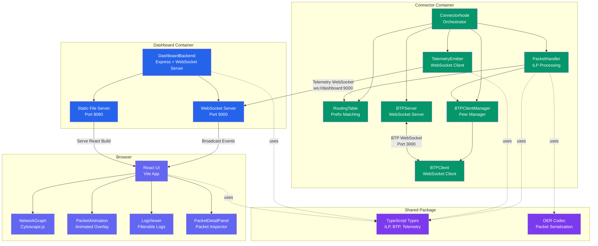
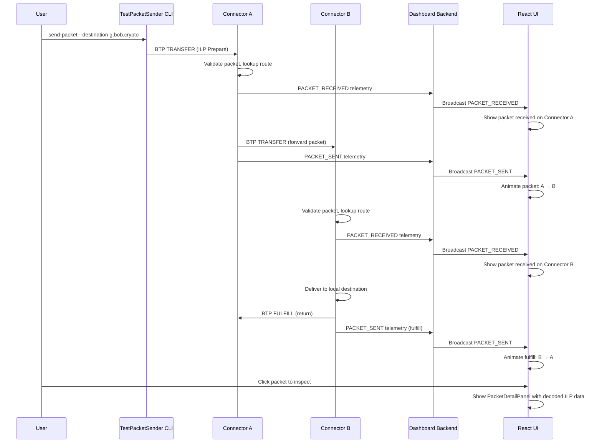
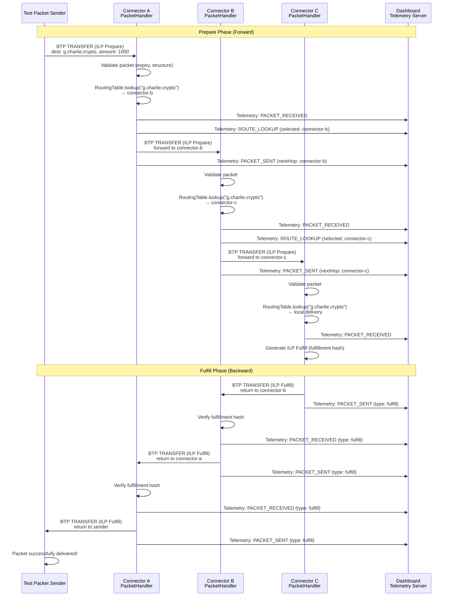
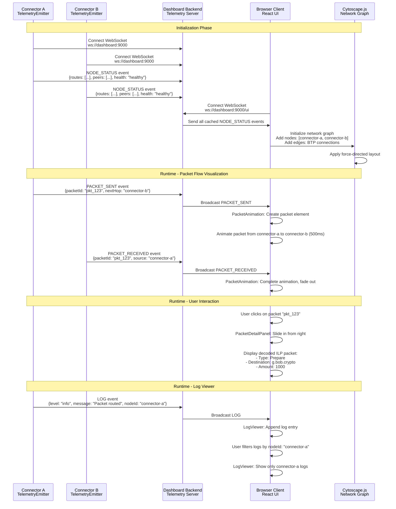
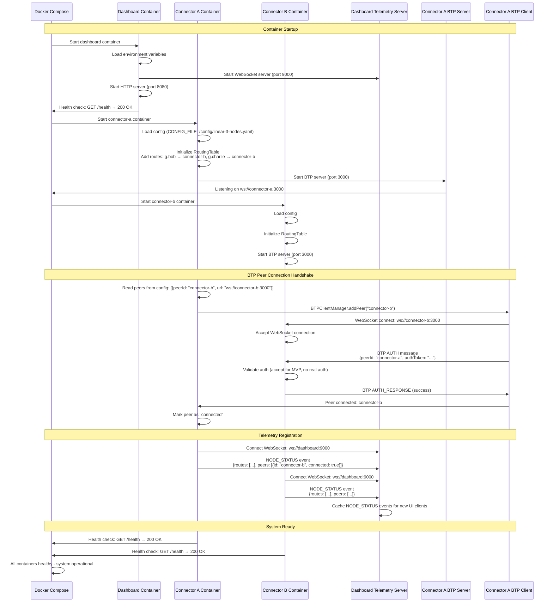

# ILP Connector with BTP and Network Visualization - Architecture Documentation

## Table of Contents

- [Introduction](#introduction)
  - [Project Purpose and Goals](#project-purpose-and-goals)
  - [Why This Architecture?](#why-this-architecture)
  - [Document Structure](#document-structure)
- [Monorepo Structure and Package Responsibilities](#monorepo-structure-and-package-responsibilities)
  - [Package Overview](#package-overview)
  - [Package Boundaries and Dependencies](#package-boundaries-and-dependencies)
  - [Tools and Examples](#tools-and-examples)
  - [Docker Compose Configurations](#docker-compose-configurations)
- [Component Architecture](#component-architecture)
  - [System Components Overview](#system-components-overview)
  - [Component Interaction Diagram](#component-interaction-diagram)
  - [Data Flow: Packet to Visualization](#data-flow-packet-to-visualization)
- [Core Workflows](#core-workflows)
  - [Packet Forwarding Workflow (Multi-Hop)](#packet-forwarding-workflow-multi-hop)
  - [Dashboard Telemetry and Visualization Workflow](#dashboard-telemetry-and-visualization-workflow)
  - [Connector Startup and BTP Connection Establishment](#connector-startup-and-btp-connection-establishment)
- [Configuration Loading and Precedence](#configuration-loading-and-precedence)
  - [Configuration Sources](#configuration-sources)
  - [Precedence Order](#precedence-order)
  - [Key Configuration Fields](#key-configuration-fields)
- [Telemetry Protocol](#telemetry-protocol)
  - [Telemetry Message Types](#telemetry-message-types)
  - [Telemetry Flow Architecture](#telemetry-flow-architecture)
  - [Telemetry Schema Examples](#telemetry-schema-examples)
- [Interledger Protocol References](#interledger-protocol-references)
  - [RFC-0027: Interledger Protocol v4 (ILPv4)](#rfc-0027-interledger-protocol-v4-ilpv4)
  - [RFC-0023: Bilateral Transfer Protocol (BTP)](#rfc-0023-bilateral-transfer-protocol-btp)
  - [RFC-0030: Notes on OER Encoding](#rfc-0030-notes-on-oer-encoding)
  - [RFC-0015: ILP Addresses](#rfc-0015-ilp-addresses)
  - [RFC-0001: Interledger Architecture](#rfc-0001-interledger-architecture)
- [Key Design Decisions](#key-design-decisions)
  - [In-Memory State Only](#in-memory-state-only)
  - [Push-Based Telemetry](#push-based-telemetry)
  - [Docker-First Deployment](#docker-first-deployment)
  - [WebSocket-Centric Communication](#websocket-centric-communication)
  - [Cytoscape.js for Network Visualization](#cytoscapejs-for-network-visualization)
  - [Educational Over Production](#educational-over-production)
  - [Hexagonal Architecture (Ports and Adapters)](#hexagonal-architecture-ports-and-adapters)
- [Extending the System](#extending-the-system)
  - [Adding New Telemetry Event Types](#adding-new-telemetry-event-types)
  - [Creating Custom Dashboard Visualizations](#creating-custom-dashboard-visualizations)
  - [Implementing New Transport Protocols](#implementing-new-transport-protocols)
  - [Supporting Custom Network Topologies](#supporting-custom-network-topologies)
- [Related Documentation](#related-documentation)

## Introduction

### Project Purpose and Goals

The **ILP Connector with BTP and Network Visualization** is an educational tool designed to make
Interledger Protocol (ILP) packet routing observable and debuggable. The system enables developers
to:

- **Visualize ILP packet flows** across multi-node connector networks in real-time
- **Inspect packet contents** (Prepare, Fulfill, Reject) with full OER-decoded details
- **Understand routing decisions** through comprehensive structured logging
- **Experiment with network topologies** (linear, mesh, hub-spoke) via Docker Compose
- **Learn Interledger RFCs** by interacting with authentic ILPv4 and BTP implementations

This is not a production-ready connector - it prioritizes observability, ease of use, and
educational value over performance, security, and high availability.

### Why This Architecture?

The architectural choices in this system are driven by four key principles:

#### Educational Value - Hands-On ILP Learning

The system is designed for developers learning Interledger Protocol. By providing a visual
dashboard showing packet flows, routing decisions, and detailed packet inspection, learners can see
abstract RFC concepts (ILP addresses, BTP connections, OER encoding) manifest in a running system.
The architecture intentionally exposes internal state (routing tables, peer connections) rather
than hiding it.

#### Observability-First Design - Visualize Packet Routing

Traditional ILP connectors are "black boxes" - packets enter, packets leave, but intermediate
routing is opaque. This system inverts that model by making telemetry a first-class concern.
Connectors emit detailed events (PACKET_RECEIVED, PACKET_SENT, ROUTE_LOOKUP) that drive real-time
network visualizations. The architecture treats observability as core functionality, not an
afterthought.

#### Developer Experience - Zero-Config Docker Deployment

Setting up multi-node connector networks is complex. This architecture uses Docker Compose to
orchestrate N connector nodes with pre-configured routing tables and BTP peer connections. Running
`docker-compose up` deploys a working 3-node network in seconds. The monorepo structure with
TypeScript type sharing across packages ensures type safety while maintaining simplicity.

#### RFC Compliance - Authentic Interledger Implementation

The system implements authentic Interledger RFCs (ILPv4, BTP, OER encoding, ILP addressing) rather
than simplified approximations. This ensures learners interact with real protocol behavior. The
architecture follows RFC-0001's layered design (transport layer via BTP, Interledger layer via
ILPv4 packet handling) and maintains protocol fidelity.

### Document Structure

This document is organized to provide both high-level context and detailed implementation guidance:

1. **Monorepo Structure** - Package organization and responsibilities
2. **Component Architecture** - System components, interfaces, and interactions
3. **Core Workflows** - Sequence diagrams for key operations (packet forwarding, telemetry,
   startup)
4. **Configuration and Protocols** - Configuration loading, telemetry protocol specifications
5. **RFC References** - Interledger RFCs implemented by this system
6. **Design Decisions** - Architectural choices and rationale
7. **Extensibility** - How to extend the system with new features

For detailed coding standards, see
[docs/architecture/coding-standards.md](./architecture/coding-standards.md).

For configuration YAML schema, see [docs/configuration-schema.md](./configuration-schema.md).

## Monorepo Structure and Package Responsibilities

### Package Overview

The system uses **npm workspaces** to manage a monorepo containing three main packages:

```
m2m/
├── packages/
│   ├── connector/          # ILP Connector service (Node.js + BTP + Telemetry)
│   ├── dashboard/          # Visualization dashboard (React + Vite + Cytoscape.js)
│   └── shared/             # Shared TypeScript types and utilities
├── tools/
│   └── send-packet/        # CLI utility for sending test ILP packets
├── examples/               # Pre-configured topology YAML files
└── docker-compose*.yml     # Docker Compose orchestration files
```

**Rationale:**

- **Type sharing:** `packages/shared` enables connector and dashboard to share ILP packet types,
  telemetry event schemas, and validation logic
- **Co-located tests:** Test files live alongside source (`*.test.ts` next to `*.ts`) for better
  discoverability
- **Independent buildability:** Each package can be built and tested independently
- **Single repository:** Simplifies dependency updates, refactoring, and CI/CD pipelines

### Package Boundaries and Dependencies

#### packages/connector

**Responsibility:** ILP packet routing, BTP connections, telemetry emission

**Key Components:**

- `ConnectorNode` - Core orchestrator managing packet handling and peer connections
- `PacketHandler` - ILPv4 packet validation and forwarding logic
- `RoutingTable` - In-memory routing table with longest-prefix matching
- `BTPServer` - WebSocket server for incoming BTP connections (RFC-0023)
- `BTPClient` - WebSocket client for outbound BTP connections
- `BTPClientManager` - Manages multiple BTP client connections
- `TelemetryEmitter` - WebSocket client emitting events to dashboard

**Dependencies:**

- `packages/shared` - ILP types, OER encoding, telemetry types
- `ws` (8.16.x) - WebSocket server and client
- `pino` (8.17.x) - Structured JSON logging
- `express` (4.18.x) - Health check endpoint
- `js-yaml` (4.1.x) - YAML configuration loading

**Tech Stack:** TypeScript 5.3.3, Node.js 20.11.0 LTS

#### packages/dashboard

**Responsibility:** Telemetry aggregation, network visualization, packet inspection UI

**Key Components:**

- **Backend:**
  - `telemetry-server.ts` - WebSocket server aggregating telemetry from connectors
  - `http-server.ts` - Express server for static React files and health endpoint
- **Frontend:**
  - `NetworkGraph.tsx` - Cytoscape.js network topology visualization
  - `PacketAnimation.tsx` - Animated packet flow overlay
  - `LogViewer.tsx` - Filterable structured log display
  - `PacketDetailPanel.tsx` - ILP packet inspection drawer
  - `NodeStatusPanel.tsx` - Connector status display

**Dependencies:**

- `packages/shared` - Telemetry types, ILP types
- Backend: `express` (4.18.x), `ws` (8.16.x), `pino` (8.17.x)
- Frontend: `react` (18.2.x), `cytoscape` (3.28.x), `tailwindcss` (3.4.x), `shadcn-ui` (v4
  components)

**Tech Stack:** React 18.2.x, Vite 5.0.x, TypeScript 5.3.3, TailwindCSS 3.4.x

#### packages/shared

**Responsibility:** Shared TypeScript types, OER encoding utilities, validation logic

**Key Exports:**

- **Types:**
  - `ILPPacket`, `ILPPreparePacket`, `ILPFulfillPacket`, `ILPRejectPacket` - ILP packet types
  - `BTPMessage`, `BTPAuth`, `BTPTransfer` - BTP message types
  - `RoutingTableEntry`, `Peer` - Routing and peer connection types
  - `TelemetryEvent` - Telemetry event union type (NODE_STATUS, PACKET_RECEIVED, PACKET_SENT,
    ROUTE_LOOKUP, LOG)
  - `ConnectorConfig` - Configuration schema type
- **Utilities:**
  - `oer.ts` - OER encoding/decoding per RFC-0030 (`serializePacket`, `deserializePacket`)
  - `ilp-address.ts` - ILP address validation per RFC-0015

**Dependencies:** None (pure TypeScript types and Node.js Buffer API)

**Tech Stack:** TypeScript 5.3.3, Node.js 20.11.0 LTS

### Tools and Examples

#### tools/send-packet

**Purpose:** CLI utility for injecting test ILP packets into connector networks

**Usage:**

```bash
# Send single packet
send-packet --source connector-a --destination g.bob.crypto --amount 1000

# Send batch (10 concurrent packets)
send-packet --source connector-a --destination g.bob.crypto --amount 1000 --batch 10

# Send sequence (10 packets with 500ms delay)
send-packet --source connector-a --destination g.bob.crypto --amount 1000 --sequence 10 --delay 500
```

**Implementation:** Node.js CLI using `commander` for argument parsing, BTP client for connector
connections, OER codec for packet serialization.

#### examples/

**Purpose:** Pre-configured network topology YAML files

**Available Topologies:**

- `linear-3-nodes.yaml` - Linear chain: A → B → C
- `mesh-4-nodes-*.yaml` - Full mesh: All nodes connect to all others
- `hub-spoke.yaml` - Hub-and-spoke: Central hub with peripheral nodes
- `complex-8-node/` - Complex 8-node network with mixed connectivity

**Usage:** Reference in Docker Compose via `CONFIG_FILE` environment variable:

```yaml
environment:
  - CONFIG_FILE=/config/linear-3-nodes.yaml
volumes:
  - ./examples:/config
```

### Docker Compose Configurations

**Available Configurations:**

- `docker-compose.yml` - Default 3-node linear topology (A → B → C)
- `docker-compose-mesh.yml` - 4-node full mesh topology
- `docker-compose-hub-spoke.yml` - Hub-and-spoke with central hub
- `docker-compose-complex.yml` - 8-node complex network

**Common Pattern:**

```yaml
services:
  dashboard:
    build: ./packages/dashboard
    ports:
      - '8080:8080'
    environment:
      - TELEMETRY_PORT=9000

  connector-a:
    build: ./packages/connector
    environment:
      - NODE_ID=connector-a
      - BTP_SERVER_PORT=3000
      - CONFIG_FILE=/config/linear-3-nodes.yaml
    volumes:
      - ./examples:/config
```

**Rationale:** Docker Compose provides declarative multi-container orchestration, supports health
checks, enables container networking, and aligns with standard developer tooling.

## Component Architecture

### System Components Overview

#### ConnectorNode

**Responsibility:** Core orchestrator managing ILP packet handling, BTP connections, routing table,
and telemetry emission

**Key Interfaces:**

- `async start()` - Initialize BTP server, connect to peers, register telemetry
- `async handleIncomingPacket(packet: ILPPreparePacket): Promise<ILPFulfillPacket | ILPRejectPacket>` -
  Process incoming ILP packets
- `async forwardPacket(packet: ILPPreparePacket, peer: Peer): Promise<void>` - Forward packet to
  next hop
- `getRoutingTable(): RoutingTableEntry[]` - Retrieve routing table snapshot
- `getHealthStatus(): { status: 'healthy' | 'unhealthy', peers: number, routes: number }` - Health
  check data

**Dependencies:**

- `PacketHandler` - ILP packet processing logic
- `RoutingTable` - Routing table lookups
- `BTPServer` - Incoming BTP connections
- `BTPClientManager` - Outbound BTP connections
- `TelemetryEmitter` - Dashboard event emission
- `Logger` (Pino) - Structured logging

**Technology Stack:** TypeScript, Node.js 20, Pino logger, ws library, Express health endpoint

#### PacketHandler

**Responsibility:** ILPv4 packet forwarding logic - validation, expiry checking, routing, error
generation

**Key Interfaces:**

- `async processPrepare(packet: ILPPreparePacket): Promise<ILPFulfillPacket | ILPRejectPacket>` -
  Main packet processing entry point
- `validatePacket(packet: ILPPreparePacket): { valid: boolean, error?: string }` - Validate packet
  structure and expiry
- `generateReject(code: string, message: string): ILPRejectPacket` - Create ILP Reject packet with
  error code

**Dependencies:**

- `RoutingTable` - Lookup next hop for destination address
- `BTPClientManager` - Send packet to selected peer
- `Logger` - Log routing decisions

**Technology Stack:** Pure TypeScript business logic

#### RoutingTable

**Responsibility:** In-memory routing table with longest-prefix matching for ILP addresses

**Key Interfaces:**

- `addRoute(entry: RoutingTableEntry): void` - Add route to table
- `removeRoute(destination: string): void` - Remove route
- `lookup(destination: string): Peer | null` - Find longest-prefix match (O(log n) complexity)
- `getAllRoutes(): RoutingTableEntry[]` - Retrieve all routes

**Dependencies:** None (pure data structure)

**Technology Stack:** TypeScript Map-based storage with prefix tree algorithm

#### BTPServer

**Responsibility:** WebSocket server for incoming BTP connections per RFC-0023

**Key Interfaces:**

- `async start(port: number): Promise<void>` - Start WebSocket server
- `onConnection(handler: (client: BTPConnection) => void): void` - Register connection handler
- `onMessage(handler: (message: BTPMessage) => void): void` - Register message handler
- `async stop(): Promise<void>` - Gracefully shutdown server

**Dependencies:**

- `ws` library - WebSocket server implementation
- `BTPMessageParser` - BTP protocol encoding/decoding
- `Logger` - Connection logging

**Technology Stack:** ws 8.16.x, Custom BTP protocol implementation

#### BTPClient

**Responsibility:** WebSocket client for outbound BTP connections with reconnection logic

**Key Interfaces:**

- `async connect(url: string): Promise<void>` - Establish BTP connection
- `async sendPacket(packet: ILPPreparePacket): Promise<ILPFulfillPacket | ILPRejectPacket>` - Send
  ILP packet over BTP
- `onPacket(handler: (packet: ILPPreparePacket) => void): void` - Register packet receive handler
- `async disconnect(): Promise<void>` - Close connection

**Dependencies:**

- `ws` library - WebSocket client implementation
- `BTPMessageParser` - BTP protocol encoding/decoding
- `Logger` - Connection logging

**Technology Stack:** ws 8.16.x, Reconnection with exponential backoff

#### BTPClientManager

**Responsibility:** Manages multiple BTP client instances (one per peer)

**Key Interfaces:**

- `addPeer(peer: Peer): Promise<void>` - Create and connect BTP client for peer
- `removePeer(peerId: string): Promise<void>` - Disconnect and remove peer
- `sendToPeer(peerId: string, packet: ILPPreparePacket): Promise<ILPFulfillPacket | ILPRejectPacket>` -
  Route packet to specific peer
- `getPeerStatus(peerId: string): { connected: boolean, lastSeen: string }` - Check peer connection
  status

**Dependencies:**

- `BTPClient` - Individual peer connections
- `Logger` - Peer management logging

**Technology Stack:** TypeScript Map-based client registry

#### OERCodec

**Responsibility:** ILP packet OER encoding/decoding per RFC-0030

**Key Interfaces:**

- `serializePacket(packet: ILPPreparePacket): Buffer` - Encode ILP packet to binary
- `deserializePacket(buffer: Buffer): ILPPreparePacket | ILPFulfillPacket | ILPRejectPacket` -
  Decode binary to ILP packet
- `serializePrepare(packet: ILPPreparePacket): Buffer` - Encode ILP Prepare packet
- `deserializePrepare(buffer: Buffer): ILPPreparePacket` - Decode ILP Prepare packet

**Dependencies:** Node.js Buffer API

**Technology Stack:** Pure TypeScript, Reference RFC-0030 and ilp-packet library

**Note:** Throws `InvalidPacketError` for malformed data per coding standards.

#### TelemetryEmitter

**Responsibility:** Non-blocking telemetry event emission to dashboard via WebSocket

**Key Interfaces:**

- `async connect(url: string): Promise<void>` - Connect to dashboard telemetry server
- `emitNodeStatus(data: { routes: RoutingTableEntry[], peers: Peer[], health: string }): void` -
  Emit NODE_STATUS event
- `emitPacketReceived(data: { packetId: string, type: PacketType, source: string, destination: string, amount: string }): void` -
  Emit PACKET_RECEIVED event
- `emitPacketSent(data: { packetId: string, nextHop: string, timestamp: string }): void` - Emit
  PACKET_SENT event
- `emitRouteLookup(data: { destination: string, selectedPeer: string, reason: string }): void` -
  Emit ROUTE_LOOKUP event

**Dependencies:**

- WebSocket (ws library) - Client connection
- Logger - Telemetry emission logging

**Technology Stack:** WebSocket client, JSON serialization, non-blocking send

**Critical Rule:** All telemetry emission wrapped in try-catch to prevent packet processing
failures per coding standards.

#### DashboardBackend

**Responsibility:** Express HTTP server + WebSocket telemetry aggregation server

**Key Interfaces:**

- `async start(port: number): Promise<void>` - Start HTTP and WebSocket servers
- `onTelemetryConnection(handler: (client: WebSocket) => void): void` - Register telemetry client
  handler
- `onTelemetryEvent(handler: (event: TelemetryEvent) => void): void` - Register event handler
- `broadcastToClients(event: TelemetryEvent): void` - Broadcast event to all connected UI clients

**Dependencies:**

- Express.js - HTTP server for static files
- ws library - WebSocket server for telemetry
- Logger - Server logging

**Technology Stack:** Express 4.18.x, ws 8.16.x, serves React build from
`packages/dashboard/dist`

#### DashboardUI (React Application)

**Responsibility:** React-based network visualization and packet inspection UI

**Key Components:**

- `NetworkGraph.tsx` - Cytoscape.js interactive network topology visualization with force-directed
  layout
- `PacketAnimation.tsx` - Animated packet flow overlay showing packets moving between nodes
- `LogViewer.tsx` - Filterable log display (filter by level, connector ID, text search)
- `PacketDetailPanel.tsx` - Sliding drawer showing decoded ILP packet details
- `NodeStatusPanel.tsx` - Connector status panel (routing table, peer connections, health)

**Dependencies:**

- React 18.2.x - UI framework
- Cytoscape.js 3.28.x - Network graph rendering
- TailwindCSS 3.4.x - Utility-first styling
- shadcn-ui (v4) - UI component library (Button, Card, Input, Checkbox, Sheet, Tabs, Toast, Table,
  Badge)
- Native WebSocket API - Browser WebSocket client

**Technology Stack:** Vite 5.0.x build tool, TypeScript + React, WebSocket client for real-time
telemetry

**Hooks:**

- `useTelemetry()` - Subscribe to telemetry events from dashboard backend
- `useNetworkGraph()` - Manage Cytoscape graph state and animations
- `usePacketAnimation()` - Handle packet animation lifecycle
- `useLogViewer()` - Manage log filtering and search

#### TestPacketSender (CLI Tool)

**Responsibility:** CLI utility for test packet injection into connector networks

**CLI Interface:**

```bash
send-packet --source <nodeId> --destination <ilpAddress> --amount <value> [options]
```

**Options:**

- `--source <nodeId>` - Source connector ID (required)
- `--destination <ilpAddress>` - ILP destination address (required)
- `--amount <value>` - Packet amount in base units (required)
- `--data <payload>` - Optional base64-encoded packet data
- `--batch <count>` - Send multiple packets concurrently (default: 1)
- `--sequence <count>` - Send packets sequentially with delay (default: 1)
- `--delay <ms>` - Delay between sequence packets (default: 1000ms)

**Key Interfaces:**

- `createTestPrepare(destination: string, amount: string, data?: Buffer): ILPPreparePacket` -
  Create test ILP Prepare packet
- `async sendToConnector(connector: string, packet: ILPPreparePacket): Promise<void>` - Send packet
  to connector via BTP

**Dependencies:**

- BTPClient - Connect to connector BTP server
- OERCodec - Serialize ILP packets
- Commander.js - CLI argument parsing

**Technology Stack:** Node.js CLI script, TypeScript compiled to executable

### Component Interaction Diagram



**Legend:**

- **Green:** Connector package components
- **Blue:** Dashboard backend components
- **Purple:** Dashboard UI components (browser)
- **Violet:** Shared package components
- **Solid arrows:** Direct dependencies and method calls
- **Dashed arrows:** Type/utility imports
- **Double arrows:** Bidirectional WebSocket communication

### Data Flow: Packet to Visualization

This section describes the end-to-end packet flow from test packet injection to dashboard
visualization:

**Step 1: User Sends Test Packet**

```bash
send-packet --source connector-a --destination g.bob.crypto --amount 1000
```

- TestPacketSender creates `ILPPreparePacket` with destination `g.bob.crypto`, amount `1000`
- Packet encoded to binary using OER codec
- BTP connection established to Connector A's BTP server (port 3000)
- Packet sent via BTP `TRANSFER` message

**Step 2: Connector A Receives and Routes Packet**

- BTPServer receives BTP message, decodes to `ILPPreparePacket`
- ConnectorNode hands packet to PacketHandler for processing
- PacketHandler validates packet (checks expiry, validates OER structure)
- RoutingTable performs longest-prefix match on `g.bob.crypto`
  - Matches route: `g.bob` → `connector-b` (peer)
- TelemetryEmitter emits `PACKET_RECEIVED` event to dashboard:
  ```json
  {
    "type": "PACKET_RECEIVED",
    "nodeId": "connector-a",
    "packetId": "pkt_abc123",
    "source": "g.alice",
    "destination": "g.bob.crypto",
    "amount": "1000"
  }
  ```

**Step 3: Connector A Forwards to Connector B via BTP**

- PacketHandler calls BTPClientManager to send packet to `connector-b`
- BTPClient encodes packet to BTP `TRANSFER` message
- Packet sent over WebSocket to Connector B (ws://connector-b:3000)
- TelemetryEmitter emits `PACKET_SENT` event:
  ```json
  {
    "type": "PACKET_SENT",
    "nodeId": "connector-a",
    "packetId": "pkt_abc123",
    "nextHop": "connector-b",
    "timestamp": "2025-12-30T12:00:00.000Z"
  }
  ```

**Step 4: Connector B Receives and Routes Packet**

- BTPServer receives packet, hands to PacketHandler
- Routing table lookup on `g.bob.crypto` matches `g.bob` → `connector-c`
- TelemetryEmitter emits `PACKET_RECEIVED` and `PACKET_SENT` events
- Packet forwarded to Connector C

**Step 5: Dashboard Visualizes Packet Animation**

- Dashboard telemetry server receives `PACKET_SENT` events from Connector A and Connector B
- Events broadcast to all connected browser clients via WebSocket
- React UI receives events via `useTelemetry()` hook
- `PacketAnimation` component animates packet moving from:
  - Connector A → Connector B (500ms animation)
  - Connector B → Connector C (500ms animation)
- Network graph updates to highlight active connections

**Step 6: User Inspects Packet Details**

- User clicks on animated packet in dashboard
- `PacketDetailPanel` drawer slides in from right
- Panel displays decoded ILP packet:
  - **Type:** ILP Prepare
  - **Destination:** `g.bob.crypto`
  - **Amount:** `1000`
  - **Data:** `<base64-encoded payload>`
  - **Execution Condition:** `<32-byte hash>`
  - **Expiry:** `2025-12-30T12:00:05.000Z`
- User can copy packet data, view raw OER bytes, trace packet path

**Data Flow Diagram:**



## Core Workflows

### Packet Forwarding Workflow (Multi-Hop)

This sequence diagram illustrates how an ILP Prepare packet traverses multiple connectors in a
linear topology (A → B → C) and how the Fulfill packet propagates back.



**Key Points:**

- Each connector validates the packet before forwarding (expiry check, OER structure validation)
- Routing table lookup uses longest-prefix matching algorithm
- Telemetry events emitted at each hop for full observability
- Fulfill packet propagates backward along the same path
- Fulfillment hash verified at each hop to prevent fraud

### Dashboard Telemetry and Visualization Workflow

This diagram shows how telemetry events flow from connectors to the dashboard and drive real-time
visualizations.



**Key Points:**

- Connectors push telemetry events to dashboard (push model, not pull)
- Dashboard broadcasts events to all connected browser clients
- Network graph initializes using `NODE_STATUS` events
- Packet animations triggered by `PACKET_SENT` and `PACKET_RECEIVED` events
- Log viewer supports real-time filtering (by level, connector ID, text search)
- Telemetry emission is non-blocking - failures do not impact packet processing

### Connector Startup and BTP Connection Establishment

This diagram illustrates the Docker Compose startup sequence and BTP peer connection handshake.



**Key Points:**

- Dashboard starts first to accept telemetry connections
- Connectors load configuration from YAML files (via `CONFIG_FILE` env var)
- BTP servers start before BTP clients to avoid connection failures
- BTP peer connections use WebSocket with simple AUTH handshake (MVP - no real authentication)
- Telemetry registration happens after BTP connections established
- Docker health checks verify all containers operational before accepting traffic

## Configuration Loading and Precedence

### Configuration Sources

The system supports three configuration sources for connector nodes:

1. **YAML Configuration Files** - Topology definitions in `examples/` directory
2. **Environment Variables** - Set in `docker-compose.yml` or shell environment
3. **Default Values** - Hardcoded defaults in `config-loader.ts`

### Precedence Order

Configuration values are resolved in this order (highest to lowest priority):

1. **Environment Variables** (highest priority) - Overrides YAML and defaults
2. **YAML Config File** (if `CONFIG_FILE` env var specified) - Overrides defaults
3. **Default Values** (lowest priority) - Used when no env var or YAML value provided

**Example:**

```yaml
# examples/linear-3-nodes.yaml
nodeId: connector-a
btpServerPort: 3000
peers:
  - peerId: connector-b
    url: ws://connector-b:3000
```

```yaml
# docker-compose.yml
services:
  connector-a:
    environment:
      - NODE_ID=connector-a # Overrides YAML nodeId
      - CONFIG_FILE=/config/linear-3-nodes.yaml
      - LOG_LEVEL=DEBUG # Not in YAML, uses env var
    volumes:
      - ./examples:/config
```

**Resolution:**

- `nodeId`: `"connector-a"` (env var `NODE_ID` overrides YAML)
- `btpServerPort`: `3000` (from YAML)
- `logLevel`: `"DEBUG"` (from env var, not in YAML)
- `healthCheckPort`: `8080` (default value, not in YAML or env)

### Key Configuration Fields

The `ConnectorConfig` type (defined in `packages/shared/src/types/config.ts`) includes:

```typescript
interface ConnectorConfig {
  nodeId: string; // Unique connector identifier (e.g., "connector-a")
  btpServerPort: number; // BTP WebSocket server port (default: 3000)
  healthCheckPort: number; // HTTP health endpoint port (default: 8080)
  peers: Peer[]; // BTP peer connection targets
  routes: RoutingTableEntry[]; // Initial routing table entries
  logLevel: string; // Pino log level: DEBUG, INFO, WARN, ERROR (default: INFO)
  dashboardTelemetryUrl: string; // WebSocket URL for telemetry (e.g., "ws://dashboard:9000")
}
```

**Peer Configuration:**

```typescript
interface Peer {
  peerId: string; // Unique peer identifier (e.g., "connector-b")
  url: string; // BTP WebSocket URL (e.g., "ws://connector-b:3000")
  authToken?: string; // Optional authentication token (not used in MVP)
}
```

**RoutingTableEntry Configuration:**

```typescript
interface RoutingTableEntry {
  destination: string; // ILP address prefix (e.g., "g.bob")
  peer: string; // Peer ID to forward to (e.g., "connector-b")
}
```

**Configuration Loading Note:** Configuration is loaded at startup only - no runtime changes
supported in MVP. Changing configuration requires container restart.

**Full YAML Schema:** See [docs/configuration-schema.md](./configuration-schema.md) for complete
YAML configuration reference with validation rules.

## Telemetry Protocol

### Telemetry Message Types

All telemetry events follow a common structure with a discriminated union `type` field:

```typescript
type TelemetryEvent =
  | NodeStatusEvent
  | PacketReceivedEvent
  | PacketSentEvent
  | RouteLookupEvent
  | LogEvent;
```

#### NODE_STATUS

**Purpose:** Advertise connector's routing table, peer connections, and health status

**Schema:**

```typescript
interface NodeStatusEvent {
  type: 'NODE_STATUS';
  nodeId: string; // Connector identifier
  timestamp: string; // ISO 8601 timestamp
  routes: RoutingTableEntry[]; // Current routing table
  peers: Peer[]; // Current peer connections
  health: 'healthy' | 'unhealthy'; // Health status
}
```

**Example:**

```json
{
  "type": "NODE_STATUS",
  "nodeId": "connector-a",
  "timestamp": "2025-12-30T12:00:00.000Z",
  "routes": [
    { "destination": "g.bob", "peer": "connector-b" },
    { "destination": "g.charlie", "peer": "connector-b" }
  ],
  "peers": [{ "peerId": "connector-b", "url": "ws://connector-b:3000", "connected": true }],
  "health": "healthy"
}
```

**Emission:** Sent on connector startup and when routing table or peer state changes.

#### PACKET_RECEIVED

**Purpose:** Log incoming ILP packet details for visualization and debugging

**Schema:**

```typescript
interface PacketReceivedEvent {
  type: 'PACKET_RECEIVED';
  nodeId: string;
  timestamp: string;
  packetId: string; // Unique packet identifier (hash of packet data)
  packetType: 'prepare' | 'fulfill' | 'reject'; // ILP packet type
  source: string; // ILP source address (if available)
  destination: string; // ILP destination address
  amount: string; // Packet amount in base units
}
```

**Example:**

```json
{
  "type": "PACKET_RECEIVED",
  "nodeId": "connector-a",
  "timestamp": "2025-12-30T12:00:00.100Z",
  "packetId": "pkt_abc123",
  "packetType": "prepare",
  "source": "g.alice",
  "destination": "g.bob.crypto",
  "amount": "1000"
}
```

**Emission:** Sent when connector receives ILP packet from BTP peer or test sender.

#### PACKET_SENT

**Purpose:** Log outgoing ILP packet details for packet flow visualization

**Schema:**

```typescript
interface PacketSentEvent {
  type: 'PACKET_SENT';
  nodeId: string;
  timestamp: string;
  packetId: string; // Matches PACKET_RECEIVED packetId
  nextHop: string; // Peer ID packet sent to
  packetType: 'prepare' | 'fulfill' | 'reject';
}
```

**Example:**

```json
{
  "type": "PACKET_SENT",
  "nodeId": "connector-a",
  "timestamp": "2025-12-30T12:00:00.200Z",
  "packetId": "pkt_abc123",
  "nextHop": "connector-b",
  "packetType": "prepare"
}
```

**Emission:** Sent when connector forwards ILP packet to BTP peer.

#### ROUTE_LOOKUP

**Purpose:** Log routing decision details for debugging routing table behavior

**Schema:**

```typescript
interface RouteLookupEvent {
  type: 'ROUTE_LOOKUP';
  nodeId: string;
  timestamp: string;
  destination: string; // ILP address being looked up
  selectedPeer: string | null; // Peer selected by routing table (null if no match)
  reason: string; // Human-readable explanation (e.g., "Longest prefix match: g.bob")
}
```

**Example:**

```json
{
  "type": "ROUTE_LOOKUP",
  "nodeId": "connector-a",
  "timestamp": "2025-12-30T12:00:00.150Z",
  "destination": "g.bob.crypto",
  "selectedPeer": "connector-b",
  "reason": "Longest prefix match: g.bob → connector-b"
}
```

**Emission:** Sent during packet processing when routing table lookup performed.

#### LOG

**Purpose:** Structured log messages from connector (replaces console.log)

**Schema:**

```typescript
interface LogEvent {
  type: 'LOG';
  nodeId: string;
  timestamp: string;
  level: 'debug' | 'info' | 'warn' | 'error'; // Log level
  message: string; // Log message
  [key: string]: any; // Additional metadata (e.g., packetId, peerId)
}
```

**Example:**

```json
{
  "type": "LOG",
  "nodeId": "connector-a",
  "timestamp": "2025-12-30T12:00:00.000Z",
  "level": "info",
  "message": "BTP peer connected",
  "peerId": "connector-b",
  "url": "ws://connector-b:3000"
}
```

**Emission:** Sent for all log messages (Pino logger configured with custom transport that emits
LOG telemetry events).

### Telemetry Flow Architecture

**Connector → Dashboard:**

1. Connector's `TelemetryEmitter` establishes WebSocket connection to dashboard telemetry server
   (ws://dashboard:9000)
2. Connector emits telemetry events by sending JSON-serialized `TelemetryEvent` objects over
   WebSocket
3. Emission is non-blocking - wrapped in try-catch to prevent packet processing failures

**Dashboard Backend:**

1. Telemetry server receives events from multiple connectors via WebSocket
2. Events cached in memory for new UI clients (limited buffer, e.g., last 1000 events)
3. Events broadcast to all connected browser clients via separate WebSocket connection

**Browser → Dashboard:**

1. React UI establishes WebSocket connection to dashboard (ws://dashboard:9000/ui)
2. Dashboard sends cached events on connection (initial state)
3. Dashboard broadcasts new events in real-time as received from connectors

**UI Event Handling:**

1. `useTelemetry()` hook subscribes to WebSocket events
2. Events dispatched to React components:
   - `NODE_STATUS` → `NetworkGraph` (initialize/update nodes and edges)
   - `PACKET_SENT` → `PacketAnimation` (animate packet flow)
   - `PACKET_RECEIVED` → `PacketDetailPanel` (show packet details)
   - `LOG` → `LogViewer` (append log entry)

**Telemetry Emission Critical Rule:** All telemetry emission wrapped in try-catch to prevent packet
processing failures per coding standards:

```typescript
try {
  telemetryEmitter.emitPacketSent({ packetId, nextHop, timestamp });
} catch (error) {
  logger.warn({ error }, 'Telemetry emission failed - continuing packet processing');
}
```

### Telemetry Schema Examples

**Full NODE_STATUS Example:**

```json
{
  "type": "NODE_STATUS",
  "nodeId": "connector-a",
  "timestamp": "2025-12-30T12:00:00.000Z",
  "routes": [
    { "destination": "g.bob", "peer": "connector-b" },
    { "destination": "g.charlie", "peer": "connector-b" },
    { "destination": "g.alice", "peer": "local" }
  ],
  "peers": [
    {
      "peerId": "connector-b",
      "url": "ws://connector-b:3000",
      "connected": true,
      "lastSeen": "2025-12-30T12:00:00.000Z"
    }
  ],
  "health": "healthy"
}
```

**Full PACKET_RECEIVED Example:**

```json
{
  "type": "PACKET_RECEIVED",
  "nodeId": "connector-b",
  "timestamp": "2025-12-30T12:00:00.250Z",
  "packetId": "pkt_abc123",
  "packetType": "prepare",
  "source": "g.alice",
  "destination": "g.bob.crypto",
  "amount": "1000",
  "data": "SGVsbG8gV29ybGQ=",
  "executionCondition": "uU0nuZNNPgilLlLX2n2r+sSE7+N6U4DukIj3rOLvzek=",
  "expiresAt": "2025-12-30T12:00:05.000Z"
}
```

**Full LOG Example:**

```json
{
  "type": "LOG",
  "nodeId": "connector-a",
  "timestamp": "2025-12-30T12:00:00.100Z",
  "level": "info",
  "message": "Packet routed successfully",
  "packetId": "pkt_abc123",
  "destination": "g.bob.crypto",
  "nextHop": "connector-b",
  "routingDecision": "Longest prefix match: g.bob → connector-b"
}
```

**Note:** Telemetry protocol uses JSON serialization (not binary) for simplicity and human
readability in dashboard logs.

## Interledger Protocol References

M2M implements the following Interledger RFCs to ensure authentic protocol behavior and compliance:

### RFC-0027: Interledger Protocol v4 (ILPv4)

**URL:** [https://interledger.org/developers/rfcs/interledger-protocol/](https://interledger.org/developers/rfcs/interledger-protocol/)

**Relevance:**

- Defines the core ILP packet format (Prepare, Fulfill, Reject)
- Specifies routing semantics (packet forwarding based on ILP addresses)
- Defines error codes (F00-F99) for reject packets
- Establishes expiry mechanism for conditional payments

**M2M Implementation:**

- `packages/shared/src/types/ilp.ts` - TypeScript type definitions for ILP packets
  (`ILPPreparePacket`, `ILPFulfillPacket`, `ILPRejectPacket`)
- `packages/connector/src/core/packet-handler.ts` - ILPv4 packet processing logic (validation,
  forwarding, error generation)
- OER encoding/decoding per RFC-0030 (see below)
- Error code constants: `F00_BAD_REQUEST`, `F02_UNREACHABLE`, `F08_AMOUNT_TOO_LARGE`

**Key Implementation Details:**

- Packet expiry checking: Reject packets with `expiresAt` in the past (error code F00)
- Fulfillment verification: Validate that fulfillment hash matches execution condition
- Reject packet generation: Include error code, triggered by, and message

### RFC-0023: Bilateral Transfer Protocol (BTP)

**URL:** [https://interledger.org/developers/rfcs/bilateral-transfer-protocol/](https://interledger.org/developers/rfcs/bilateral-transfer-protocol/)

**Relevance:**

- Defines WebSocket-based ledger plugin protocol for connector peering
- Specifies BTP message types (AUTH, TRANSFER, RESPONSE, ERROR)
- Establishes connection handshake and lifecycle management

**M2M Implementation:**

- `packages/connector/src/btp/btp-server.ts` - WebSocket server accepting BTP connections
- `packages/connector/src/btp/btp-client.ts` - WebSocket client for outbound BTP connections
- `packages/connector/src/btp/btp-message-parser.ts` - BTP protocol encoding/decoding
- `packages/shared/src/types/btp.ts` - TypeScript BTP message type definitions

**Key Implementation Details:**

- WebSocket transport: RFC-0023 specifies BTP over WebSocket (ws:// URLs)
- AUTH handshake: Simplified AUTH (no real authentication in MVP)
- TRANSFER message: Wraps ILP packet in BTP envelope
- Reconnection logic: Exponential backoff on connection failures

**BTP Message Format:**

```json
{
  "type": "TRANSFER",
  "requestId": "req_123",
  "data": {
    "ilpPacket": "<base64-encoded OER packet>",
    "amount": "1000"
  }
}
```

### RFC-0030: Notes on OER Encoding

**URL:** [https://interledger.org/developers/rfcs/oer-encoding/](https://interledger.org/developers/rfcs/oer-encoding/)

**Relevance:**

- Defines Octet Encoding Rules (OER) for ILP packet serialization
- Specifies binary encoding format for Prepare, Fulfill, Reject packets
- Ensures efficient, compact packet representation for network transmission

**M2M Implementation:**

- `packages/shared/src/encoding/oer.ts` - OER encoding/decoding implementation
- `serializePacket()` - Encode ILP packet to binary Buffer
- `deserializePacket()` - Decode binary Buffer to ILP packet
- Type-specific encoders: `serializePrepare()`, `serializeFulfill()`, `serializeReject()`

**Key Implementation Details:**

- Variable-length integer encoding (VarUInt) for amounts and lengths
- Binary format: Type byte (12=Prepare, 13=Fulfill, 14=Reject) + payload
- Error handling: Throws `InvalidPacketError` for malformed data per coding standards
- Reference implementation: Based on `ilp-packet` library structure

**OER Prepare Packet Structure:**

```
[Type: 12] [Amount: VarUInt] [ExpiresAt: 17 bytes] [ExecutionCondition: 32 bytes]
[Destination: VarOctetString] [Data: VarOctetString]
```

### RFC-0015: ILP Addresses

**URL:** [https://interledger.org/developers/rfcs/ilp-addresses/](https://interledger.org/developers/rfcs/ilp-addresses/)

**Relevance:**

- Defines hierarchical ILP addressing scheme (e.g., `g.alice`, `g.bob.crypto`)
- Specifies address validation rules (allowed characters, length limits)
- Enables longest-prefix matching for routing decisions

**M2M Implementation:**

- `packages/shared/src/validation/ilp-address.ts` - ILP address validation logic
- `validateILPAddress()` - Check address format and structure
- `packages/connector/src/routing/routing-table.ts` - Longest-prefix matching algorithm

**Key Implementation Details:**

- Address format: Dot-separated segments (e.g., `g.alice.bob`)
- Allowed characters: `a-z`, `0-9`, `_`, `-`, `.`
- Maximum length: 1023 characters
- Routing algorithm: Find longest matching prefix in routing table (e.g., `g.bob.crypto` matches
  `g.bob` route)

**Address Examples:**

- `g.alice` - Global address for Alice
- `g.bob.crypto` - Bob's crypto wallet address
- `test.connector-a.local` - Test address for Connector A

### RFC-0001: Interledger Architecture

**URL:** [https://interledger.org/developers/rfcs/interledger-architecture/](https://interledger.org/developers/rfcs/interledger-architecture/)

**Relevance:**

- Defines high-level Interledger protocol architecture
- Establishes layered design philosophy (Application, Transport, Interledger, Ledger layers)
- Provides context for how ILPv4, BTP, STREAM, and other RFCs fit together

**M2M Implementation:**

- Overall system design follows RFC-0001 layered architecture:
  - **Ledger Layer:** BTP connections between connectors (RFC-0023)
  - **Interledger Layer:** ILPv4 packet routing and forwarding (RFC-0027)
  - **Transport Layer:** (Not implemented - MVP focuses on Interledger layer)
  - **Application Layer:** Test packet sender CLI tool
- Hexagonal architecture (ports and adapters) aligns with RFC-0001 separation of concerns

**Architectural Alignment:**

- BTP acts as "ledger plugin" abstracting transport details
- PacketHandler implements Interledger layer logic independent of transport
- Routing table enables multi-hop packet forwarding per RFC-0001 connector role

**Future Extensions:**

- STREAM protocol (RFC-0029) - Transport layer for streaming payments
- SPSP (RFC-0009) - Application layer for payment setup
- ILP-over-HTTP (RFC-0035) - Alternative ledger layer transport

## Key Design Decisions

### In-Memory State Only

**Decision:** No persistence layer - routing tables configured at startup, packet history ephemeral

**Rationale:**

- **Simplifies architecture:** Eliminates database setup, schema migrations, ORM complexity
- **Sufficient for educational/testing use case:** Connectors restart frequently during
  experimentation
- **Aligns with ephemeral Docker containers:** Containers are stateless, destroyed and recreated
  easily
- **Enables rapid iteration:** No database state to manage or clean up between experiments

**Trade-offs:**

- Configuration changes require container restart (no runtime updates)
- Packet history lost on restart (telemetry not persisted)
- Not suitable for production use (no state recovery)

**Implementation:**

- Routing table stored in TypeScript `Map` in `RoutingTable` class
- Peer connections re-established on startup from YAML configuration
- Telemetry events cached in dashboard memory (limited buffer, e.g., last 1000 events)

### Push-Based Telemetry

**Decision:** Connectors push events to dashboard via WebSocket (not pull-based polling)

**Rationale:**

- **Enables real-time visualization:** Dashboard receives events immediately, no polling delay
- **Reduces dashboard complexity:** Dashboard is passive aggregator, not active poller
- **Supports future multi-client scenarios:** Multiple dashboards can subscribe to same connector
  telemetry
- **Aligns with event-driven architecture:** Telemetry emission decoupled from packet processing

**Trade-offs:**

- Connectors depend on dashboard availability (but telemetry emission non-blocking)
- Dashboard becomes single point of failure for observability (but not for packet routing)

**Implementation:**

- `TelemetryEmitter` class in connector establishes WebSocket connection to dashboard on startup
- Events emitted via `emit()` method wrapped in try-catch (non-blocking)
- Dashboard broadcasts events to all connected browser clients

### Docker-First Deployment

**Decision:** No non-containerized deployment supported for MVP

**Rationale:**

- **Simplifies multi-node orchestration:** Docker Compose handles N connector containers with
  declarative YAML
- **Ensures environment consistency:** All nodes run identical Node.js 20-alpine images
- **Aligns with developer tooling:** Docker standard for local development, CI/CD pipelines
- **Enables network topology experimentation:** Easy to deploy linear, mesh, hub-spoke networks

**Trade-offs:**

- Requires Docker installed (barrier for non-Docker users)
- Slightly higher resource usage vs. native Node.js processes
- Container startup latency (~2-3 seconds vs. instant for native processes)

**Implementation:**

- All packages have Dockerfile (multi-stage builds with TypeScript compilation)
- Docker Compose configurations for common topologies (`docker-compose.yml`,
  `docker-compose-mesh.yml`)
- Health checks ensure containers operational before accepting traffic

### WebSocket-Centric Communication

**Decision:** BTP uses WebSocket, telemetry uses WebSocket, real-time UI updates use WebSocket

**Rationale:**

- **Real-time bidirectional communication required:** BTP and telemetry both need full-duplex
  communication
- **RFC-0023 specifies BTP over WebSocket:** Aligns with Interledger standard
- **Single protocol simplifies architecture:** No mixing HTTP polling, WebSocket, server-sent
  events
- **Native browser support:** WebSocket API built into all modern browsers, no library required

**Trade-offs:**

- WebSocket connections consume server resources (but only N connectors + M UI clients)
- No HTTP/2 multiplexing (but not needed for MVP)
- Requires WebSocket-aware load balancers for production (future concern)

**Implementation:**

- `ws` library (8.16.x) for Node.js WebSocket server and client
- Native WebSocket API for browser clients
- Reconnection logic with exponential backoff for BTP clients and telemetry emitters

### Cytoscape.js for Network Visualization

**Decision:** Use Cytoscape.js for interactive network graph rendering

**Rationale:**

- **Purpose-built for network graphs:** Designed specifically for node-edge visualizations
- **Performant for 10+ nodes:** Force-directed layout algorithm scales well for MVP requirements
- **Supports animation:** Built-in support for animated packet flows, node highlighting
- **MIT licensed:** No licensing concerns for open-source project
- **Well-documented:** Extensive documentation, active community, TypeScript type definitions
  available

**Alternatives Considered:**

- D3.js - Rejected (lower-level API, steeper learning curve, overkill for MVP)
- vis.js - Rejected (less active development, TypeScript support weaker)
- React Flow - Rejected (designed for flowcharts, not network topologies)

**Implementation:**

- `NetworkGraph.tsx` component wraps Cytoscape.js in React
- Force-directed layout: `layout: { name: 'cose' }` (Compound Spring Embedder)
- Packet animation: Overlay layer with CSS transitions for packet movement

### Educational Over Production

**Decision:** Security, high availability, and performance optimization secondary to observability
and ease of use

**Rationale:**

- **Aligns with PRD goals:** System designed for learning Interledger, not production use
- **Reduces MVP complexity:** No need for authentication, encryption, horizontal scaling, disaster
  recovery
- **Enables faster iteration:** Focus on core features (visualization, packet routing) rather than
  operational concerns

**Security Implications:**

- No BTP authentication (AUTH handshake accepts all connections)
- No TLS/encryption for WebSocket connections (ws:// not wss://)
- No input sanitization for telemetry data (assumes trusted network)
- No rate limiting or DDoS protection

**Note:** See [docs/architecture/security.md](./architecture/security.md) for security
considerations and future hardening recommendations.

### Hexagonal Architecture (Ports and Adapters)

**Decision:** Core ILP packet handling logic independent of BTP transport

**Rationale:**

- **Enables future transport support:** Could add ILP-over-HTTP (RFC-0035) without changing packet
  handler
- **Improves testability:** Can mock BTP transport for unit testing packet handler in isolation
- **Aligns with RFC-0001 layered architecture:** Clear separation between Interledger layer and
  Ledger layer
- **Simplifies reasoning:** Packet handler only knows about ILP packets, not BTP protocol details

**Implementation:**

- `PacketHandler` class has no direct BTP dependencies (only `BTPClientManager` interface)
- BTP is "adapter" implementing ledger plugin interface:
  ```typescript
  interface ILedgerPlugin {
    sendPacket(packet: ILPPreparePacket): Promise<ILPFulfillPacket | ILPRejectPacket>;
    onPacket(handler: (packet: ILPPreparePacket) => void): void;
  }
  ```
- `BTPClientManager` and `BTPClient` implement this interface
- Future: Create `HTTPLedgerPlugin` implementing same interface for ILP-over-HTTP support

**Hexagonal Architecture Diagram:**

```
┌─────────────────────────────────────────┐
│         Core Domain Logic               │
│  ┌────────────────────────────────┐     │
│  │     PacketHandler              │     │
│  │  (ILP Packet Processing)       │     │
│  └────────────────────────────────┘     │
│  ┌────────────────────────────────┐     │
│  │     RoutingTable               │     │
│  │  (Longest Prefix Matching)     │     │
│  └────────────────────────────────┘     │
└─────────────────────────────────────────┘
           ▲                      ▲
           │ Port Interface       │ Port Interface
           │ (ILedgerPlugin)      │ (ITelemetry)
           ▼                      ▼
┌──────────────────────┐  ┌──────────────────────┐
│  BTP Adapter         │  │  Telemetry Adapter   │
│  (BTPClientManager)  │  │  (TelemetryEmitter)  │
└──────────────────────┘  └──────────────────────┘
```

## Extending the System

### Adding New Telemetry Event Types

**Use Case:** You want to track additional metrics (e.g., routing table changes, peer latency,
packet drops)

**Steps:**

1. **Define new event type in `packages/shared/src/types/telemetry.ts`:**

   ```typescript
   // Add to TelemetryEventType enum
   export enum TelemetryEventType {
     NODE_STATUS = 'NODE_STATUS',
     PACKET_RECEIVED = 'PACKET_RECEIVED',
     PACKET_SENT = 'PACKET_SENT',
     ROUTE_LOOKUP = 'ROUTE_LOOKUP',
     LOG = 'LOG',
     ROUTE_CHANGED = 'ROUTE_CHANGED', // NEW EVENT TYPE
   }

   // Define event schema
   export interface RouteChangedEvent {
     type: 'ROUTE_CHANGED';
     nodeId: string;
     timestamp: string;
     action: 'added' | 'removed' | 'updated';
     destination: string;
     peer: string;
   }

   // Add to TelemetryEvent union type
   export type TelemetryEvent =
     | NodeStatusEvent
     | PacketReceivedEvent
     | PacketSentEvent
     | RouteLookupEvent
     | LogEvent
     | RouteChangedEvent; // ADD HERE
   ```

2. **Emit event from connector using `TelemetryEmitter`:**

   ```typescript
   // In packages/connector/src/routing/routing-table.ts
   export class RoutingTable {
     addRoute(entry: RoutingTableEntry): void {
       this.routes.set(entry.destination, entry);

       // Emit telemetry event
       this.telemetryEmitter.emit({
         type: 'ROUTE_CHANGED',
         nodeId: this.nodeId,
         timestamp: new Date().toISOString(),
         action: 'added',
         destination: entry.destination,
         peer: entry.peer,
       });
     }
   }
   ```

3. **Handle event in dashboard telemetry server (broadcast to clients):**

   ```typescript
   // In packages/dashboard/server/telemetry-server.ts
   // No changes needed - server broadcasts all events automatically
   ```

4. **Subscribe to event in dashboard UI component:**

   ```typescript
   // In packages/dashboard/src/components/RoutingTablePanel.tsx
   import { useTelemetry } from '../hooks/useTelemetry';

   export function RoutingTablePanel() {
     const [routes, setRoutes] = useState<RoutingTableEntry[]>([]);

     useTelemetry((event) => {
       if (event.type === 'ROUTE_CHANGED') {
         // Update routes state based on event
         if (event.action === 'added') {
           setRoutes((prev) => [...prev, { destination: event.destination, peer: event.peer }]);
         }
       }
     });

     return <div>{/* Render routing table */}</div>;
   }
   ```

5. **Example: Add ROUTE_CHANGED event for dynamic routing table updates**

**Testing:** Use integration test to verify event emission and dashboard handling.

### Creating Custom Dashboard Visualizations

**Use Case:** You want to add new UI panels (e.g., routing table viewer, peer latency graph, packet
history timeline)

**Steps:**

1. **Create new React component in `packages/dashboard/src/components/`:**

   ```typescript
   // packages/dashboard/src/components/RouteTablePanel.tsx
   import { useState } from 'react';
   import { useTelemetry } from '../hooks/useTelemetry';
   import { Card, CardContent, CardHeader, CardTitle } from './ui/card';
   import { Table, TableBody, TableCell, TableHead, TableHeader, TableRow } from './ui/table';

   export function RouteTablePanel() {
     const [routes, setRoutes] = useState<Record<string, RoutingTableEntry[]>>({});

     useTelemetry((event) => {
       if (event.type === 'NODE_STATUS') {
         setRoutes((prev) => ({
           ...prev,
           [event.nodeId]: event.routes,
         }));
       }
     });

     return (
       <Card>
         <CardHeader>
           <CardTitle>Routing Tables</CardTitle>
         </CardHeader>
         <CardContent>
           {Object.entries(routes).map(([nodeId, nodeRoutes]) => (
             <div key={nodeId}>
               <h3>{nodeId}</h3>
               <Table>
                 <TableHeader>
                   <TableRow>
                     <TableHead>Destination</TableHead>
                     <TableHead>Next Hop</TableHead>
                   </TableRow>
                 </TableHeader>
                 <TableBody>
                   {nodeRoutes.map((route) => (
                     <TableRow key={route.destination}>
                       <TableCell>{route.destination}</TableCell>
                       <TableCell>{route.peer}</TableCell>
                     </TableRow>
                   ))}
                 </TableBody>
               </Table>
             </div>
           ))}
         </CardContent>
       </Card>
     );
   }
   ```

2. **Subscribe to relevant telemetry events using `useTelemetry` hook:**

   See example above - subscribes to `NODE_STATUS` events to get routing table updates.

3. **Add component to `DashboardHome.tsx` layout:**

   ```typescript
   // packages/dashboard/src/pages/DashboardHome.tsx
   import { RouteTablePanel } from '../components/RouteTablePanel';

   export function DashboardHome() {
     return (
       <div className="grid grid-cols-2 gap-4">
         <NetworkGraph />
         <PacketAnimation />
         <LogViewer />
         <RouteTablePanel /> {/* ADD HERE */}
       </div>
     );
   }
   ```

4. **Use shadcn-ui components for consistent styling:**

   Import components from `./ui/*` (Card, Table, Button, Badge, etc.)

5. **Example: Create RouteTablePanel component showing current routing tables for all connectors**

**Best Practices:**

- Use `useTelemetry()` hook for event subscription (handles WebSocket connection, cleanup)
- Use shadcn-ui components for consistent design system
- Add loading states while waiting for initial telemetry data
- Handle edge cases (no connectors connected, empty routing tables)

### Implementing New Transport Protocols

**Use Case:** You want to add ILP-over-HTTP transport (RFC-0035) alongside BTP

**Steps:**

1. **Create adapter implementing `ILedgerPlugin` interface (hexagonal architecture):**

   ```typescript
   // packages/connector/src/http/http-ledger-plugin.ts
   import { ILPPreparePacket, ILPFulfillPacket, ILPRejectPacket } from '@m2m/shared';

   export interface ILedgerPlugin {
     sendPacket(packet: ILPPreparePacket): Promise<ILPFulfillPacket | ILPRejectPacket>;
     onPacket(handler: (packet: ILPPreparePacket) => void): void;
   }

   export class HTTPLedgerPlugin implements ILedgerPlugin {
     constructor(private readonly peerUrl: string) {}

     async sendPacket(packet: ILPPreparePacket): Promise<ILPFulfillPacket | ILPRejectPacket> {
       // POST packet to peer HTTP endpoint
       const response = await fetch(`${this.peerUrl}/ilp`, {
         method: 'POST',
         headers: { 'Content-Type': 'application/octet-stream' },
         body: serializePacket(packet),
       });

       const buffer = await response.arrayBuffer();
       return deserializePacket(Buffer.from(buffer));
     }

     onPacket(handler: (packet: ILPPreparePacket) => void): void {
       // HTTP is request/response - no incoming packets from this side
       // Server would handle via Express route
     }
   }
   ```

2. **Implement packet send/receive methods:**

   See example above - `sendPacket()` uses HTTP POST, `onPacket()` handled by Express route.

3. **Update `ConnectorNode` to inject transport adapter:**

   ```typescript
   // packages/connector/src/core/connector-node.ts
   export class ConnectorNode {
     constructor(
       private readonly config: ConnectorConfig,
       private readonly transportAdapter: ILedgerPlugin // INJECT ADAPTER
     ) {}

     async start() {
       // Use transportAdapter.sendPacket() instead of BTPClientManager
     }
   }
   ```

4. **Add configuration options for transport selection:**

   ```yaml
   # examples/linear-3-nodes-http.yaml
   nodeId: connector-a
   transport: http # NEW FIELD
   peers:
     - peerId: connector-b
       url: http://connector-b:3001/ilp # HTTP URL instead of ws://
   ```

5. **Example: Add ILP-over-HTTP transport (RFC-0035) alongside BTP**

**Testing:**

- Unit test `HTTPLedgerPlugin` with mocked fetch
- Integration test verifying HTTP transport works alongside BTP

### Supporting Custom Network Topologies

**Use Case:** You want to deploy a star topology (all nodes connect to single central hub)

**Steps:**

1. **Create YAML topology file in `examples/` directory:**

   ```yaml
   # examples/star-topology.yaml
   nodes:
     - nodeId: hub
       btpServerPort: 3000
       peers: [] # Hub has no outbound connections
       routes:
         - destination: g.spoke1
           peer: local
         - destination: g.spoke2
           peer: local
         - destination: g.spoke3
           peer: local

     - nodeId: spoke-1
       btpServerPort: 3001
       peers:
         - peerId: hub
           url: ws://hub:3000
       routes:
         - destination: g.hub
           peer: hub
         - destination: g.spoke2
           peer: hub # Route to hub, hub forwards to spoke-2
         - destination: g.spoke3
           peer: hub

     - nodeId: spoke-2
       btpServerPort: 3002
       peers:
         - peerId: hub
           url: ws://hub:3000
       routes:
         - destination: g.hub
           peer: hub
         - destination: g.spoke1
           peer: hub
         - destination: g.spoke3
           peer: hub

     - nodeId: spoke-3
       btpServerPort: 3003
       peers:
         - peerId: hub
           url: ws://hub:3000
       routes:
         - destination: g.hub
           peer: hub
         - destination: g.spoke1
           peer: hub
         - destination: g.spoke2
           peer: hub
   ```

2. **Define `nodeId`, `peers`, `routes` for each connector:**

   See example above - hub has no outbound peers, spokes all connect to hub.

3. **Create corresponding `docker-compose-{topology}.yml` file:**

   ```yaml
   # docker-compose-star.yml
   services:
     dashboard:
       build: ./packages/dashboard
       ports:
         - '8080:8080'

     hub:
       build: ./packages/connector
       environment:
         - NODE_ID=hub
         - CONFIG_FILE=/config/star-topology.yaml
       volumes:
         - ./examples:/config

     spoke-1:
       build: ./packages/connector
       environment:
         - NODE_ID=spoke-1
         - CONFIG_FILE=/config/star-topology.yaml
       volumes:
         - ./examples:/config

     spoke-2:
       build: ./packages/connector
       environment:
         - NODE_ID=spoke-2
         - CONFIG_FILE=/config/star-topology.yaml
       volumes:
         - ./examples:/config

     spoke-3:
       build: ./packages/connector
       environment:
         - NODE_ID=spoke-3
         - CONFIG_FILE=/config/star-topology.yaml
       volumes:
         - ./examples:/config
   ```

4. **Update README with topology description and usage:**

   ````markdown
   ### Star Topology

   All nodes connect to a central hub. Packets route through hub to reach other spokes.

   **Start:**

   ```bash
   docker-compose -f docker-compose-star.yml up
   ```
   ````

   **Test packet flow:**

   ```bash
   send-packet --source spoke-1 --destination g.spoke2.crypto --amount 1000
   # Packet routes: spoke-1 → hub → spoke-2
   ```

   ```

   ```

5. **Verify topology with topology validator:**

   ```typescript
   // packages/connector/src/config/topology-validator.ts
   import { validateTopology } from './topology-validator';

   const config = loadConfig('./examples/star-topology.yaml');
   const validation = validateTopology(config);

   if (!validation.valid) {
     console.error('Topology validation failed:', validation.errors);
     // Errors: ["Node spoke-1 route to g.spoke2 via hub, but hub not in peers list"]
   }
   ```

6. **Example: Creating star topology (all nodes connect to single central hub)**

**Testing:**

- Deploy topology with `docker-compose -f docker-compose-star.yml up`
- Send test packets between spokes to verify routing through hub
- Check dashboard visualization shows star layout

## Agent Society Protocol (Epic 13)

### Overview

The Agent Society Protocol extends the M2M ILP implementation to support autonomous AI agents as
first-class network participants. Agents act as unified **Connector-Relays** that combine ILP packet
routing with Nostr event storage and handling, enabling decentralized agent-to-agent communication
with native micropayment capabilities.

**Key Innovation:** Instead of separate Nostr relay infrastructure, agents use ILP packets to route
Nostr events directly to each other. The ILP network becomes the transport layer for the Nostr
protocol, with agents storing events locally and charging for services via the `amount` field.

### Design Principles

1. **Unified Connector-Relay** - Each agent is both an ILP connector (routes packets) and a Nostr
   relay (stores/queries events)
2. **ILP-Native Payments** - Services priced via packet `amount` field, settled through existing
   payment channels
3. **Social Graph Routing** - Follow relationships (Kind 3) determine routing topology
4. **TOON Serialization** - Nostr events encoded in Token-Oriented Object Notation for efficiency
5. **Local Event Storage** - Agents maintain their own event databases, query each other via ILP

### Agent Architecture

```
┌─────────────────────────────────────────────────────────────────────┐
│                    Autonomous Agent Peer                             │
│                  (ILP Connector + Nostr "Relay")                     │
├─────────────────────────────────────────────────────────────────────┤
│                                                                      │
│  ┌────────────────────────┐    ┌────────────────────────┐           │
│  │  ILP Router            │    │  Event Database        │           │
│  │  - Route by g.agent.*  │    │  - SQLite / LevelDB    │           │
│  │  - Follow graph        │    │  - Index by kind       │           │
│  │    topology            │    │  - Index by pubkey     │           │
│  └────────────────────────┘    └────────────────────────┘           │
│            │                             ▲                           │
│            ▼                             │                           │
│  ┌────────────────────────────────────────────────────────────┐     │
│  │  Event Handler (dispatches by Nostr event kind)            │     │
│  │                                                            │     │
│  │  Kind 1 (Note)      → Store locally, optionally forward    │     │
│  │  Kind 3 (Follow)    → Update local routing table           │     │
│  │  Kind 5 (Delete)    → Remove from local database           │     │
│  │  Kind 10000 (Query) → Query local DB, return results       │     │
│  │  Kind CUSTOM        → Agent-specific tooling/capabilities  │     │
│  └────────────────────────────────────────────────────────────┘     │
│            │                                                         │
│            ▼                                                         │
│  ┌────────────────────────┐    ┌────────────────────────┐           │
│  │  Agent Tooling         │    │  Settlement Integration │           │
│  │  - LLM integration     │    │  - Track earnings       │           │
│  │  - Custom handlers     │    │  - Threshold triggers   │           │
│  │  - Work execution      │    │  - Multi-chain settle   │           │
│  └────────────────────────┘    └────────────────────────┘           │
│                                                                      │
└─────────────────────────────────────────────────────────────────────┘
         ↕ ILP Packets (TOON-serialized Nostr events)
         ↕ BTP WebSocket connections to followed agents
```

### ILP as Nostr Transport

The ILP packet structure natively supports agent communication:

```typescript
// Request: Agent A queries Agent B's event database
const preparePacket: ILPPreparePacket = {
  type: PacketType.PREPARE,
  amount: 100n,                              // Payment for query service
  destination: 'g.agent.bob.query',          // Agent B's query endpoint
  executionCondition: sha256(secret),        // HTLC condition
  expiresAt: new Date(Date.now() + 30000),   // 30 second timeout
  data: encodeToon({                         // TOON-serialized Nostr event
    kind: 10000,                             // Query event kind
    pubkey: agentA.pubkey,
    content: JSON.stringify({
      filter: { kinds: [1], authors: ['pubkey...'], limit: 10 }
    }),
    created_at: Math.floor(Date.now() / 1000),
    tags: [],
    sig: '...'
  })
};

// Response: Agent B returns matching events
const fulfillPacket: ILPFulfillPacket = {
  type: PacketType.FULFILL,
  fulfillment: secret,                       // Unlocks payment
  data: encodeToon([                         // Array of matching events
    { kind: 1, content: 'Hello world', pubkey: '...', ... },
    { kind: 1, content: 'Another note', pubkey: '...', ... }
  ])
};
```

### Agent Addressing

Agents use the `g.agent.*` ILP address prefix:

| Address Pattern         | Purpose                         |
| ----------------------- | ------------------------------- |
| `g.agent`               | Agent network root prefix       |
| `g.agent.alice`         | Agent Alice's base address      |
| `g.agent.alice.query`   | Alice's query service endpoint  |
| `g.agent.alice.work`    | Alice's work execution endpoint |
| `g.agent.alice.storage` | Alice's event storage endpoint  |

The existing `isValidILPAddress()` function validates these addresses without modification.

### Follow Graph Routing

Agents populate their routing tables from Kind 3 (Follow List) events with ILP address extensions:

```typescript
// Extended Kind 3 event with ILP addresses
interface AgentFollowEvent {
  kind: 3;
  pubkey: string;
  tags: [
    ['p', '<hex pubkey>', '<relay hint>', '<petname>'],
    ['ilp', '<hex pubkey>', '<ilp address>'], // ILP address tag
    // ... more follows
  ];
  content: '';
}

// Routing table population
class FollowGraphRouter {
  populateFromFollowList(event: AgentFollowEvent): void {
    for (const tag of event.tags) {
      if (tag[0] === 'ilp' && tag.length >= 3) {
        const pubkey = tag[1];
        const ilpAddress = tag[2];
        this.routingTable.addRoute({
          destination: ilpAddress,
          peer: this.getPeerIdForPubkey(pubkey),
        });
      }
    }
  }
}
```

### Event Database Schema

Each agent maintains a local **libSQL** database for event storage. libSQL is a SQLite fork by Turso
that adds MVCC (Multi-Version Concurrency Control) for concurrent writes, eliminating SQLite's
single-writer bottleneck while maintaining full SQL compatibility:

```sql
-- Core events table
CREATE TABLE events (
  id TEXT PRIMARY KEY,                    -- Nostr event ID (hex)
  pubkey TEXT NOT NULL,                   -- Author public key (hex)
  kind INTEGER NOT NULL,                  -- Event kind (integer)
  created_at INTEGER NOT NULL,            -- Unix timestamp
  content TEXT,                           -- Event content
  tags TEXT NOT NULL,                     -- JSON array of tags
  sig TEXT NOT NULL,                      -- Schnorr signature (hex)
  received_at INTEGER DEFAULT (unixepoch()) -- When we received it
);

-- Indexes for efficient querying
CREATE INDEX idx_events_pubkey ON events(pubkey);
CREATE INDEX idx_events_kind ON events(kind);
CREATE INDEX idx_events_created ON events(created_at DESC);
CREATE INDEX idx_events_kind_created ON events(kind, created_at DESC);

-- Tags index for tag-based queries (e.g., find events mentioning pubkey)
CREATE TABLE event_tags (
  event_id TEXT NOT NULL,
  tag_name TEXT NOT NULL,                 -- First element (e.g., 'p', 'e', 'ilp')
  tag_value TEXT NOT NULL,                -- Second element (the value)
  FOREIGN KEY (event_id) REFERENCES events(id) ON DELETE CASCADE
);
CREATE INDEX idx_event_tags_value ON event_tags(tag_name, tag_value);
```

### Payment Flow

Agents charge for services using the ILP packet `amount` field:

```
Agent A                                              Agent B
   │                                                    │
   │  ILP Prepare                                       │
   │  ┌────────────────────────────────────────────┐   │
   │  │ amount: 100n (micropayment)                │   │
   │  │ destination: g.agent.bob.query             │   │
   │  │ executionCondition: SHA256(secret)         │   │
   │  │ data: TOON({ kind: 10000, filter: {...} }) │   │
   │  └────────────────────────────────────────────┘   │
   │ ─────────────────────────────────────────────────►│
   │                                                    │
   │                         ┌──────────────────────┐   │
   │                         │ 1. Validate payment  │   │
   │                         │ 2. Query database    │   │
   │                         │ 3. Prepare results   │   │
   │                         └──────────────────────┘   │
   │                                                    │
   │  ILP Fulfill                                       │
   │  ┌────────────────────────────────────────────┐   │
   │  │ fulfillment: secret (releases payment)     │   │
   │  │ data: TOON([event1, event2, ...])          │   │
   │  └────────────────────────────────────────────┘   │
   │ ◄─────────────────────────────────────────────────│
   │                                                    │
   │  Balance update: A owes B 100 units               │
   │  (Tracked in TigerBeetle, settled via channels)   │
```

### Pricing Strategies

Agents implement custom pricing in their event handlers:

```typescript
class QueryEventHandler {
  private readonly baseCost = 5n;
  private readonly perResultCost = 2n;

  async handle(packet: ILPPreparePacket): Promise<ILPFulfillPacket | ILPRejectPacket> {
    const queryEvent = decodeToon(packet.data);
    const estimatedResults = await this.estimateResults(queryEvent);
    const requiredPayment = this.baseCost + BigInt(estimatedResults) * this.perResultCost;

    if (packet.amount < requiredPayment) {
      return {
        type: PacketType.REJECT,
        code: ILPErrorCode.F03_INVALID_AMOUNT,
        triggeredBy: this.agentAddress,
        message: `Insufficient payment. Required: ${requiredPayment}`,
        data: Buffer.alloc(0),
      };
    }

    const results = await this.executeQuery(queryEvent);
    return {
      type: PacketType.FULFILL,
      fulfillment: this.deriveFulfillment(packet.executionCondition),
      data: encodeToon(results),
    };
  }
}
```

| Service            | Example Pricing               |
| ------------------ | ----------------------------- |
| Store event        | 10 units per event            |
| Query events       | 5 base + 2 per result         |
| Execute LLM work   | 1000+ units per request       |
| Forward to follows | 1 unit per hop                |
| Priority queue     | 100 units premium             |
| Free tier          | 0 units (gossip, public data) |

### TOON Serialization

TOON (Token-Oriented Object Notation) reduces payload size by 30-60% compared to JSON:

```typescript
import { encode, decode } from '@toon-format/toon';

// Nostr event to TOON to Buffer
function encodeNostrEvent(event: NostrEvent): Buffer {
  const toonString = encode(event);
  return Buffer.from(toonString, 'utf-8');
}

// Buffer to TOON to Nostr event
function decodeNostrEvent(buffer: Buffer): NostrEvent {
  const toonString = buffer.toString('utf-8');
  return decode(toonString) as NostrEvent;
}

// Array of events (tabular format for efficiency)
function encodeEventArray(events: NostrEvent[]): Buffer {
  // TOON collapses uniform arrays into CSV-style format
  const toonString = encode(events);
  return Buffer.from(toonString, 'utf-8');
}
```

### Component Specifications

#### AgentEventDatabase

**Responsibility:** Persistent storage and retrieval of Nostr events

**Key Interfaces:**

```typescript
interface AgentEventDatabase {
  // Storage
  storeEvent(event: NostrEvent): Promise<void>;
  storeEvents(events: NostrEvent[]): Promise<void>;
  deleteEvent(eventId: string): Promise<boolean>;

  // Querying (NIP-01 filter format)
  queryEvents(filter: NostrFilter): Promise<NostrEvent[]>;
  countEvents(filter: NostrFilter): Promise<number>;

  // Lifecycle
  initialize(): Promise<void>;
  close(): Promise<void>;
}

interface NostrFilter {
  ids?: string[]; // Event IDs
  authors?: string[]; // Pubkeys
  kinds?: number[]; // Event kinds
  since?: number; // Unix timestamp (>=)
  until?: number; // Unix timestamp (<=)
  limit?: number; // Max results
  '#e'?: string[]; // Events referenced
  '#p'?: string[]; // Pubkeys referenced
}
```

**Technology:** @libsql/client (SQLite-compatible with MVCC concurrent writes)

**Why libSQL over SQLite:**

- **Concurrent writes** - MVCC eliminates SQLITE_BUSY errors under load (~4x throughput)
- **SQL compatibility** - Same schema and queries as SQLite (drop-in replacement)
- **Encryption at rest** - Built-in encryption for sensitive event content
- **Async API** - Non-blocking operations align with Node.js event loop

#### AgentEventHandler

**Responsibility:** Dispatch incoming events to appropriate handlers by kind

**Key Interfaces:**

```typescript
interface AgentEventHandler {
  // Register handler for event kind
  registerHandler(kind: number, handler: EventKindHandler): void;

  // Process incoming ILP packet containing Nostr event
  handlePacket(packet: ILPPreparePacket): Promise<ILPFulfillPacket | ILPRejectPacket>;
}

interface EventKindHandler {
  // Validate payment is sufficient
  validatePayment(amount: bigint, event: NostrEvent): boolean;

  // Process the event, return response events
  handle(event: NostrEvent, context: HandlerContext): Promise<NostrEvent[]>;
}
```

#### FollowGraphRouter

**Responsibility:** Maintain routing table from Kind 3 follow relationships

**Key Interfaces:**

```typescript
interface FollowGraphRouter {
  // Update routing from follow list event
  updateFromFollowList(event: NostrEvent): void;

  // Get next hop for destination
  getNextHop(destination: ILPAddress): string | null;

  // Get all known agent addresses
  getKnownAgents(): Map<string, ILPAddress>; // pubkey -> address

  // Export current follow graph
  exportGraph(): FollowGraphEdge[];
}

interface FollowGraphEdge {
  follower: string; // Pubkey
  followed: string; // Pubkey
  ilpAddress: string; // ILP address of followed
  petname?: string; // Optional display name
}
```

#### ToonCodec

**Responsibility:** Encode/decode Nostr events to/from TOON format for ILP packets

**Key Interfaces:**

```typescript
interface ToonCodec {
  // Single event
  encodeEvent(event: NostrEvent): Buffer;
  decodeEvent(buffer: Buffer): NostrEvent;

  // Array of events
  encodeEvents(events: NostrEvent[]): Buffer;
  decodeEvents(buffer: Buffer): NostrEvent[];

  // Generic encode/decode
  encode<T>(data: T): Buffer;
  decode<T>(buffer: Buffer): T;
}
```

#### SubscriptionManager

**Responsibility:** Manage Nostr REQ/CLOSE subscriptions and push matching events over BTP

**Key Interfaces:**

```typescript
interface SubscriptionManager {
  // Register subscription from peer (Nostr REQ)
  registerSubscription(peerId: string, subscriptionId: string, filters: NostrFilter[]): void;

  // Unregister subscription (Nostr CLOSE)
  unregisterSubscription(peerId: string, subscriptionId: string): void;

  // Called when new event stored - pushes to matching subscriptions
  onEventStored(event: NostrEvent): Promise<void>;

  // Get all active subscriptions for a peer
  getSubscriptions(peerId: string): Map<string, NostrFilter[]>;

  // Cleanup all subscriptions for disconnected peer
  cleanupPeer(peerId: string): void;
}
```

**Push Flow:**

1. Peer sends Nostr REQ via ILP packet → `registerSubscription()`
2. New event arrives and is stored in database
3. `onEventStored()` checks all active subscriptions
4. Matching events pushed to peers via existing BTP WebSocket connections
5. Peer sends Nostr CLOSE → `unregisterSubscription()`

**Technology:** In-memory Map for subscriptions (no persistence needed - peers re-subscribe on reconnect)

### Package Structure

```
packages/connector/src/agent/
├── index.ts                    # Public API exports
├── types.ts                    # Agent-specific type definitions
├── event-database.ts           # libSQL event storage
├── event-database.test.ts
├── event-handler.ts            # Kind-based event dispatcher
├── event-handler.test.ts
├── subscription-manager.ts     # Nostr REQ/CLOSE subscription handling
├── subscription-manager.test.ts
├── follow-graph-router.ts      # Kind 3 → routing table
├── follow-graph-router.test.ts
├── toon-codec.ts               # TOON serialization wrapper
├── toon-codec.test.ts
├── handlers/                   # Built-in event kind handlers
│   ├── note-handler.ts         # Kind 1 (notes)
│   ├── follow-handler.ts       # Kind 3 (follow lists)
│   ├── delete-handler.ts       # Kind 5 (deletions)
│   ├── query-handler.ts        # Kind 10000 (queries)
│   └── index.ts
└── agent-node.ts               # Main agent orchestrator
```

### Integration with Existing Components

The Agent Society Protocol extends existing M2M components:

| Existing Component      | Extension                                 |
| ----------------------- | ----------------------------------------- |
| `ConnectorNode`         | `AgentNode` extends with event handling   |
| `PacketHandler`         | Add TOON event detection middleware       |
| `RoutingTable`          | `FollowGraphRouter` populates from Kind 3 |
| `SettlementCoordinator` | Reused for agent-to-agent settlement      |
| `TelemetryEmitter`      | Add agent-specific event types            |

### Telemetry Events

New telemetry event types for agent monitoring:

```typescript
interface AgentEventReceived {
  type: 'AGENT_EVENT_RECEIVED';
  nodeId: string;
  timestamp: string;
  eventId: string;
  eventKind: number;
  authorPubkey: string;
  paymentAmount: string;
}

interface AgentEventStored {
  type: 'AGENT_EVENT_STORED';
  nodeId: string;
  timestamp: string;
  eventId: string;
  eventKind: number;
  storageSize: number;
}

interface AgentQueryExecuted {
  type: 'AGENT_QUERY_EXECUTED';
  nodeId: string;
  timestamp: string;
  queryFilter: object;
  resultCount: number;
  paymentReceived: string;
  executionTimeMs: number;
}

interface AgentFollowGraphUpdated {
  type: 'AGENT_FOLLOW_GRAPH_UPDATED';
  nodeId: string;
  timestamp: string;
  totalFollows: number;
  newRoutes: number;
  removedRoutes: number;
}
```

### Configuration

Agent configuration extends the existing connector config:

```yaml
# agent-config.yaml
nodeId: agent-alice
ilpAddress: g.agent.alice

# Agent-specific settings
agent:
  # Nostr identity
  privateKey: ${AGENT_PRIVATE_KEY} # Or path to key file

  # Event database
  database:
    path: ./data/events.db
    maxSize: 1GB

  # Pricing (in smallest units)
  pricing:
    storeEvent: 10
    queryBase: 5
    queryPerResult: 2
    forwardEvent: 1

  # Follow list (static configuration)
  follows:
    - pubkey: '91cf9...4e5ca'
      ilpAddress: g.agent.bob
      petname: bob
    - pubkey: '14aeb...8dad4'
      ilpAddress: g.agent.carol
      petname: carol

  # Event handling
  handlers:
    - kind: 1
      action: store_and_forward
    - kind: 3
      action: update_routing
    - kind: 10000
      action: query_database

# Standard connector settings (reused)
btpServerPort: 3000
healthCheckPort: 8080
dashboardTelemetryUrl: ws://dashboard:9000
```

### Dependencies

```json
{
  "dependencies": {
    "@toon-format/toon": "^3.0.0",
    "nostr-tools": "^2.x.x",
    "better-sqlite3": "^9.x.x"
  },
  "devDependencies": {
    "@types/better-sqlite3": "^7.x.x"
  }
}
```

**Note:** `nostr-tools` is used only for cryptographic operations (key generation, event
signing/verification), not for relay connections.

### Success Criteria

- [ ] Agents can send/receive TOON-serialized Nostr events via ILP packets
- [ ] Agent addresses (`g.agent.*`) route correctly through follow graph
- [ ] Events are stored and queryable in local SQLite database
- [ ] Payment validation rejects underpaid requests with F03 error
- [ ] Kind 3 events successfully update routing tables
- [ ] Settlement coordinator handles agent-to-agent micropayments
- [ ] Reference agent implementation demonstrates full protocol
- [ ] Integration tests verify multi-agent communication

## Related Documentation

- **[README.md](../README.md)** - Quick start guide, installation instructions, usage examples
- **[Configuration Schema](./configuration-schema.md)** - Complete YAML configuration reference
  with validation rules
- **[Coding Standards](./architecture/coding-standards.md)** - TypeScript coding standards, naming
  conventions, critical rules
- **[Tech Stack](./architecture/tech-stack.md)** - Detailed technology stack table with versions and
  rationale
- **[Source Tree](./architecture/source-tree.md)** - Monorepo directory structure and file
  organization
- **[Components](./architecture/components.md)** - Detailed component specifications and interfaces
- **[Data Models](./architecture/data-models.md)** - TypeScript type definitions for ILP packets,
  BTP messages, telemetry events
- **[Core Workflows](./architecture/core-workflows.md)** - Sequence diagrams for packet forwarding,
  telemetry, startup
- **[Test Strategy](./architecture/test-strategy-and-standards.md)** - Testing philosophy, test
  types, coverage standards
- **[Security](./architecture/security.md)** - Security considerations for educational MVP
- **[Sharded Architecture Directory](./architecture/)** - Comprehensive sharded architecture
  documentation for deep dives

---

**Document Version:** 1.1

**Last Updated:** 2026-01-22

**Authors:** Winston (Architect), James (Developer)

**Changelog:**

- v1.2 (2026-01-22): Updated Agent Society Protocol to use libSQL (MVCC concurrent writes), added SubscriptionManager for Nostr REQ/CLOSE push events
- v1.1 (2026-01-22): Added Agent Society Protocol (Epic 13) architecture section
- v1.0 (2025-12-30): Initial architecture documentation
