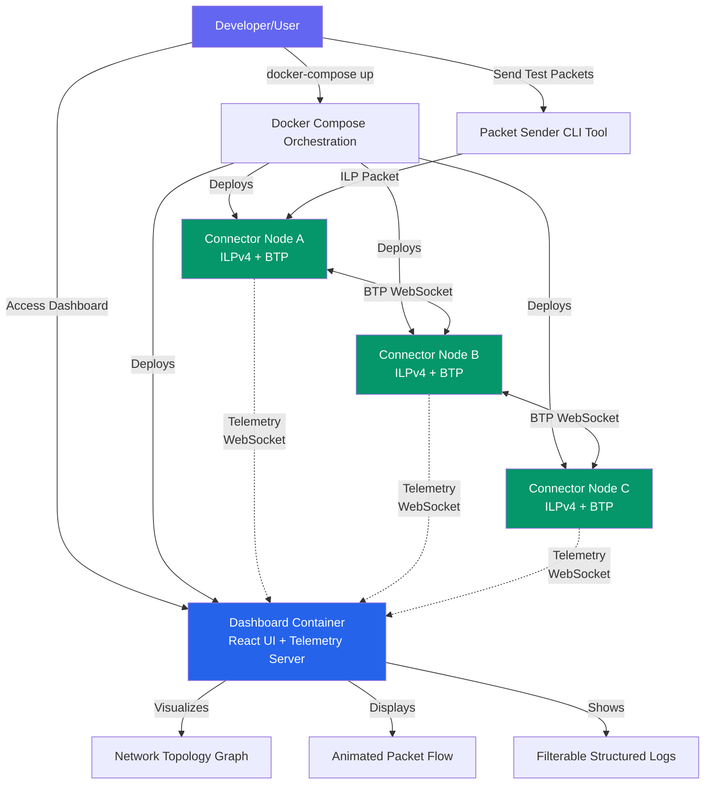
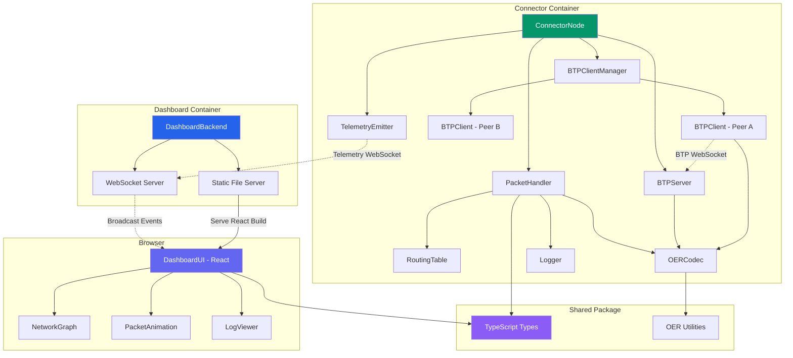
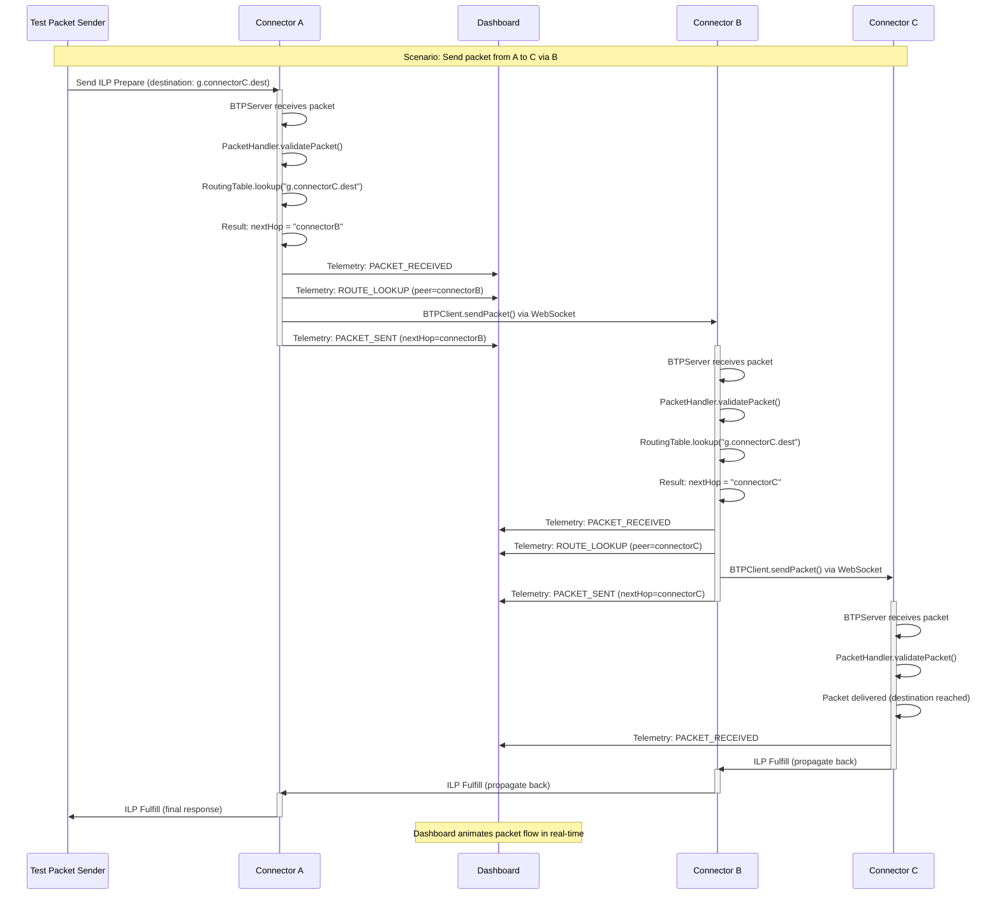
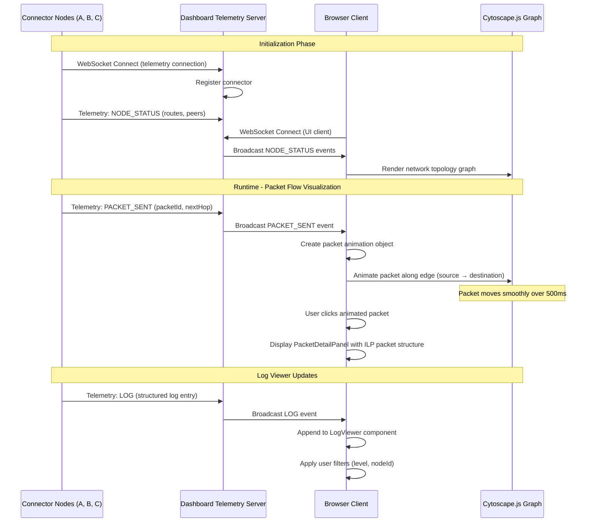
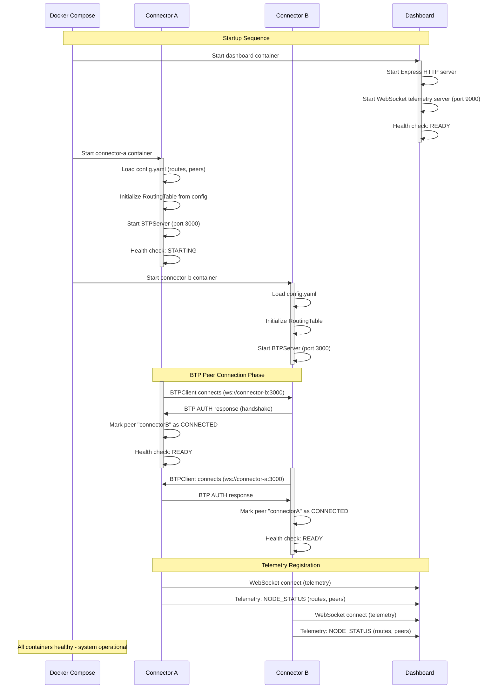

# ILP Connector with BTP and Network Visualization - Architecture Document

## Introduction

This document outlines the overall project architecture for the ILP Connector with BTP and Network Visualization, including backend systems, shared services, and non-UI specific concerns. Its primary goal is to serve as the guiding architectural blueprint for AI-driven development, ensuring consistency and adherence to chosen patterns and technologies.

**Relationship to Frontend Architecture:**
If the project includes a significant user interface, a separate Frontend Architecture Document will detail the frontend-specific design and MUST be used in conjunction with this document. Core technology stack choices documented herein (see "Tech Stack") are definitive for the entire project, including any frontend components.

### Change Log

| Date | Version | Description | Author |
|------|---------|-------------|--------|
| 2025-12-26 | 0.1 | Initial architecture creation | Winston (Architect) |

### Starter Template or Existing Project

**Decision: Greenfield Project - No Starter Template**

Based on PRD review, this is a greenfield project with no existing codebase. Given the unique architectural requirements (ILP connector + BTP + visualization), manual setup is recommended.

**Rationale:**
- Unique requirements don't align with standard starters (Create React App, NestJS, etc.)
- Monorepo structure (`packages/connector`, `packages/dashboard`, `packages/shared`) needs custom configuration
- Educational value enhanced by building from first principles per PRD goals
- PRD explicitly mentions building custom ILP packet implementation for RFC understanding

**Alternatives Considered:**
- Turborepo/Nx monorepo starters - Rejected (unnecessary complexity for 3-package monorepo)
- Vite React starter - Will use for dashboard package only
- NestJS - Overkill for lightweight connector

**Implementation:** Manual initialization with npm workspaces, TypeScript strict mode, and custom project structure.

## High Level Architecture

### Technical Summary

The system employs a **microservices architecture deployed via Docker containers** with an observability-first design philosophy. Multiple independent ILP connector nodes communicate using BTP (RFC-0023) over WebSocket, while a centralized React dashboard aggregates telemetry and provides real-time network visualization. The architecture prioritizes developer experience through comprehensive structured logging, zero-configuration network deployment, and visual packet flow inspection. Built entirely in TypeScript on Node.js, the system leverages in-memory state for simplicity while supporting configurable network topologies from linear chains to full mesh networks. This design directly supports the PRD's core goals: making Interledger packet routing observable, reducing debugging time through enhanced visibility, and enabling rapid experimentation with different network scenarios.

### High Level Overview

**Architectural Style:** **Containerized Microservices with Event-Driven Telemetry**

1. **Repository Structure:** Monorepo (npm workspaces) containing `packages/connector`, `packages/dashboard`, and `packages/shared`
   - Rationale: Simplifies dependency management, enables TypeScript type sharing across packages, streamlines single-developer workflow

2. **Service Architecture:**
   - N identical connector containers (each running ILPv4 + BTP implementation)
   - Single dashboard container (React UI + telemetry WebSocket server)
   - No shared database - each connector maintains in-memory routing tables and peer state

3. **Primary Data Flow:**
   ```
   User sends test packet → Connector A receives via BTP
   → Connector A routes packet (consults routing table)
   → Connector A forwards to Connector B via BTP WebSocket
   → Both emit telemetry to dashboard via WebSocket
   → Dashboard visualizes packet animation in real-time
   → User clicks packet to inspect ILP packet structure
   ```

4. **Key Architectural Decisions:**
   - **In-memory state only:** No persistence layer for MVP - routing tables configured at startup, packet history ephemeral
   - **Push-based telemetry:** Connectors push events to dashboard (not pull-based polling)
   - **Docker-first deployment:** No non-containerized deployment supported for MVP
   - **WebSocket-centric communication:** BTP uses WebSocket (RFC-0023), telemetry uses WebSocket, real-time UI updates use WebSocket
   - **Educational over production:** Security, high availability, and performance optimization secondary to observability and ease of use

### High Level Project Diagram



### Architectural and Design Patterns

1. **Microservices Architecture (Containerized)**
   - Each connector node runs as independent Docker container
   - Services communicate via WebSocket (BTP protocol + telemetry)
   - _Rationale:_ Aligns with PRD requirement for deploying N nodes flexibly; enables network topology experimentation; supports independent scaling and isolation

2. **Event-Driven Telemetry**
   - Connectors emit events (PACKET_RECEIVED, PACKET_SENT, ROUTE_LOOKUP) to dashboard asynchronously
   - Dashboard aggregates and broadcasts to UI clients
   - _Rationale:_ Decouples observability from packet processing; supports real-time visualization without blocking routing; enables future extensibility (multiple dashboard clients, logging backends)

3. **Repository Pattern (for Routing Table Management)**
   - Abstract routing table operations behind interface
   - In-memory implementation for MVP, could swap for Redis/database later
   - _Rationale:_ Enables testing (mock routing table), future migration flexibility, clear separation of routing logic from storage

4. **Observer Pattern (for BTP Connection State)**
   - BTP clients emit connection lifecycle events (connected, disconnected, error)
   - Packet handler observes state to make routing decisions
   - _Rationale:_ Connector components can react to peer availability changes; supports health reporting to dashboard; aligns with event-driven architecture

5. **Strategy Pattern (for Network Topology Configuration)**
   - Topology configuration (linear, mesh, custom) loaded at startup
   - Different topology strategies populate routing tables accordingly
   - _Rationale:_ Supports PRD requirement for multiple pre-configured topologies; enables easy addition of new topology types; separates topology logic from connector core

6. **Hexagonal Architecture (Ports and Adapters)**
   - Core ILP packet handling logic independent of BTP transport
   - BTP is an adapter implementing ledger plugin interface
   - _Rationale:_ Enables future support for ILP-over-HTTP or other transports; improves testability (mock transport); aligns with RFC-0001 layered architecture

7. **Structured Logging as First-Class Concern**
   - All operations emit structured JSON logs with consistent schema
   - Logging integrated at framework level (not ad-hoc console.logs)
   - _Rationale:_ Directly supports FR10 comprehensive logging requirement; enables filterable log viewer; critical for debugging educational use case

8. **RESTful Convention for Dashboard API (Minimal)**
   - Health check endpoint: `GET /health`
   - Static file serving for React build
   - WebSocket endpoint for telemetry: `ws://dashboard:9000/telemetry`
   - _Rationale:_ Simple, standard conventions; minimal API surface for MVP; aligns with Docker health check requirements

## Tech Stack

**CRITICAL SECTION - DEFINITIVE TECHNOLOGY CHOICES**

This section represents the single source of truth for all technology decisions. All implementation must reference these exact versions and choices.

### Cloud Infrastructure

- **Provider:** None (Local Docker deployment for MVP)
- **Key Services:** Docker Engine, Docker Compose
- **Deployment Regions:** Localhost only (future: cloud-agnostic Kubernetes)

### Technology Stack Table

| Category | Technology | Version | Purpose | Rationale |
|----------|-----------|---------|---------|-----------|
| **Language** | TypeScript | 5.3.3 | Primary development language for all packages | Strong typing ensures RFC compliance, excellent IDE support, enables type sharing between connector/dashboard, aligns with Interledger.js ecosystem |
| **Runtime** | Node.js | 20.11.0 LTS | JavaScript runtime for connector and dashboard backend | LTS version guarantees stability, wide ecosystem, asynchronous I/O ideal for WebSocket handling, Docker images readily available |
| **Package Manager** | npm | 10.x | Dependency management and workspace orchestration | Built-in workspaces feature supports monorepo, standard tooling, no additional setup required |
| **Backend Framework** | None (Express.js minimal) | Express 4.18.x | HTTP server for dashboard static files and health endpoint | Lightweight, well-documented, sufficient for minimal API needs, avoids framework overhead |
| **Frontend Framework** | React | 18.2.x | Dashboard UI | Mature ecosystem, excellent integration with visualization libraries, large community, component-based architecture fits dashboard modular design |
| **Build Tool (Frontend)** | Vite | 5.0.x | React development server and production bundler | Lightning-fast HMR, optimized builds, TypeScript support out-of-box, modern alternative to CRA |
| **UI Styling** | TailwindCSS | 3.4.x | Utility-first CSS framework | Rapid UI development, small bundle size, easy dark theme implementation, minimal custom CSS needed |
| **Network Visualization** | Cytoscape.js | 3.28.x | Interactive network graph rendering | Purpose-built for network graphs, performant for 10+ nodes, supports animated layouts, force-directed positioning, MIT licensed |
| **WebSocket Library (Server)** | ws | 8.16.x | WebSocket server for BTP and telemetry | Lightweight, standard Node.js WebSocket library, RFC 6455 compliant, widely used |
| **WebSocket Library (Client)** | Native WebSocket API | Browser built-in | Browser-side WebSocket for dashboard UI | No additional dependencies, standard browser API, sufficient for client needs |
| **Logging Library** | Pino | 8.17.x | Structured JSON logging | High-performance (minimal overhead), excellent TypeScript support, structured JSON output, child logger support for correlation IDs |
| **Testing Framework** | Jest | 29.7.x | Unit and integration testing | Industry standard, excellent TypeScript support, snapshot testing, mocking capabilities, coverage reporting |
| **Linting** | ESLint | 8.56.x | Code quality and consistency | Enforce coding standards, catch common errors, TypeScript integration via @typescript-eslint |
| **Code Formatting** | Prettier | 3.2.x | Automated code formatting | Consistent code style, integrates with ESLint, reduces style debates |
| **ILP Packet Encoding** | Custom OER Implementation | N/A | Encode/decode ILP packets per RFC-0030 | Educational value of building from scratch, no suitable existing library with TypeScript types, enables deep RFC understanding |
| **Configuration Format** | YAML + dotenv | js-yaml 4.1.x | Topology definitions (YAML), runtime config (ENV) | YAML human-readable for topology files, ENV vars integrate with Docker Compose, standard conventions |
| **Container Base Image** | node:20-alpine | 20-alpine | Docker base image for all containers | Small footprint (~150MB), official Node.js image, Alpine Linux security benefits, faster startup |
| **Container Orchestration** | Docker Compose | 2.24.x | Multi-node network deployment | Simple declarative configuration, standard developer tool, supports health checks and networking |
| **Version Control** | Git | 2.x | Source control with conventional commits | Industry standard, conventional commits enable changelog automation |
| **CI/CD** | GitHub Actions | N/A | Automated testing, linting, and Docker builds | Free for open-source, GitHub integration, supports matrix testing across Node versions |
| **Database** | None (In-memory) | N/A | No persistence layer for MVP | Simplifies architecture, sufficient for ephemeral routing state, aligns with educational/testing use case |

**Important Notes:**

1. **No External APIs Required:** All functionality self-contained except Docker Hub for base images
2. **Monorepo Package Structure:**
   - `packages/connector` - Uses Node.js, TypeScript, Pino, ws, Express (health endpoint)
   - `packages/dashboard` - Uses React, Vite, TailwindCSS, Cytoscape.js
   - `packages/shared` - Pure TypeScript types and utilities (ILP packet definitions, OER encoding)
3. **TypeScript Configuration:** Strict mode enabled across all packages, shared tsconfig.base.json in monorepo root
4. **Version Pinning Strategy:** Patch versions flexible (^), minor versions locked for stability, LTS/stable releases preferred
5. **License Compatibility:** All dependencies MIT or Apache 2.0 compatible (open-source project)

## Data Models

### ILPPacket (Base)

**Purpose:** Abstract base type for all ILP packet types (Prepare, Fulfill, Reject) as defined in RFC-0027

**Key Attributes:**
- `type: PacketType` (enum: PREPARE = 12, FULFILL = 13, REJECT = 14) - Discriminator for packet type
- `data: Buffer` - Binary payload data
- `amount: bigint` - Payment amount in smallest unit (uint64)
- `destination: ILPAddress` - Hierarchical ILP address per RFC-0015

**Relationships:**
- Extended by ILPPreparePacket, ILPFulfillPacket, ILPRejectPacket
- Used in BTPMessage payload field

### ILPPreparePacket

**Purpose:** Represents conditional payment packet initiating an ILP transaction (RFC-0027 Section 3.1)

**Key Attributes:**
- `type: PacketType.PREPARE` (12) - Packet type identifier
- `amount: bigint` - Transfer amount
- `destination: ILPAddress` - Payment destination address
- `executionCondition: Buffer` - 32-byte SHA-256 hash condition
- `expiresAt: Date` - Expiration timestamp (ISO 8601)
- `data: Buffer` - Optional application data payload

**Relationships:**
- Forwarded through multiple Connectors until reaching destination
- Responded to with either ILPFulfillPacket or ILPRejectPacket
- Wrapped in BTPMessage for transmission

### ILPFulfillPacket

**Purpose:** Represents successful payment fulfillment (RFC-0027 Section 3.2)

**Key Attributes:**
- `type: PacketType.FULFILL` (13) - Packet type identifier
- `fulfillment: Buffer` - 32-byte preimage that hashes to executionCondition
- `data: Buffer` - Optional return data

**Relationships:**
- Response to ILPPreparePacket
- Propagates backward through connector chain

### ILPRejectPacket

**Purpose:** Represents payment rejection with error information (RFC-0027 Section 3.3)

**Key Attributes:**
- `type: PacketType.REJECT` (14) - Packet type identifier
- `code: ILPErrorCode` - Three-character error code (F00-F99, T00-T99, R00-R99)
- `triggeredBy: ILPAddress` - Address of connector that generated error
- `message: string` - Human-readable error description
- `data: Buffer` - Additional error context

**Relationships:**
- Response to ILPPreparePacket when payment cannot be fulfilled
- Propagates backward through connector chain

**Error Code Categories:**
- F-prefix: Final errors (permanent failures)
- T-prefix: Temporary errors (retryable)
- R-prefix: Relative errors (protocol violations)

### RoutingTableEntry

**Purpose:** Maps ILP address prefixes to next-hop peer identifiers for packet forwarding

**Key Attributes:**
- `prefix: string` - ILP address prefix (e.g., "g.alice" or "g.bob.crypto")
- `nextHop: string` - Peer identifier matching BTP connection
- `priority: number` - Route priority for tie-breaking (optional, default 0)

**Relationships:**
- Many entries comprise a RoutingTable
- nextHop references a Peer in the connector's peer list

### Peer

**Purpose:** Represents a BTP-connected peer connector with connection metadata

**Key Attributes:**
- `id: string` - Unique peer identifier
- `url: string` - WebSocket URL for BTP connection (e.g., "ws://connector-b:3000")
- `authToken: string` - Shared secret for BTP authentication
- `connected: boolean` - Current connection state
- `lastSeen: Date` - Timestamp of last successful communication

**Relationships:**
- Referenced by RoutingTableEntry.nextHop
- Manages one BTPConnection instance

### BTPMessage

**Purpose:** BTP protocol message wrapping ILP packets for transmission (RFC-0023)

**Key Attributes:**
- `type: BTPMessageType` (enum: MESSAGE, RESPONSE, ERROR, TRANSFER, etc.)
- `requestId: number` - Correlation ID for request/response matching
- `data: BTPData` - Message payload containing:
  - `protocolData: BTPProtocolData[]` - Array of protocol-specific data
  - `ilpPacket: Buffer` - Serialized ILP packet (OER encoded)

**Relationships:**
- Contains serialized ILPPacket
- Transmitted over WebSocket connection between Peers

### TelemetryEvent

**Purpose:** Observability event emitted by connectors to dashboard for visualization

**Key Attributes:**
- `type: TelemetryEventType` (enum: NODE_STATUS, PACKET_RECEIVED, PACKET_SENT, ROUTE_LOOKUP)
- `nodeId: string` - Identifier of connector emitting event
- `timestamp: Date` - Event occurrence time
- `data: object` - Event-specific payload (varies by type)

**Event Type Payloads:**
- `NODE_STATUS`: { routes: RoutingTableEntry[], peers: Peer[], health: string }
- `PACKET_RECEIVED`: { packetId: string, type: PacketType, source: string, destination: string, amount: string }
- `PACKET_SENT`: { packetId: string, nextHop: string, timestamp: string }
- `ROUTE_LOOKUP`: { destination: string, selectedPeer: string, reason: string }

**Relationships:**
- Generated by Connector components during packet processing
- Transmitted to Dashboard via WebSocket
- Consumed by Dashboard for visualization and logging

### ConnectorConfig

**Purpose:** Configuration object loaded at connector startup defining routing and peer topology

**Key Attributes:**
- `nodeId: string` - Unique identifier for this connector instance
- `btpServerPort: number` - Port for incoming BTP connections (default 3000)
- `healthCheckPort: number` - HTTP health endpoint port (default 8080)
- `peers: Peer[]` - List of peer connectors to connect to
- `routes: RoutingTableEntry[]` - Initial routing table entries
- `logLevel: string` - Logging verbosity (DEBUG, INFO, WARN, ERROR)
- `dashboardTelemetryUrl: string` - WebSocket URL for telemetry emission

**Relationships:**
- Loaded from YAML file or environment variables
- Initializes RoutingTable and Peer connections

## Components

### ConnectorNode

**Responsibility:** Core ILP connector service that receives, routes, and forwards ILP packets according to RFC-0027. Manages BTP connections to peer connectors and emits telemetry for observability.

**Key Interfaces:**
- `handleIncomingPacket(packet: ILPPacket): Promise<ILPPacket>` - Process received packet and return response
- `forwardPacket(packet: ILPPreparePacket, nextHop: string): Promise<void>` - Forward to peer via BTP
- `getRoutingTable(): RoutingTableEntry[]` - Export current routes for inspection
- `getHealthStatus(): HealthStatus` - Report connector operational status

**Dependencies:**
- PacketHandler (packet processing logic)
- RoutingTable (route lookups)
- BTPServer (accept incoming connections)
- BTPClientManager (manage outbound connections)
- TelemetryEmitter (send events to dashboard)
- Logger (structured logging)

**Technology Stack:** TypeScript, Node.js 20, Pino logger, ws library for WebSocket, Express for health endpoint

### PacketHandler

**Responsibility:** Implements ILPv4 packet forwarding logic including validation, expiry checking, routing table lookup, and error generation per RFC-0027.

**Key Interfaces:**
- `processPrepare(packet: ILPPreparePacket): Promise<ILPFulfillPacket | ILPRejectPacket>` - Process Prepare packet
- `validatePacket(packet: ILPPacket): ValidationResult` - Validate packet structure and expiry
- `generateReject(code: ILPErrorCode, message: string): ILPRejectPacket` - Create reject packet

**Dependencies:**
- RoutingTable (determine next hop)
- BTPClientManager (send to next hop)
- Logger (log routing decisions)

**Technology Stack:** Pure TypeScript business logic with minimal external dependencies

### RoutingTable

**Responsibility:** Maintains in-memory mapping of ILP address prefixes to next-hop peers. Implements longest-prefix matching algorithm per RFC-0027 routing requirements.

**Key Interfaces:**
- `addRoute(prefix: string, nextHop: string): void` - Add routing entry
- `removeRoute(prefix: string): void` - Remove routing entry
- `lookup(destination: ILPAddress): string | null` - Find next-hop peer using longest-prefix match
- `getAllRoutes(): RoutingTableEntry[]` - Export all routes

**Dependencies:** None (pure data structure)

**Technology Stack:** TypeScript with Map-based storage, optimized for O(log n) prefix matching

### BTPServer

**Responsibility:** WebSocket server accepting incoming BTP connections from peer connectors. Implements RFC-0023 authentication and message parsing.

**Key Interfaces:**
- `start(port: number): Promise<void>` - Start listening for connections
- `onConnection(callback: (peerId: string, connection: WebSocket) => void)` - Connection event handler
- `onMessage(callback: (peerId: string, message: BTPMessage) => void)` - Message received handler
- `stop(): Promise<void>` - Graceful shutdown

**Dependencies:**
- ws library (WebSocket server)
- BTPMessageParser (decode BTP frames)
- Logger

**Technology Stack:** ws library 8.16.x, Custom BTP protocol implementation per RFC-0023

### BTPClient

**Responsibility:** WebSocket client for outbound BTP connections to peer connectors. Handles connection lifecycle, authentication, and packet transmission.

**Key Interfaces:**
- `connect(url: string, authToken: string): Promise<void>` - Establish BTP connection
- `sendPacket(packet: ILPPacket): Promise<void>` - Send ILP packet wrapped in BTP MESSAGE
- `onPacket(callback: (packet: ILPPacket) => void)` - Incoming packet handler
- `disconnect(): Promise<void>` - Close connection gracefully

**Dependencies:**
- ws library (WebSocket client)
- BTPMessageParser (encode/decode BTP)
- Logger

**Technology Stack:** ws library 8.16.x, Reconnection logic with exponential backoff

### BTPClientManager

**Responsibility:** Manages multiple BTPClient instances (one per peer). Tracks connection state and routes packets to appropriate client based on peer ID.

**Key Interfaces:**
- `addPeer(peer: Peer): Promise<void>` - Create and connect BTP client for peer
- `removePeer(peerId: string): Promise<void>` - Disconnect and remove peer
- `sendToPeer(peerId: string, packet: ILPPacket): Promise<void>` - Send packet to specific peer
- `getPeerStatus(): Map<string, boolean>` - Get connection state for all peers

**Dependencies:**
- BTPClient (manages instances)
- Logger

**Technology Stack:** TypeScript Map-based client registry

### OERCodec

**Responsibility:** Encode and decode ILP packets to/from binary format using OER (Octet Encoding Rules) per RFC-0030.

**Key Interfaces:**
- `serializePacket(packet: ILPPacket): Buffer` - Encode to binary
- `deserializePacket(buffer: Buffer): ILPPacket` - Decode from binary
- `serializePrepare(packet: ILPPreparePacket): Buffer` - Encode Prepare packet
- `deserializePrepare(buffer: Buffer): ILPPreparePacket` - Decode Prepare packet
- (Similar methods for Fulfill and Reject)

**Dependencies:** Node.js Buffer API

**Technology Stack:** Pure TypeScript implementation, Reference: RFC-0030 and existing ilp-packet library for validation

### TelemetryEmitter

**Responsibility:** Sends telemetry events from connector to dashboard via WebSocket for real-time visualization and logging.

**Key Interfaces:**
- `connect(dashboardUrl: string): Promise<void>` - Connect to dashboard telemetry server
- `emitNodeStatus(routes: RoutingTableEntry[], peers: Peer[]): void` - Send node status event
- `emitPacketReceived(packet: ILPPacket): void` - Send packet received event
- `emitPacketSent(packetId: string, nextHop: string): void` - Send packet sent event
- `emitRouteLookup(destination: string, selectedPeer: string, reason: string): void` - Send routing decision

**Dependencies:**
- Native WebSocket or ws library
- Logger

**Technology Stack:** WebSocket client with non-blocking send, JSON serialization for telemetry events

### DashboardBackend

**Responsibility:** Express.js HTTP server serving React static files and WebSocket telemetry aggregation server. Acts as central hub for connector telemetry.

**Key Interfaces:**
- `start(port: number): Promise<void>` - Start HTTP and WebSocket servers
- `onTelemetryConnection(callback: (connectorId: string) => void)` - New connector connected
- `onTelemetryEvent(callback: (event: TelemetryEvent) => void)` - Telemetry event received
- `broadcastToClients(event: TelemetryEvent): void` - Send to all dashboard UI clients

**Dependencies:**
- Express.js (HTTP server)
- ws library (WebSocket server)
- Logger

**Technology Stack:** Express 4.18.x for static file serving, ws 8.16.x for WebSocket server, Serves built React app from `packages/dashboard/dist`

### DashboardUI (React Application)

**Responsibility:** React-based web UI providing network visualization, packet animation, log viewer, and interactive inspection panels.

**Key Interfaces:**
- NetworkGraph component (Cytoscape.js visualization)
- PacketAnimation component (animated packet flow)
- LogViewer component (filterable structured logs)
- PacketDetailPanel component (inspect packet contents)
- NodeDetailPanel component (inspect connector state)

**Dependencies:**
- React 18.2.x
- Cytoscape.js 3.28.x (network graph)
- TailwindCSS 3.4.x (styling)
- Native WebSocket API (telemetry connection)

**Technology Stack:** Built with Vite 5.0.x, TypeScript + React, WebSocket client connects to DashboardBackend telemetry endpoint

### TestPacketSender (CLI Tool)

**Responsibility:** Command-line utility for injecting test ILP packets into the network to observe routing behavior.

**Key Interfaces:**
- CLI: `send-packet --source <nodeId> --destination <address> --amount <value> [--data <payload>]`
- `createTestPrepare(destination: string, amount: bigint): ILPPreparePacket` - Generate valid packet
- `sendToConnector(nodeUrl: string, packet: ILPPacket): Promise<void>` - Send via BTP

**Dependencies:**
- BTPClient (connect to target connector)
- OERCodec (serialize packet)
- Commander.js (CLI argument parsing)

**Technology Stack:** Node.js CLI script, TypeScript compiled to executable

### Component Diagrams



## External APIs

**Decision: No External APIs Required for MVP**

This project is self-contained with no external API integrations needed. All functionality is implemented using:

- Official Interledger RFCs (specifications, not API calls)
- Docker Hub for base images (node:20-alpine)
- npm registry for package dependencies

**Rationale:**
- Educational/testing tool runs entirely locally
- No real ledger integration (MVP scope limitation per PRD)
- No cloud services or third-party APIs
- BTP connections between connectors are internal (not external APIs)

**Post-MVP Considerations:**
Future versions might integrate with:
- Interledger testnet connectors (real network connectivity)
- Settlement engine APIs (RFC-0038)
- External monitoring/alerting services

## Core Workflows

### Packet Forwarding Workflow (Multi-Hop)

The following sequence diagram illustrates the core ILP packet forwarding flow through multiple connector hops with telemetry emission:



### Dashboard Telemetry and Visualization Workflow



### Connector Startup and BTP Connection Establishment



## Database Schema

**Decision: No Database Required for MVP**

The architecture uses **in-memory data structures only** with no persistence layer.

**Rationale:**
- Routing tables configured at startup from YAML files (ephemeral)
- Packet history not persisted (real-time observability only)
- Connector state resets on container restart (acceptable for dev/test tool)
- Simplifies architecture and reduces dependencies
- Aligns with educational/testing use case (no production data)

**Data Storage Strategy:**
- **Routing Tables:** In-memory Map/Array in each ConnectorNode
- **Peer Connections:** In-memory Map in BTPClientManager
- **Telemetry Events:** Streamed to dashboard, not stored
- **Logs:** Output to stdout, aggregated by Docker logging driver

**Post-MVP Considerations:**
Future versions might add:
- SQLite for optional packet history logging
- Redis for shared routing table state (multi-instance connectors)
- TimescaleDB for performance metrics storage

## Source Tree

```
m2m/                                  # Monorepo root
├── packages/
│   ├── connector/                    # ILP Connector service
│   │   ├── src/
│   │   │   ├── core/
│   │   │   │   ├── connector-node.ts      # Main ConnectorNode orchestrator
│   │   │   │   ├── packet-handler.ts      # ILP packet processing logic
│   │   │   │   └── routing-table.ts       # Routing table implementation
│   │   │   ├── btp/
│   │   │   │   ├── btp-server.ts          # BTP WebSocket server
│   │   │   │   ├── btp-client.ts          # BTP WebSocket client
│   │   │   │   ├── btp-client-manager.ts  # Peer connection manager
│   │   │   │   └── btp-message-parser.ts  # BTP protocol encoding/decoding
│   │   │   ├── telemetry/
│   │   │   │   └── telemetry-emitter.ts   # Dashboard telemetry client
│   │   │   ├── config/
│   │   │   │   └── config-loader.ts       # YAML config loading
│   │   │   ├── http/
│   │   │   │   └── health-server.ts       # Express health check endpoint
│   │   │   ├── utils/
│   │   │   │   └── logger.ts              # Pino logger configuration
│   │   │   └── index.ts                   # Connector entry point
│   │   ├── test/
│   │   │   ├── unit/
│   │   │   │   ├── packet-handler.test.ts
│   │   │   │   ├── routing-table.test.ts
│   │   │   │   └── btp-message-parser.test.ts
│   │   │   └── integration/
│   │   │       └── multi-node-forwarding.test.ts
│   │   ├── Dockerfile                     # Connector container build
│   │   ├── package.json
│   │   └── tsconfig.json
│   │
│   ├── dashboard/                    # Visualization dashboard
│   │   ├── server/
│   │   │   ├── telemetry-server.ts        # WebSocket telemetry aggregator
│   │   │   ├── http-server.ts             # Express static file server
│   │   │   └── index.ts                   # Dashboard backend entry point
│   │   ├── src/                           # React UI source
│   │   │   ├── components/
│   │   │   │   ├── NetworkGraph.tsx       # Cytoscape.js network visualization
│   │   │   │   ├── PacketAnimation.tsx    # Animated packet flow layer
│   │   │   │   ├── LogViewer.tsx          # Filterable log display
│   │   │   │   ├── PacketDetailPanel.tsx  # Packet inspection panel
│   │   │   │   └── NodeDetailPanel.tsx    # Connector status panel
│   │   │   ├── hooks/
│   │   │   │   ├── useTelemetry.ts        # WebSocket telemetry hook
│   │   │   │   └── useNetworkGraph.ts     # Cytoscape graph state
│   │   │   ├── types/
│   │   │   │   └── telemetry.ts           # UI-specific types
│   │   │   ├── App.tsx                    # Main React app
│   │   │   ├── main.tsx                   # Vite entry point
│   │   │   └── index.css                  # Tailwind imports
│   │   ├── public/
│   │   │   └── index.html
│   │   ├── test/
│   │   │   └── components/
│   │   │       ├── NetworkGraph.test.tsx
│   │   │       └── LogViewer.test.tsx
│   │   ├── Dockerfile                     # Dashboard container build
│   │   ├── package.json
│   │   ├── tsconfig.json
│   │   ├── vite.config.ts
│   │   └── tailwind.config.js
│   │
│   └── shared/                       # Shared TypeScript types and utilities
│       ├── src/
│       │   ├── types/
│       │   │   ├── ilp.ts                 # ILP packet type definitions
│       │   │   ├── btp.ts                 # BTP message types
│       │   │   ├── routing.ts             # Routing table types
│       │   │   └── telemetry.ts           # Telemetry event types
│       │   ├── encoding/
│       │   │   └── oer.ts                 # OER encoder/decoder implementation
│       │   ├── validation/
│       │   │   └── ilp-address.ts         # ILP address validation (RFC-0015)
│       │   └── index.ts                   # Shared package exports
│       ├── test/
│       │   ├── encoding/
│       │   │   └── oer.test.ts            # OER encoding test vectors
│       │   └── validation/
│       │       └── ilp-address.test.ts
│       ├── package.json
│       └── tsconfig.json
│
├── tools/                            # CLI utilities
│   └── send-packet/
│       ├── src/
│       │   └── index.ts                   # Test packet sender CLI
│       ├── package.json
│       └── tsconfig.json
│
├── docker/                           # Docker configurations
│   ├── docker-compose.yml                 # Default 3-node linear topology
│   ├── docker-compose.mesh.yml            # 4-node mesh topology
│   └── docker-compose.custom.yml          # Custom topology template
│
├── examples/                         # Example topology configurations
│   ├── linear-3-nodes.yaml                # Linear chain topology config
│   ├── mesh-4-nodes.yaml                  # Full mesh topology config
│   └── hub-spoke.yaml                     # Hub-and-spoke topology config
│
├── docs/                             # Documentation
│   ├── architecture.md                    # This file
│   ├── prd.md                             # Product requirements
│   ├── brief.md                           # Project brief
│   └── rfcs/                              # Copied relevant Interledger RFCs
│       ├── rfc-0027-ilpv4.md
│       ├── rfc-0023-btp.md
│       └── rfc-0030-oer.md
│
├── .github/
│   └── workflows/
│       ├── ci.yml                         # GitHub Actions CI pipeline
│       └── docker-build.yml               # Docker image build workflow
│
├── package.json                      # Root package.json (workspaces)
├── tsconfig.base.json                # Shared TypeScript configuration
├── .eslintrc.json                    # ESLint configuration
├── .prettierrc.json                  # Prettier configuration
├── .gitignore
├── README.md                         # Project overview and quick start
├── CONTRIBUTING.md                   # Contribution guidelines
├── LICENSE                           # MIT or Apache 2.0 license
└── CHANGELOG.md                      # Version history
```

**Key Directory Decisions:**

1. **Monorepo with npm workspaces:** Simplifies dependency management and type sharing
2. **Clear package boundaries:** `connector`, `dashboard`, `shared` are independently buildable
3. **Co-located tests:** Test files alongside source for better discoverability
4. **Docker configs at root:** Easier access for `docker-compose up`
5. **Examples directory:** Pre-configured topologies for quick experimentation
6. **Tools separate:** CLI utilities independent of main packages

## Infrastructure and Deployment

### Infrastructure as Code

- **Tool:** Docker Compose 2.24.x
- **Location:** `docker/docker-compose.yml` (and topology variants)
- **Approach:** Declarative container orchestration with environment-based configuration

**Decision Rationale:**
- Docker Compose sufficient for MVP (single-machine deployment)
- YAML format aligns with topology configuration files
- No Terraform/Pulumi needed (no cloud resources)
- Future migration to Kubernetes possible if cloud deployment needed

### Deployment Strategy

- **Strategy:** Local container deployment with manual execution
- **CI/CD Platform:** GitHub Actions
- **Pipeline Configuration:** `.github/workflows/ci.yml`

**Deployment Flow:**
1. Developer runs `docker-compose up` locally
2. Docker pulls pre-built images (if published) or builds from Dockerfiles
3. Containers start with health checks
4. Dashboard accessible at `http://localhost:8080`

**CI/CD Pipeline Stages:**
1. **Build:** Compile TypeScript for all packages
2. **Lint:** Run ESLint and Prettier checks
3. **Test:** Execute Jest unit and integration tests
4. **Docker Build:** Build connector and dashboard images (on main branch)
5. **Optional:** Push images to GitHub Container Registry

### Environments

- **Local Development:** Primary environment - `docker-compose up` on developer machine
  - All services run on localhost
  - Hot reload for development (Vite HMR for dashboard)
  - Direct log access via `docker-compose logs`

- **CI/CD Testing:** GitHub Actions runners
  - Automated test execution
  - Docker build validation
  - No persistent state between runs

- **Future Production (Post-MVP):** Cloud deployment with Kubernetes
  - Multi-node connector clusters
  - Hosted dashboard with authentication
  - Persistent metrics storage

### Environment Promotion Flow

```
Local Development
  ↓ (git push)
GitHub Actions CI
  ↓ (tests pass)
Docker Image Build
  ↓ (manual tag/release)
GitHub Container Registry
  ↓ (future: automated deployment)
Cloud Environment (Kubernetes)
```

**MVP Scope:** Promotion stops at Docker Image Build. Cloud deployment deferred to post-MVP.

### Rollback Strategy

- **Primary Method:** Container restart with previous image tag
- **Trigger Conditions:**
  - Health checks failing after deployment
  - Critical bugs discovered in new version
  - Performance degradation beyond NFR thresholds
- **Recovery Time Objective:** < 2 minutes (restart containers with previous image)

**Rollback Procedure:**
```bash
# Tag current deployment
docker tag ilp-connector:latest ilp-connector:rollback-backup

# Pull previous version
docker pull ilp-connector:v0.2.0

# Restart with previous version
docker-compose down
docker-compose up -d
```

## Error Handling Strategy

### General Approach

- **Error Model:** Exception-based error handling with typed error classes
- **Exception Hierarchy:**
  - `ILPError` (base class for ILP protocol errors)
    - `ILPFinalError` (F-prefix errors - permanent failures)
    - `ILPTemporaryError` (T-prefix errors - retryable)
    - `ILPRelativeError` (R-prefix errors - protocol violations)
  - `BTPError` (BTP protocol errors)
  - `ConfigurationError` (startup configuration issues)
  - `TelemetryError` (telemetry emission failures - non-critical)
- **Error Propagation:**
  - ILP errors converted to ILPRejectPacket and returned to sender
  - BTP errors logged and trigger connection retry
  - Configuration errors cause startup failure with clear messages
  - Telemetry errors logged but do not block packet processing

### Logging Standards

- **Library:** Pino 8.17.x
- **Format:** Structured JSON with consistent schema
- **Levels:** DEBUG, INFO, WARN, ERROR
  - **DEBUG:** Detailed packet contents, routing table lookups
  - **INFO:** Packet forwarding events, connection state changes
  - **WARN:** Retry attempts, degraded performance
  - **ERROR:** Unrecoverable errors, configuration issues
- **Required Context:**
  - **Correlation ID:** Generated for each ILP Prepare packet, tracked through entire flow
  - **Service Context:** `nodeId` included in every log entry
  - **User Context:** Not applicable (no user authentication in MVP)

**Example Structured Log Entry:**
```json
{
  "level": "info",
  "time": 1703620800000,
  "nodeId": "connector-a",
  "correlationId": "pkt_abc123",
  "msg": "Packet forwarded",
  "packetType": "PREPARE",
  "destination": "g.connectorC.dest",
  "nextHop": "connectorB",
  "amount": "1000"
}
```

### Error Handling Patterns

#### External API Errors (BTP Connections)

- **Retry Policy:** Exponential backoff (1s, 2s, 4s, 8s, 16s) up to 5 attempts
- **Circuit Breaker:** After 5 consecutive failures, mark peer as DISCONNECTED for 60s before retry
- **Timeout Configuration:** BTP connection timeout 5s, packet send timeout 10s
- **Error Translation:**
  - BTP connection failure → ILP T01 (Ledger Unreachable) error
  - BTP timeout → ILP T00 (Transfer Timed Out) error
  - BTP authentication failure → Startup failure (configuration error)

#### Business Logic Errors

- **Custom Exceptions:**
  - `PacketExpiredError` → ILP T00 (Transfer Timed Out)
  - `RouteNotFoundError` → ILP F02 (Unreachable)
  - `InvalidPacketError` → ILP R00 (Transfer Cancelled)
- **User-Facing Errors:** Displayed in dashboard log viewer with human-readable messages
- **Error Codes:** ILP standard error codes (RFC-0027) used consistently

#### Data Consistency

- **Transaction Strategy:** No database transactions (in-memory only for MVP)
- **Compensation Logic:** Not applicable for MVP (no distributed transactions)
- **Idempotency:** Packet IDs used to detect duplicates (best-effort, not guaranteed in MVP)

## Coding Standards

**CRITICAL: These standards are MANDATORY for AI code generation**

### Core Standards

- **Languages & Runtimes:** TypeScript 5.3.3 (strict mode), Node.js 20.11.0 LTS
- **Style & Linting:** ESLint (@typescript-eslint/recommended), Prettier (line length 100, single quotes)
- **Test Organization:** Co-located tests (`*.test.ts` next to `*.ts`), `__mocks__` for shared mocks

### Naming Conventions

| Element | Convention | Example |
|---------|-----------|---------|
| Files (TypeScript) | kebab-case | `packet-handler.ts` |
| Classes | PascalCase | `PacketHandler` |
| Interfaces/Types | PascalCase with `I` prefix for interfaces | `ILPPacket`, `RoutingTableEntry` |
| Functions/Methods | camelCase | `validatePacket()` |
| Constants | UPPER_SNAKE_CASE | `DEFAULT_BTP_PORT` |
| Private members | camelCase with `_` prefix | `_internalState` |

### Critical Rules

- **NEVER use console.log:** Use Pino logger exclusively (`logger.info()`, `logger.error()`, etc.)
- **All ILP packet responses use typed returns:** Functions return `ILPFulfillPacket | ILPRejectPacket`, never plain objects
- **BTP connections must use BTPClient/BTPServer classes:** No raw WebSocket usage outside BTP module
- **Telemetry emission is non-blocking:** Always use `try-catch` around `telemetryEmitter.emit()` to prevent packet processing failures
- **Configuration loaded at startup only:** No runtime config changes for MVP
- **NEVER hardcode ports/URLs:** Use environment variables with defaults
- **All async functions must handle errors:** Use try-catch or .catch() - no unhandled promise rejections
- **OER encoding must validate packet structure:** Throw `InvalidPacketError` for malformed data
- **Routing table lookups return null for no match:** Caller handles null by generating F02 error

### Language-Specific Guidelines

#### TypeScript Specifics

- **Strict mode enabled:** `strict: true` in tsconfig.json - no `any` types except in test mocks
- **Prefer interfaces over type aliases** for object shapes (better error messages)
- **Use `Buffer` for binary data:** Not `Uint8Array` or `ArrayBuffer` (Node.js convention)
- **Async/await over callbacks:** All asynchronous code uses `async/await` pattern
- **Optional chaining for safety:** Use `peer?.connected` instead of `peer && peer.connected`

## Test Strategy and Standards

### Testing Philosophy

- **Approach:** Test-Driven Development (TDD) encouraged but not required
- **Coverage Goals:**
  - `packages/shared`: >90% (critical protocol logic)
  - `packages/connector`: >80% (core routing and BTP)
  - `packages/dashboard`: >70% (UI components - lower bar acceptable)
- **Test Pyramid:**
  - 70% Unit Tests (fast, isolated, comprehensive)
  - 20% Integration Tests (multi-component, Docker-based)
  - 10% E2E Tests (full system validation)

### Test Types and Organization

#### Unit Tests

- **Framework:** Jest 29.7.x with TypeScript support (`ts-jest`)
- **File Convention:** `<filename>.test.ts` co-located with source
- **Location:** Same directory as source file (e.g., `src/core/packet-handler.test.ts`)
- **Mocking Library:** Jest built-in mocking (`jest.fn()`, `jest.mock()`)
- **Coverage Requirement:** >80% line coverage for connector, >90% for shared

**AI Agent Requirements:**
- Generate tests for all public methods and exported functions
- Cover edge cases: empty inputs, null values, maximum values, expired timestamps
- Follow AAA pattern (Arrange, Act, Assert) with clear test descriptions
- Mock all external dependencies (WebSocket, Logger, BTPClient)
- Use descriptive test names: `should reject packet when expiry time has passed`

**Example Unit Test Structure:**
```typescript
describe('PacketHandler', () => {
  let handler: PacketHandler;
  let mockRoutingTable: jest.Mocked<RoutingTable>;
  let mockLogger: jest.Mocked<Logger>;

  beforeEach(() => {
    mockRoutingTable = createMockRoutingTable();
    mockLogger = createMockLogger();
    handler = new PacketHandler(mockRoutingTable, mockLogger);
  });

  it('should reject packet when expiry time has passed', async () => {
    // Arrange
    const expiredPacket = createExpiredPreparePacket();

    // Act
    const result = await handler.processPrepare(expiredPacket);

    // Assert
    expect(result.type).toBe(PacketType.REJECT);
    expect(result.code).toBe('T00'); // Transfer Timed Out
  });
});
```

#### Integration Tests

- **Scope:** Multi-component interaction within connector package
- **Location:** `packages/connector/test/integration/`
- **Test Infrastructure:**
  - **WebSocket:** Use real ws library with localhost connections (not mocked)
  - **Routing Table:** Real RoutingTable instance with test data
  - **BTP:** Real BTPServer + BTPClient connecting locally

**Example Integration Test:**
- Deploy 3 connector instances in-process
- Send ILP Prepare through Connector A
- Verify packet routed through B to C
- Validate telemetry events emitted at each hop

#### End-to-End Tests

- **Framework:** Jest with Docker Compose integration
- **Scope:** Full system deployment with dashboard
- **Environment:** Automated Docker Compose startup in test
- **Test Data:** Pre-configured 3-node linear topology

**Example E2E Test Flow:**
```typescript
describe('Full System E2E', () => {
  beforeAll(async () => {
    await execAsync('docker-compose up -d');
    await waitForHealthy(['connector-a', 'connector-b', 'connector-c', 'dashboard']);
  });

  it('should forward packet through network and visualize in dashboard', async () => {
    // Send packet using CLI tool
    await sendTestPacket('connector-a', 'g.connectorC.dest', 1000);

    // Wait for telemetry
    const telemetryEvents = await collectTelemetryEvents(timeout: 5000);

    // Verify packet flow
    expect(telemetryEvents).toContainEqual(
      expect.objectContaining({ type: 'PACKET_SENT', nodeId: 'connector-a' })
    );
    expect(telemetryEvents).toContainEqual(
      expect.objectContaining({ type: 'PACKET_RECEIVED', nodeId: 'connector-c' })
    );
  });

  afterAll(async () => {
    await execAsync('docker-compose down');
  });
});
```

### Test Data Management

- **Strategy:** Factory functions for test data generation
- **Fixtures:** JSON fixtures in `test/fixtures/` for complex scenarios
- **Factories:** `createTestPreparePacket(overrides)` functions in `test/helpers/`
- **Cleanup:** Jest `afterEach` hooks reset in-memory state, Docker tests clean up containers

### Continuous Testing

- **CI Integration:**
  - `npm test` runs all unit tests
  - `npm run test:integration` runs integration tests
  - E2E tests run on main branch only (slow)
- **Performance Tests:** Separate `npm run test:perf` script (Story 4.9)
- **Security Tests:** `npm audit` in CI pipeline, dependency scanning with Dependabot

## Security

**MANDATORY security requirements for AI-generated code**

### Input Validation

- **Validation Library:** Custom validators in `packages/shared/src/validation/`
- **Validation Location:** At API boundaries (BTPServer packet reception, config loading)
- **Required Rules:**
  - All ILP packets MUST be OER-decoded and validated before processing
  - ILP addresses MUST match RFC-0015 format (hierarchical, valid characters)
  - Packet expiry timestamps MUST be validated (not in past, within reasonable future bound)
  - BTP message structure MUST be validated before extracting ILP packet

### Authentication & Authorization

- **Auth Method:** Shared secrets for BTP authentication (configured per-peer in YAML)
- **Session Management:** Not applicable (no user sessions - tool runs locally)
- **Required Patterns:**
  - BTP handshake MUST validate shared secret before accepting connection
  - Invalid authentication MUST close WebSocket connection immediately
  - Dashboard has no authentication for MVP (localhost-only deployment)

### Secrets Management

- **Development:** `.env` file (gitignored) for local secrets
- **Production:** Environment variables injected by Docker Compose
- **Code Requirements:**
  - NEVER hardcode BTP shared secrets - load from environment variables
  - Access secrets via `process.env` with fallback to defaults for non-sensitive config
  - No secrets in logs or error messages (redact in Pino serializers)

**Example:**
```typescript
const btpSecret = process.env.BTP_AUTH_SECRET || (() => {
  logger.error('BTP_AUTH_SECRET not configured');
  process.exit(1);
})();
```

### API Security

- **Rate Limiting:** Not implemented for MVP (localhost deployment, trusted environment)
- **CORS Policy:** Dashboard allows all origins (no CORS restrictions for localhost)
- **Security Headers:** Not required for MVP (no internet-facing deployment)
- **HTTPS Enforcement:** Not required for MVP (local Docker network uses ws://)

**Post-MVP:** Add HTTPS (wss://), CORS restrictions, rate limiting if cloud-deployed

### Data Protection

- **Encryption at Rest:** Not required (no persistent data storage)
- **Encryption in Transit:** Not required for MVP (local Docker network)
- **PII Handling:** No PII collected or processed
- **Logging Restrictions:**
  - DO NOT log BTP shared secrets
  - DO log packet amounts, addresses (not PII in test environment)
  - Redact `authToken` field in peer configuration logs

**Pino Serializer Example:**
```typescript
const logger = pino({
  serializers: {
    peer: (peer) => ({
      ...peer,
      authToken: '[REDACTED]'  // Never log secrets
    })
  }
});
```

### Dependency Security

- **Scanning Tool:** `npm audit` (built-in) + GitHub Dependabot
- **Update Policy:** Review and update dependencies monthly, critical security patches within 48 hours
- **Approval Process:** All new dependencies require rationale comment in PR

### Security Testing

- **SAST Tool:** ESLint security plugins (`eslint-plugin-security`)
- **DAST Tool:** Not applicable for MVP (no public-facing endpoints)
- **Penetration Testing:** Not required for MVP (educational tool, not production system)

**Security Stance:**
This is a **development and educational tool**, not a production payment system. Security focuses on:
- Preventing accidental secret leakage
- Basic input validation to avoid crashes
- No malicious code in dependencies

Production-grade security (encryption, formal audits, threat modeling) deferred to post-MVP if tool is adapted for real payment processing.

## Next Steps

After completing this architecture document:

1. **Proceed to Implementation:**
   - Use this document as the definitive reference for all coding decisions
   - Start with Epic 1 (Foundation & Core ILP Protocol Implementation)
   - Implement stories sequentially as defined in PRD

2. **Extract Agent-Specific Files:**
   - **docs/architecture/tech-stack.md** - Technology stack table for quick reference
   - **docs/architecture/coding-standards.md** - Critical rules for dev agent
   - **docs/architecture/source-tree.md** - Directory structure for file creation

3. **Review with Product Owner:**
   - Validate architectural decisions align with MVP goals
   - Confirm technology choices meet project constraints
   - Approve before significant implementation begins

