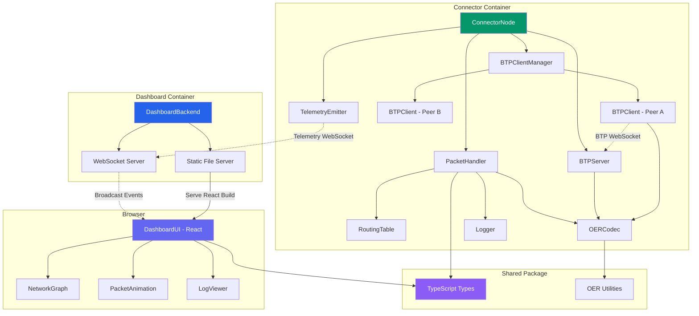

# Components

## ConnectorNode

**Responsibility:** Core ILP connector service that receives, routes, and forwards ILP packets according to RFC-0027. Manages BTP connections to peer connectors and emits telemetry for observability.

**Key Interfaces:**
- `handleIncomingPacket(packet: ILPPacket): Promise<ILPPacket>` - Process received packet and return response
- `forwardPacket(packet: ILPPreparePacket, nextHop: string): Promise<void>` - Forward to peer via BTP
- `getRoutingTable(): RoutingTableEntry[]` - Export current routes for inspection
- `getHealthStatus(): HealthStatus` - Report connector operational status

**Dependencies:**
- PacketHandler (packet processing logic)
- RoutingTable (route lookups)
- BTPServer (accept incoming connections)
- BTPClientManager (manage outbound connections)
- TelemetryEmitter (send events to dashboard)
- Logger (structured logging)

**Technology Stack:** TypeScript, Node.js 20, Pino logger, ws library for WebSocket, Express for health endpoint

## PacketHandler

**Responsibility:** Implements ILPv4 packet forwarding logic including validation, expiry checking, routing table lookup, and error generation per RFC-0027.

**Key Interfaces:**
- `processPrepare(packet: ILPPreparePacket): Promise<ILPFulfillPacket | ILPRejectPacket>` - Process Prepare packet
- `validatePacket(packet: ILPPacket): ValidationResult` - Validate packet structure and expiry
- `generateReject(code: ILPErrorCode, message: string): ILPRejectPacket` - Create reject packet

**Dependencies:**
- RoutingTable (determine next hop)
- BTPClientManager (send to next hop)
- Logger (log routing decisions)

**Technology Stack:** Pure TypeScript business logic with minimal external dependencies

## RoutingTable

**Responsibility:** Maintains in-memory mapping of ILP address prefixes to next-hop peers. Implements longest-prefix matching algorithm per RFC-0027 routing requirements.

**Key Interfaces:**
- `addRoute(prefix: string, nextHop: string): void` - Add routing entry
- `removeRoute(prefix: string): void` - Remove routing entry
- `lookup(destination: ILPAddress): string | null` - Find next-hop peer using longest-prefix match
- `getAllRoutes(): RoutingTableEntry[]` - Export all routes

**Dependencies:** None (pure data structure)

**Technology Stack:** TypeScript with Map-based storage, optimized for O(log n) prefix matching

## BTPServer

**Responsibility:** WebSocket server accepting incoming BTP connections from peer connectors. Implements RFC-0023 authentication and message parsing.

**Key Interfaces:**
- `start(port: number): Promise<void>` - Start listening for connections
- `onConnection(callback: (peerId: string, connection: WebSocket) => void)` - Connection event handler
- `onMessage(callback: (peerId: string, message: BTPMessage) => void)` - Message received handler
- `stop(): Promise<void>` - Graceful shutdown

**Dependencies:**
- ws library (WebSocket server)
- BTPMessageParser (decode BTP frames)
- Logger

**Technology Stack:** ws library 8.16.x, Custom BTP protocol implementation per RFC-0023

## BTPClient

**Responsibility:** WebSocket client for outbound BTP connections to peer connectors. Handles connection lifecycle, authentication, and packet transmission.

**Key Interfaces:**
- `connect(url: string, authToken: string): Promise<void>` - Establish BTP connection
- `sendPacket(packet: ILPPacket): Promise<void>` - Send ILP packet wrapped in BTP MESSAGE
- `onPacket(callback: (packet: ILPPacket) => void)` - Incoming packet handler
- `disconnect(): Promise<void>` - Close connection gracefully

**Dependencies:**
- ws library (WebSocket client)
- BTPMessageParser (encode/decode BTP)
- Logger

**Technology Stack:** ws library 8.16.x, Reconnection logic with exponential backoff

## BTPClientManager

**Responsibility:** Manages multiple BTPClient instances (one per peer). Tracks connection state and routes packets to appropriate client based on peer ID.

**Key Interfaces:**
- `addPeer(peer: Peer): Promise<void>` - Create and connect BTP client for peer
- `removePeer(peerId: string): Promise<void>` - Disconnect and remove peer
- `sendToPeer(peerId: string, packet: ILPPacket): Promise<void>` - Send packet to specific peer
- `getPeerStatus(): Map<string, boolean>` - Get connection state for all peers

**Dependencies:**
- BTPClient (manages instances)
- Logger

**Technology Stack:** TypeScript Map-based client registry

## OERCodec

**Responsibility:** Encode and decode ILP packets to/from binary format using OER (Octet Encoding Rules) per RFC-0030.

**Key Interfaces:**
- `serializePacket(packet: ILPPacket): Buffer` - Encode to binary
- `deserializePacket(buffer: Buffer): ILPPacket` - Decode from binary
- `serializePrepare(packet: ILPPreparePacket): Buffer` - Encode Prepare packet
- `deserializePrepare(buffer: Buffer): ILPPreparePacket` - Decode Prepare packet
- (Similar methods for Fulfill and Reject)

**Dependencies:** Node.js Buffer API

**Technology Stack:** Pure TypeScript implementation, Reference: RFC-0030 and existing ilp-packet library for validation

## TelemetryEmitter

**Responsibility:** Sends telemetry events from connector to dashboard via WebSocket for real-time visualization and logging.

**Key Interfaces:**
- `connect(dashboardUrl: string): Promise<void>` - Connect to dashboard telemetry server
- `emitNodeStatus(routes: RoutingTableEntry[], peers: Peer[]): void` - Send node status event
- `emitPacketReceived(packet: ILPPacket): void` - Send packet received event
- `emitPacketSent(packetId: string, nextHop: string): void` - Send packet sent event
- `emitRouteLookup(destination: string, selectedPeer: string, reason: string): void` - Send routing decision

**Dependencies:**
- Native WebSocket or ws library
- Logger

**Technology Stack:** WebSocket client with non-blocking send, JSON serialization for telemetry events

## DashboardBackend

**Responsibility:** Express.js HTTP server serving React static files and WebSocket telemetry aggregation server. Acts as central hub for connector telemetry.

**Key Interfaces:**
- `start(port: number): Promise<void>` - Start HTTP and WebSocket servers
- `onTelemetryConnection(callback: (connectorId: string) => void)` - New connector connected
- `onTelemetryEvent(callback: (event: TelemetryEvent) => void)` - Telemetry event received
- `broadcastToClients(event: TelemetryEvent): void` - Send to all dashboard UI clients

**Dependencies:**
- Express.js (HTTP server)
- ws library (WebSocket server)
- Logger

**Technology Stack:** Express 4.18.x for static file serving, ws 8.16.x for WebSocket server, Serves built React app from `packages/dashboard/dist`

## DashboardUI (React Application)

**Responsibility:** React-based web UI providing network visualization, packet animation, log viewer, and interactive inspection panels.

**Key Interfaces:**
- NetworkGraph component (Cytoscape.js visualization)
- PacketAnimation component (animated packet flow)
- LogViewer component (filterable structured logs)
- PacketDetailPanel component (inspect packet contents)
- NodeDetailPanel component (inspect connector state)

**Dependencies:**
- React 18.2.x
- Cytoscape.js 3.28.x (network graph)
- TailwindCSS 3.4.x (styling)
- Native WebSocket API (telemetry connection)

**Technology Stack:** Built with Vite 5.0.x, TypeScript + React, WebSocket client connects to DashboardBackend telemetry endpoint

## TestPacketSender (CLI Tool)

**Responsibility:** Command-line utility for injecting test ILP packets into the network to observe routing behavior.

**Key Interfaces:**
- CLI: `send-packet --source <nodeId> --destination <address> --amount <value> [--data <payload>]`
- `createTestPrepare(destination: string, amount: bigint): ILPPreparePacket` - Generate valid packet
- `sendToConnector(nodeUrl: string, packet: ILPPacket): Promise<void>` - Send via BTP

**Dependencies:**
- BTPClient (connect to target connector)
- OERCodec (serialize packet)
- Commander.js (CLI argument parsing)

**Technology Stack:** Node.js CLI script, TypeScript compiled to executable

## Component Diagrams

