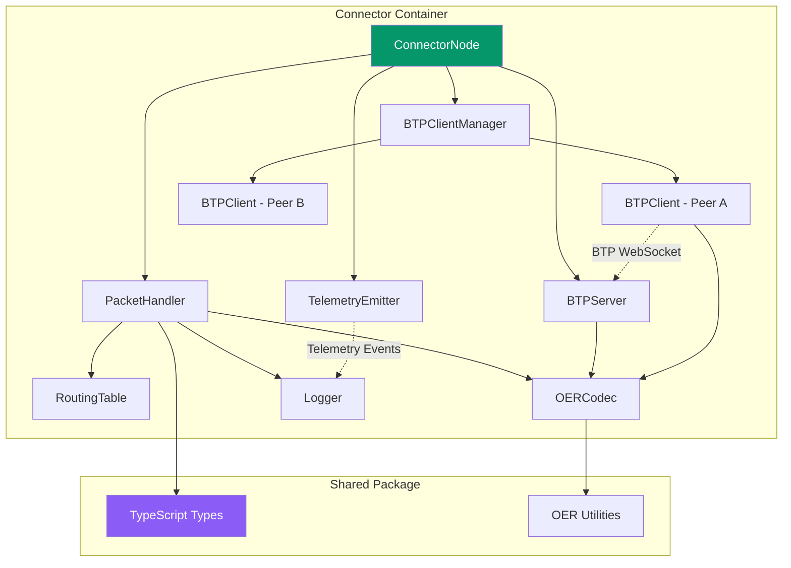

# Components

## ConnectorNode

**Responsibility:** Core ILP connector service that receives, routes, and forwards ILP packets according to RFC-0027. Manages BTP connections to peer connectors and emits telemetry for observability.

**Key Interfaces:**

- `handleIncomingPacket(packet: ILPPacket): Promise<ILPPacket>` - Process received packet and return response
- `forwardPacket(packet: ILPPreparePacket, nextHop: string): Promise<void>` - Forward to peer via BTP
- `getRoutingTable(): RoutingTableEntry[]` - Export current routes for inspection
- `getHealthStatus(): HealthStatus` - Report connector operational status

**Dependencies:**

- PacketHandler (packet processing logic)
- RoutingTable (route lookups)
- BTPServer (accept incoming connections)
- BTPClientManager (manage outbound connections)
- TelemetryEmitter (emit events for monitoring)
- Logger (structured logging)

**Technology Stack:** TypeScript, Node.js 20, Pino logger, ws library for WebSocket, Express for health endpoint

## PacketHandler

**Responsibility:** Implements ILPv4 packet forwarding logic including validation, expiry checking, routing table lookup, and error generation per RFC-0027.

**Key Interfaces:**

- `processPrepare(packet: ILPPreparePacket): Promise<ILPFulfillPacket | ILPRejectPacket>` - Process Prepare packet
- `validatePacket(packet: ILPPacket): ValidationResult` - Validate packet structure and expiry
- `generateReject(code: ILPErrorCode, message: string): ILPRejectPacket` - Create reject packet

**Dependencies:**

- RoutingTable (determine next hop)
- BTPClientManager (send to next hop)
- Logger (log routing decisions)

**Technology Stack:** Pure TypeScript business logic with minimal external dependencies

## RoutingTable

**Responsibility:** Maintains in-memory mapping of ILP address prefixes to next-hop peers. Implements longest-prefix matching algorithm per RFC-0027 routing requirements.

**Key Interfaces:**

- `addRoute(prefix: string, nextHop: string): void` - Add routing entry
- `removeRoute(prefix: string): void` - Remove routing entry
- `lookup(destination: ILPAddress): string | null` - Find next-hop peer using longest-prefix match
- `getAllRoutes(): RoutingTableEntry[]` - Export all routes

**Dependencies:** None (pure data structure)

**Technology Stack:** TypeScript with Map-based storage, optimized for O(log n) prefix matching

## BTPServer

**Responsibility:** WebSocket server accepting incoming BTP connections from peer connectors. Implements RFC-0023 authentication and message parsing.

**Key Interfaces:**

- `start(port: number): Promise<void>` - Start listening for connections
- `onConnection(callback: (peerId: string, connection: WebSocket) => void)` - Connection event handler
- `onMessage(callback: (peerId: string, message: BTPMessage) => void)` - Message received handler
- `stop(): Promise<void>` - Graceful shutdown

**Dependencies:**

- ws library (WebSocket server)
- BTPMessageParser (decode BTP frames)
- Logger

**Technology Stack:** ws library 8.16.x, Custom BTP protocol implementation per RFC-0023

## BTPClient

**Responsibility:** WebSocket client for outbound BTP connections to peer connectors. Handles connection lifecycle, authentication, and packet transmission.

**Key Interfaces:**

- `connect(url: string, authToken: string): Promise<void>` - Establish BTP connection
- `sendPacket(packet: ILPPacket): Promise<void>` - Send ILP packet wrapped in BTP MESSAGE
- `onPacket(callback: (packet: ILPPacket) => void)` - Incoming packet handler
- `disconnect(): Promise<void>` - Close connection gracefully

**Dependencies:**

- ws library (WebSocket client)
- BTPMessageParser (encode/decode BTP)
- Logger

**Technology Stack:** ws library 8.16.x, Reconnection logic with exponential backoff

## BTPClientManager

**Responsibility:** Manages multiple BTPClient instances (one per peer). Tracks connection state and routes packets to appropriate client based on peer ID.

**Key Interfaces:**

- `addPeer(peer: Peer): Promise<void>` - Create and connect BTP client for peer
- `removePeer(peerId: string): Promise<void>` - Disconnect and remove peer
- `sendToPeer(peerId: string, packet: ILPPacket): Promise<void>` - Send packet to specific peer
- `getPeerStatus(): Map<string, boolean>` - Get connection state for all peers

**Dependencies:**

- BTPClient (manages instances)
- Logger

**Technology Stack:** TypeScript Map-based client registry

## OERCodec

**Responsibility:** Encode and decode ILP packets to/from binary format using OER (Octet Encoding Rules) per RFC-0030.

**Key Interfaces:**

- `serializePacket(packet: ILPPacket): Buffer` - Encode to binary
- `deserializePacket(buffer: Buffer): ILPPacket` - Decode from binary
- `serializePrepare(packet: ILPPreparePacket): Buffer` - Encode Prepare packet
- `deserializePrepare(buffer: Buffer): ILPPreparePacket` - Decode Prepare packet
- (Similar methods for Fulfill and Reject)

**Dependencies:** Node.js Buffer API

**Technology Stack:** Pure TypeScript implementation, Reference: RFC-0030 and existing ilp-packet library for validation

## TelemetryEmitter

**Responsibility:** Emits telemetry events from connector for monitoring and observability. Events can be consumed by logging systems, metrics collectors, or future visualization tools.

**Key Interfaces:**

- `emit(event: TelemetryEvent): void` - Emit telemetry event (logged to stdout)
- `emitNodeStatus(routes: RoutingTableEntry[], peers: Peer[]): void` - Emit node status event
- `emitPacketReceived(packet: ILPPacket): void` - Emit packet received event
- `emitPacketSent(packetId: string, nextHop: string): void` - Emit packet sent event
- `emitRouteLookup(destination: string, selectedPeer: string, reason: string): void` - Emit routing decision

**Dependencies:**

- Logger

**Technology Stack:** Event emission to structured logging system, JSON serialization for telemetry events

**Note:** Dashboard visualization deferred - see DASHBOARD-DEFERRED.md in root

## TestPacketSender (CLI Tool)

**Responsibility:** Command-line utility for injecting test ILP packets into the network to observe routing behavior.

**Key Interfaces:**

- CLI: `send-packet --source <nodeId> --destination <address> --amount <value> [--data <payload>]`
- `createTestPrepare(destination: string, amount: bigint): ILPPreparePacket` - Generate valid packet
- `sendToConnector(nodeUrl: string, packet: ILPPacket): Promise<void>` - Send via BTP

**Dependencies:**

- BTPClient (connect to target connector)
- OERCodec (serialize packet)
- Commander.js (CLI argument parsing)

**Technology Stack:** Node.js CLI script, TypeScript compiled to executable

## XRPChannelSDK

**Responsibility:** High-level SDK for XRP payment channel lifecycle management. Consolidates XRPLClient, PaymentChannelManager, and ClaimSigner into unified API with automatic state caching.

**Key Interfaces:**

- `openChannel(destination: string, amount: string, settleDelay: number): Promise<string>` - Create new XRP channel
- `fundChannel(channelId: string, additionalAmount: string): Promise<void>` - Add XRP to existing channel
- `signClaim(channelId: string, amount: string): Promise<XRPClaim>` - Sign claim off-chain
- `verifyClaim(claim: XRPClaim): Promise<boolean>` - Verify claim signature
- `submitClaim(claim: XRPClaim): Promise<void>` - Submit claim to ledger
- `closeChannel(channelId: string): Promise<void>` - Close channel cooperatively
- `getChannelState(channelId: string): Promise<XRPChannelState>` - Query ledger for channel state
- `startAutoRefresh(): void` - Start automatic channel state refresh (30s interval)
- `stopAutoRefresh(): void` - Stop automatic refresh

**Dependencies:**

- XRPLClient (ledger interactions)
- PaymentChannelManager (channel operations)
- ClaimSigner (off-chain signatures)
- TelemetryEmitter (optional, event emission)
- Logger

**Technology Stack:** TypeScript, xrpl.js library, Map-based state cache, 30-second auto-refresh interval

## UnifiedSettlementExecutor

**Responsibility:** Routes settlement operations to appropriate settlement method (EVM or XRP) based on peer configuration and token type. Listens for SETTLEMENT_REQUIRED events and determines whether to settle via EVM payment channels or XRP payment channels.

**Key Interfaces:**

- `start(): void` - Start settlement executor (register event listeners)
- `stop(): void` - Stop settlement executor (unregister event listeners)
- `handleSettlement(event: SettlementRequiredEvent): Promise<void>` - Private method handling settlement routing

**Settlement Routing Logic:**

```typescript
// XRP token + peer supports XRP → XRP settlement
if (tokenId === 'XRP' && canUseXRP) {
  await settleViaXRP(peerId, amount, peerConfig);
}
// ERC20 token + peer supports EVM → EVM settlement
else if (tokenId !== 'XRP' && canUseEVM) {
  await settleViaEVM(peerId, amount, tokenAddress, peerConfig);
}
// Incompatible combination → Error
else {
  throw new Error(`No compatible settlement method`);
}
```

**Dependencies:**

- PaymentChannelSDK (EVM settlements, Epic 8)
- PaymentChannelManager (XRP settlements, Epic 9)
- ClaimSigner (XRP claim generation)
- SettlementMonitor (emits SETTLEMENT_REQUIRED events)
- AccountManager (TigerBeetle balance updates)
- Logger

**Technology Stack:** TypeScript event-driven architecture, integrates with TigerBeetle accounting layer

## XRPChannelLifecycleManager

**Responsibility:** Manages automatic XRP payment channel lifecycle: opens channels when first settlement needed, funds channels when balance low, closes idle channels, handles expiration-based closures.

**Key Interfaces:**

- `start(): Promise<void>` - Start lifecycle manager (begin periodic checks)
- `stop(): void` - Stop lifecycle manager (clear timers)
- `getOrCreateChannel(peerId: string, destination: string): Promise<string>` - Get existing or create new channel
- `updateChannelActivity(peerId: string, claimAmount: string): void` - Update activity timestamp
- `needsFunding(peerId: string): boolean` - Check if channel needs funding
- `fundChannel(peerId: string, additionalAmount: string): Promise<void>` - Fund existing channel
- `closeChannel(peerId: string, reason: 'idle' | 'expiration' | 'manual'): Promise<void>` - Close channel
- `getChannelForPeer(peerId: string): XRPChannelTrackingState | null` - Get tracked state

**Automatic Lifecycle Events (every 1 hour):**

- Idle detection: Close channels with no activity for `idleChannelThreshold` seconds
- Expiration handling: Close channels within 1 hour of `cancelAfter` timestamp
- Funding checks: Monitor balance and fund when below `minBalanceThreshold`

**Dependencies:**

- XRPChannelSDK (channel operations)
- Logger

**Technology Stack:** TypeScript, Map-based channel tracking, 1-hour periodic checks via setInterval

## AgentNode

**Responsibility:** Main orchestrator for autonomous agent peers. Extends ConnectorNode functionality with Nostr event handling, local event storage, and subscription management.

**Key Interfaces:**

- `start(): Promise<void>` - Initialize event database, register handlers, start connector
- `stop(): Promise<void>` - Graceful shutdown with database close
- `handleAgentPacket(packet: ILPPreparePacket): Promise<ILPFulfillPacket | ILPRejectPacket>` - Process agent-addressed packets

**Dependencies:**

- ConnectorNode (base connector functionality)
- AgentEventDatabase (event storage)
- AgentEventHandler (kind-based dispatch)
- SubscriptionManager (push subscriptions)
- FollowGraphRouter (routing from follow list)
- ToonCodec (serialization)
- Logger

**Technology Stack:** TypeScript, extends existing ConnectorNode pattern

## AgentEventDatabase

**Responsibility:** Persistent storage and retrieval of Nostr events using libSQL with MVCC concurrent writes.

**Key Interfaces:**

- `storeEvent(event: NostrEvent): Promise<void>` - Store single event
- `storeEvents(events: NostrEvent[]): Promise<void>` - Batch store
- `deleteEvent(eventId: string): Promise<boolean>` - Delete by ID
- `queryEvents(filter: NostrFilter): Promise<NostrEvent[]>` - Query with NIP-01 filter
- `countEvents(filter: NostrFilter): Promise<number>` - Count matching events
- `initialize(): Promise<void>` - Create tables and indexes
- `close(): Promise<void>` - Close database connection

**Dependencies:**

- @libsql/client (database driver)
- Logger

**Technology Stack:** libSQL (SQLite fork with MVCC), async API

## AgentEventHandler

**Responsibility:** Dispatch incoming Nostr events to appropriate handlers based on event kind. Validates payment before execution.

**Key Interfaces:**

- `registerHandler(kind: number, handler: EventKindHandler): void` - Register handler for kind
- `handlePacket(packet: ILPPreparePacket): Promise<ILPFulfillPacket | ILPRejectPacket>` - Process packet
- `getRegisteredKinds(): number[]` - List supported event kinds

**Dependencies:**

- ToonCodec (decode packet data)
- AgentEventDatabase (storage)
- Logger

**Technology Stack:** TypeScript, Map-based handler registry

## SubscriptionManager

**Responsibility:** Manage Nostr REQ/CLOSE subscriptions and push matching events to subscribers over BTP.

**Key Interfaces:**

- `registerSubscription(peerId: string, subscriptionId: string, filters: NostrFilter[]): void` - Register subscription
- `unregisterSubscription(peerId: string, subscriptionId: string): void` - Unregister subscription
- `onEventStored(event: NostrEvent): Promise<void>` - Push to matching subscriptions
- `getSubscriptions(peerId: string): Map<string, NostrFilter[]>` - Get peer's subscriptions
- `cleanupPeer(peerId: string): void` - Remove all subscriptions for disconnected peer

**Dependencies:**

- BTPClientManager (push events to peers)
- ToonCodec (encode events)
- Logger

**Technology Stack:** TypeScript, in-memory Map storage (subscriptions not persisted)

## FollowGraphRouter

**Responsibility:** Maintain routing table from Kind 3 follow list events. Maps agent pubkeys to ILP addresses.

**Key Interfaces:**

- `updateFromFollowList(event: NostrEvent): void` - Update routing from follow event
- `getNextHop(destination: ILPAddress): string | null` - Get next hop for destination
- `getKnownAgents(): Map<string, ILPAddress>` - Get pubkey → address mapping
- `exportGraph(): FollowGraphEdge[]` - Export graph for debugging

**Dependencies:**

- RoutingTable (underlying route storage)
- Logger

**Technology Stack:** TypeScript, extends existing RoutingTable

## ToonCodec

**Responsibility:** Encode and decode Nostr events to/from TOON format for ILP packet data field.

**Key Interfaces:**

- `encodeEvent(event: NostrEvent): Buffer` - Encode single event
- `decodeEvent(buffer: Buffer): NostrEvent` - Decode single event
- `encodeEvents(events: NostrEvent[]): Buffer` - Encode array of events
- `decodeEvents(buffer: Buffer): NostrEvent[]` - Decode array of events

**Dependencies:**

- @toon-format/toon (TOON encoding library)

**Technology Stack:** TypeScript wrapper around TOON library

## Component Diagrams



## AIAgentDispatcher

**Responsibility:** AI-powered event handler that uses Vercel AI SDK's `generateText()` with registered skills to intelligently process incoming Nostr events. Falls back to direct `AgentEventHandler` dispatch when AI is unavailable, budget is exhausted, or AI is disabled.

**Key Interfaces:**

- `handleEvent(context: EventHandlerContext): Promise<EventHandlerResult>` - Process event using AI agent with skill invocation
- `getBudgetStatus(): TokenBudgetStatus` - Get current token budget status
- `isEnabled: boolean` - Check if AI dispatch is enabled
- `skillRegistry: SkillRegistry` - Access registered skills

**Dependencies:**

- Vercel AI SDK (`generateText`)
- SkillRegistry (skill management and tool conversion)
- SystemPromptBuilder (dynamic prompt construction)
- TokenBudget (cost management)
- AgentEventHandler (direct dispatch fallback)

**Technology Stack:** Vercel AI SDK, Zod, TypeScript

## SkillRegistry

**Responsibility:** Manages agent skills — modular AI capabilities mapped to Nostr event kinds. Each skill is registered as an AI SDK `tool()` with a description, Zod schema, and execute function. Supports dynamic registration for future NIP extensions.

**Key Interfaces:**

- `register(skill: AgentSkill): void` - Register a new skill
- `unregister(name: string): boolean` - Remove a skill
- `toTools(context: SkillExecuteContext): Record<string, CoreTool>` - Convert skills to AI SDK tools
- `getSkillsForKind(kind: number): AgentSkill[]` - Find skills for an event kind
- `getSkillSummary(): SkillSummary[]` - Get skill descriptions for prompt building

**Dependencies:** Vercel AI SDK (`tool`), Zod

**Technology Stack:** TypeScript, Zod, Vercel AI SDK

## TokenBudget

**Responsibility:** Rolling-window token budget tracker that enforces hourly cost limits for AI operations. Emits telemetry at 80% and 95% usage thresholds and triggers auto-fallback to direct dispatch when exhausted.

**Key Interfaces:**

- `canSpend(estimatedTokens?: number): boolean` - Check if budget is available
- `recordUsage(usage: TokenUsageRecord): void` - Record token usage from completed request
- `getStatus(): TokenBudgetStatus` - Get current budget status
- `getRemainingBudget(): number` - Get remaining tokens in window

**Dependencies:** None (pure data structure with telemetry callback)

**Technology Stack:** TypeScript
