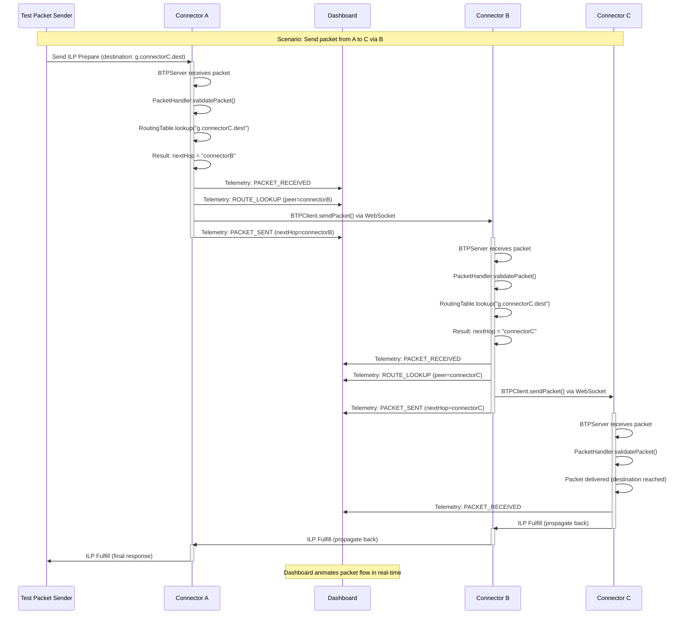
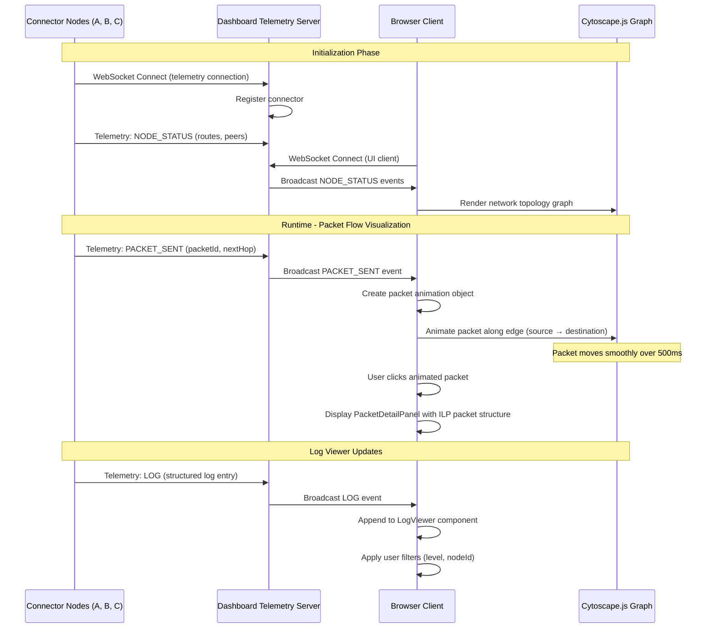
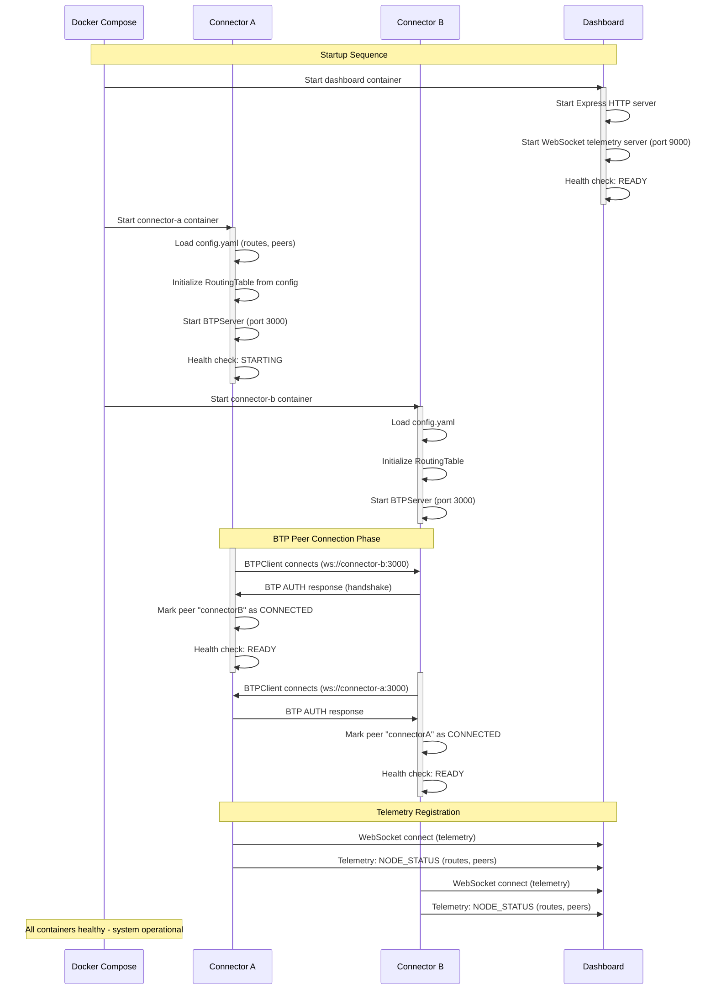

# Core Workflows

## Packet Forwarding Workflow (Multi-Hop)

The following sequence diagram illustrates the core ILP packet forwarding flow through multiple connector hops with telemetry emission:

## Dashboard Telemetry and Visualization Workflow

## Connector Startup and BTP Connection Establishment

