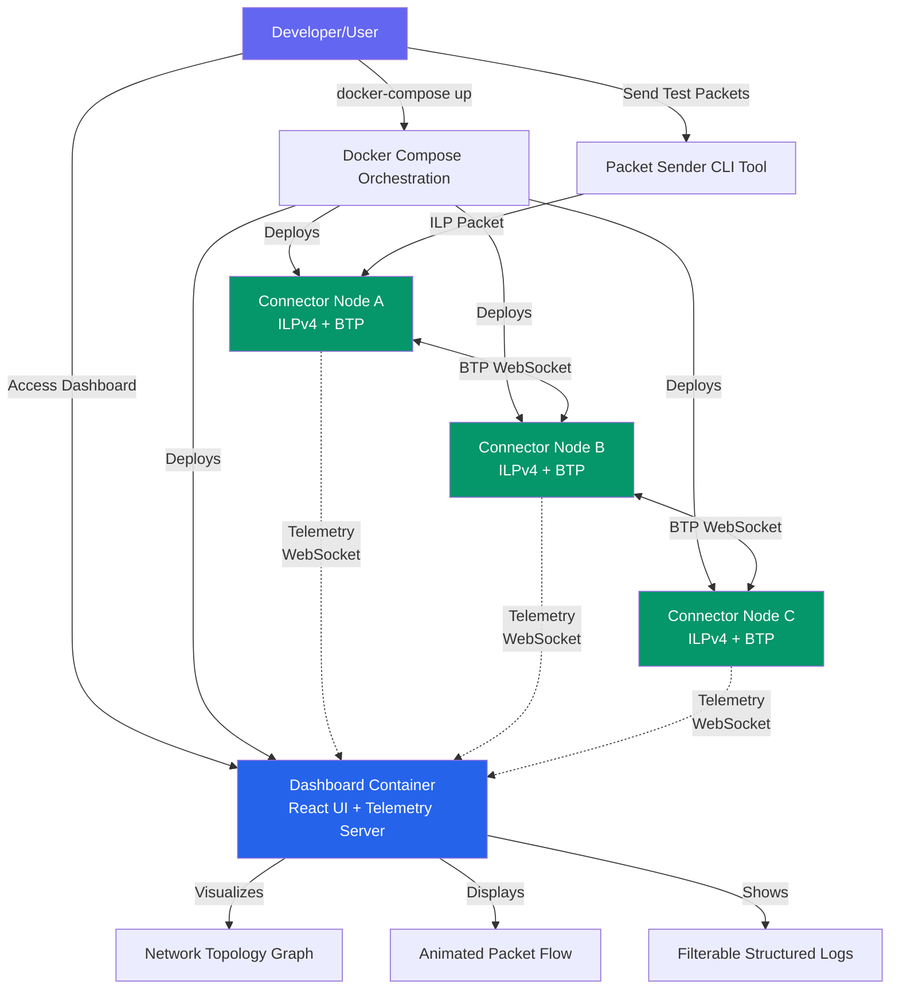

# High Level Architecture

## Technical Summary

The system employs a **microservices architecture deployed via Docker containers** with an observability-first design philosophy. Multiple independent ILP connector nodes communicate using BTP (RFC-0023) over WebSocket, while a centralized React dashboard aggregates telemetry and provides real-time network visualization. The architecture prioritizes developer experience through comprehensive structured logging, zero-configuration network deployment, and visual packet flow inspection. Built entirely in TypeScript on Node.js, the system leverages in-memory state for simplicity while supporting configurable network topologies from linear chains to full mesh networks. This design directly supports the PRD's core goals: making Interledger packet routing observable, reducing debugging time through enhanced visibility, and enabling rapid experimentation with different network scenarios.

## High Level Overview

**Architectural Style:** **Containerized Microservices with Event-Driven Telemetry**

1. **Repository Structure:** Monorepo (npm workspaces) containing `packages/connector`, `packages/dashboard`, and `packages/shared`
   - Rationale: Simplifies dependency management, enables TypeScript type sharing across packages, streamlines single-developer workflow

2. **Service Architecture:**
   - N identical connector containers (each running ILPv4 + BTP implementation)
   - Single dashboard container (React UI + telemetry WebSocket server)
   - No shared database - each connector maintains in-memory routing tables and peer state

3. **Primary Data Flow:**
   ```
   User sends test packet → Connector A receives via BTP
   → Connector A routes packet (consults routing table)
   → Connector A forwards to Connector B via BTP WebSocket
   → Both emit telemetry to dashboard via WebSocket
   → Dashboard visualizes packet animation in real-time
   → User clicks packet to inspect ILP packet structure
   ```

4. **Key Architectural Decisions:**
   - **In-memory state only:** No persistence layer for MVP - routing tables configured at startup, packet history ephemeral
   - **Push-based telemetry:** Connectors push events to dashboard (not pull-based polling)
   - **Docker-first deployment:** No non-containerized deployment supported for MVP
   - **WebSocket-centric communication:** BTP uses WebSocket (RFC-0023), telemetry uses WebSocket, real-time UI updates use WebSocket
   - **Educational over production:** Security, high availability, and performance optimization secondary to observability and ease of use

## High Level Project Diagram



## Architectural and Design Patterns

1. **Microservices Architecture (Containerized)**
   - Each connector node runs as independent Docker container
   - Services communicate via WebSocket (BTP protocol + telemetry)
   - _Rationale:_ Aligns with PRD requirement for deploying N nodes flexibly; enables network topology experimentation; supports independent scaling and isolation

2. **Event-Driven Telemetry**
   - Connectors emit events (PACKET_RECEIVED, PACKET_SENT, ROUTE_LOOKUP) to dashboard asynchronously
   - Dashboard aggregates and broadcasts to UI clients
   - _Rationale:_ Decouples observability from packet processing; supports real-time visualization without blocking routing; enables future extensibility (multiple dashboard clients, logging backends)

3. **Repository Pattern (for Routing Table Management)**
   - Abstract routing table operations behind interface
   - In-memory implementation for MVP, could swap for Redis/database later
   - _Rationale:_ Enables testing (mock routing table), future migration flexibility, clear separation of routing logic from storage

4. **Observer Pattern (for BTP Connection State)**
   - BTP clients emit connection lifecycle events (connected, disconnected, error)
   - Packet handler observes state to make routing decisions
   - _Rationale:_ Connector components can react to peer availability changes; supports health reporting to dashboard; aligns with event-driven architecture

5. **Strategy Pattern (for Network Topology Configuration)**
   - Topology configuration (linear, mesh, custom) loaded at startup
   - Different topology strategies populate routing tables accordingly
   - _Rationale:_ Supports PRD requirement for multiple pre-configured topologies; enables easy addition of new topology types; separates topology logic from connector core

6. **Hexagonal Architecture (Ports and Adapters)**
   - Core ILP packet handling logic independent of BTP transport
   - BTP is an adapter implementing ledger plugin interface
   - _Rationale:_ Enables future support for ILP-over-HTTP or other transports; improves testability (mock transport); aligns with RFC-0001 layered architecture

7. **Structured Logging as First-Class Concern**
   - All operations emit structured JSON logs with consistent schema
   - Logging integrated at framework level (not ad-hoc console.logs)
   - _Rationale:_ Directly supports FR10 comprehensive logging requirement; enables filterable log viewer; critical for debugging educational use case

8. **RESTful Convention for Dashboard API (Minimal)**
   - Health check endpoint: `GET /health`
   - Static file serving for React build
   - WebSocket endpoint for telemetry: `ws://dashboard:9000/telemetry`
   - _Rationale:_ Simple, standard conventions; minimal API surface for MVP; aligns with Docker health check requirements
