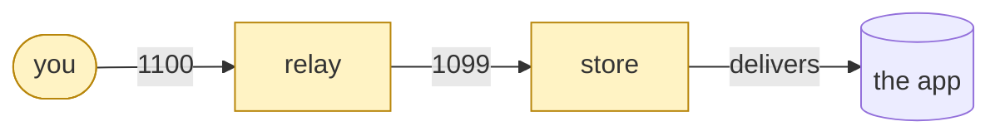
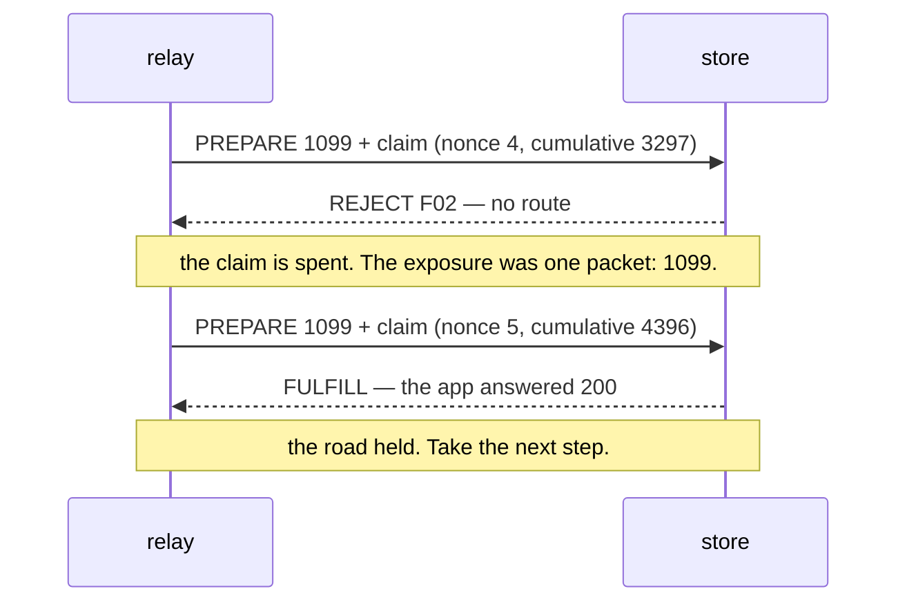
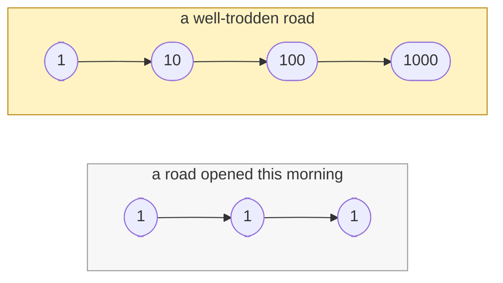
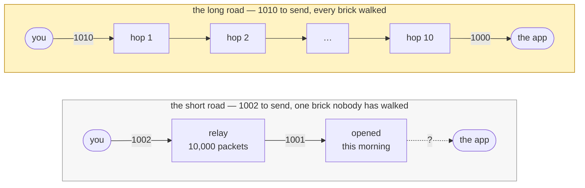

# The yellow brick road

_On why you send a packet down a path, not to a place — and why the road matters more than
the map._

---

Dorothy asks the way to the Emerald City. Glinda does not give her coordinates. She does not
say "it is forty miles east, past the poppy field, second gate on the left." She says:

> _Follow the yellow brick road._

That is the whole answer, and it is a better answer than an address. Dorothy has never been to
Oz. She cannot verify a location; she can only verify the ground under her feet, one brick at a
time. The road is real in a way the destination is not yet: it was laid by someone, it has been
walked by others, and every traveller before her who reached the City reached it by this road.
She does not trust the Wizard. She trusts the road.

Interledger works the way Glinda talks.

---

## A destination is a name. A path is a commitment.

An ILP address — `g.toon.store`, `g.toon.relay.gas` — is a **name**. It is self-asserted,
nobody allocates it, and it tells you nothing about how to reach it or what it will cost to try.
You cannot send a packet "to" a name any more than Dorothy can walk "to" Oz. What you can do is
hand your packet to the first hop on a road that claims to go there.

Every hop on that road is a **peering** that some operator chose, on purpose, with a fee and a
cap. The relay does not "send to the store." It forwards `g.toon.relay.store` across the one
peering it holds with the store, on the one channel it funded, at the one cap it set. Two roads
to the same name are two different things entirely — different hops, different fees, different
records. The name is the same. The commitment is not.

That is the first idea: **you never pay a destination. You pay a path.**

---

## The road is walked in steps, and a step cannot be taken back

Here is the thing about a packet that the word "payment" hides. When the relay hands the store
a `PREPARE` for 1099, it hands it a **signed claim** for 1099 in the same envelope. The store
holds that claim the instant it arrives. What comes back — a `FULFILL` with the app's answer, or
a `REJECT` because nothing routes that name, or nothing at all because the store was restarting
— comes back _with the claim already spent_.

A fulfilment is a delivery receipt. It is not the moment money moves. The money moved when the
step was taken.

In ILP as first written this was simply true and simply dangerous: a hop could take your claim
and walk. Nothing in the protocol stops it, and nothing ever will, because the hop that carries
your packet is by definition the hop you handed it to. You can no more make it deliver than
Dorothy can make the road keep going.

Payment channels do not change that. **They change what it costs you.**

A channel lets a packet be small enough that the step it pays for is nearly nothing — a relay
write is one micro-USDC; a store upload is a thousandth of a cent plus ten per kibibyte. Nobody
holds your deposit. Every hop holds only what you have _already signed_ to it, and the most the
next hop can ever walk off with is **the one packet you just handed it**. Not your balance. Not
your channel. The last brick.

That is the second idea: **your exposure on a road is the step you are in the middle of.**

---

## The road earns the traffic it carries

If exposure is one packet, then risk is not something you check. It is something you **size**.

A road you opened this morning has carried nothing. Send it a small packet. If it fulfils, send
another. A road that has fulfilled a thousand packets has earned a bigger one — not because
anyone certified it, but because the bricks have been walked and they held. Reputation on a
road is not a score somebody publishes; it is the record of your own packets coming back
fulfilled, and it is the only reputation that means anything, because it is the only one you
paid for yourself.

The same number, seen from the other side, is `max_packet_amount`: the largest single packet
you will **carry** for a peer, which is the most that peer can ever cost you at once. Yours to
choose, per peering, for exactly the reason your own packet size is yours to choose. Nothing
in the config file can know how far you trust a road; only you can, and only from having
walked it.

That is the third idea: **amount follows record. A well-trodden road is worth more than a short
one.**

---

## The long way round

Now put two roads to the same name side by side.

One is short: two hops, and the second of them is a node somebody stood up this morning. The
other is long: ten hops, every one of them a peering that has been funded, walked and paid for
thousands of times. Each hop takes a fee, so the long road costs more — on this fleet a hop's
fee is one micro-USDC and the store's charge is a thousand, so the short road wants 1002 from
you and the long road wants 1010.

Every instinct says take the short road. The instinct is wrong, and the reason is arithmetic.

**Fees add up per hop. Exposure does not.**

You hand your packet to the first hop. That hop is your only counterparty. What happens at the
sixth hop is the fifth hop's business — on the fifth hop's channel, under the fifth hop's cap,
paid for by the fifth hop's own claim. Nobody down the road holds anything of yours, because
nothing of yours ever reaches them; each pair settles between themselves, one link at a time.
So if the packet dies out there — a name nobody routes, a node that was restarting, a hop that
simply took the claim and stopped — you are out exactly what you sent. One packet. The same
one packet whether it died at the second hop or the tenth.

Ten hops is not ten times the risk. It is eight extra micro-USDC — less than one percent on top
of the packet — and the fee was quoted to you before you sent, in the reject that discovers a
path's cost. The stranger on the short road can take the whole 1002. **You are paying under one
percent to route around the one brick nobody has stepped on.**

What the extra hops change is the odds, not the stake. And the odds are exactly what a record
buys down. Ten proven hops is ten relationships that have each been paid to carry and have each
delivered, over and over. Two hops with a stranger in the middle is one unproven brick — and the
unproven brick is precisely where a packet stops.

There is a second thing you get for those fees, and it is the reason busy roads stay busy. A
hop that carries a lot of traffic **peers widely**: it has other roads onward, because being
useful to many senders is what made it worth peering with. When one of its legs goes dark it has
another. A lonely hop has one way through and no answer when that way fails. So the fee at a
well-trodden junction is not only the price of carriage — it is the price of the alternatives,
and a road made of such junctions can be more reliable than a road made of fewer, quieter ones.

Dorothy's road was not the shortest way to the Emerald City. Nobody ever claimed it was. It was
the road that was **known to arrive** — and it ran through the places where travellers already
were.

That is the fourth idea: **hops cost fees; strangers cost packets. Take the long trodden road.**

---

## What Glinda knew

She could have drawn a map. A map is a claim about where things are, made by someone who is
not walking. The road is different: it is made of the walking. Every brick is where it is
because a traveller needed it to be there, and every traveller who reached the City proved the
road one step further.

When you peer with a node, you are laying a brick. When you forward a packet across it, you
are testing one. When it fulfils, the road is one packet longer than it was. That is the whole
of how a route becomes trusted on this network: not announced, not learned, not bought — walked.

So when someone asks how to reach `g.toon.store`, the honest answer is not an address. It is
Glinda's answer.

_Follow the road. Start small. Let the bricks earn the next step._

---

Where this is written down as law

- [ADR 0042](adr/0042-a-packet-carries-its-claim.md) — every packet carries its claim; a
  fulfilment is a receipt, not a payment trigger; _"small packets, and larger ones only on a
  path that has earned them."_
- [ADR 0049](adr/0049-the-cap-bounds-one-packet-is-discovered-by-t04-and-is-set-from-outside.md)
  — the cap bounds one packet, never an accumulation, and is set by the operator.
- [ADR 0043](adr/0043-purchasable-peering-is-removed.md) and
  [ADR 0022](adr/0022-a-connector-answers-it-does-not-announce.md) — a peering is chosen by an
  operator, and by nothing else.
- [ADR 0010](adr/0010-flat-per-packet-fee-and-minimum-delivery.md) and
  [ADR 0028](adr/0028-a-forwarded-route-is-priced-at-the-client-edge.md) — a hop keeps a flat fee
  per packet, and a forwarded route is priced at the client edge, so a path's cost is the sum of
  its hops' fees plus the terminating charge.
- [RFC 0018](rfcs/README.md), _Connector Risk Mitigations_ — _"smaller payments carry
  proportionally less risk … in ILPv4, this is the default."_
- [RFC 0027](rfcs/README.md), _ILPv4_ — designed for _"large volumes of low-value packets."_
- The README's [Peering](../README.md#peering) chapter, where the operator's version of this
  lives, and [`CONTEXT.md`](../CONTEXT.md)'s **Path** entry.

