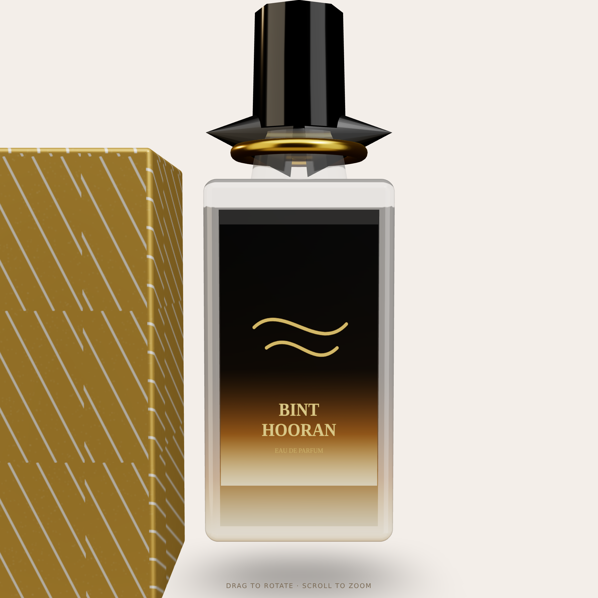

# Bint Hooran — Interactive 3D Perfume Viewer

A self-contained React + [react-three-fiber](https://docs.pmnd.rs/react-three-fiber)
component that renders an interactive 3D perfume bottle + presentation box, modelled
on the **Bint Hooran** product (black-to-amber gradient glass, faceted black cap,
black satin bow with a gold ring, gold geometric box).

Built as a landing-page hero concept: the visitor can **drag to rotate** and
**scroll / pinch to zoom** the bottle.



## Run it

```bash
npm install
npm run dev      # http://localhost:5188
npm run build    # production bundle in dist/
```

## Use your real product photo as the label

The bottle front reads `public/bottle-label.png`. The repo ships **without** that
file, so the viewer falls back to a procedurally-drawn gold-on-black label.

To use the real product:

1. Save your Bint Hooran front-of-bottle photo (ideally cropped tight to the label,
   PNG, ~512×768 portrait) to `public/bottle-label.png`.
2. Reload — the loader (`src/Perfume.tsx` → `useLabelTexture`) swaps it in
   automatically. No code change needed.

A transparent-background PNG looks best (only the artwork shows); a normal photo
works too but appears as a rectangular label patch.

## Files

| File              | Purpose                                                            |
| ----------------- | ----------------------------------------------------------------- |
| `src/App.tsx`     | `<Canvas>`, lighting, in-scene Lightformer environment, OrbitControls |
| `src/Perfume.tsx` | Bottle, gradient liquid, cap, bow, box, label loader              |
| `src/textures.ts` | Canvas-generated fallback label, liquid gradient, box foil pattern |
| `render.png`      | Still export for Figma mock-ups                                   |

## For Figma

`render.png` is a 2× still of the scene — drop it straight into Figma as the
mock-up image. To regenerate after tweaks, run the dev server and screenshot the
canvas (it renders with `preserveDrawingBuffer`, so a right-click "save image" or a
headless screenshot both work).

## Notes / limitations

- The geometry is a **stylised procedural approximation**, not a photogrammetry
  scan of the real bottle. It captures the silhouette, colour gradient, cap, bow,
  and box — swapping in the real label photo closes most of the realism gap.
- The studio reflections come from in-scene `<Lightformer>`s (no external HDR
  fetch), so it runs fully offline.
